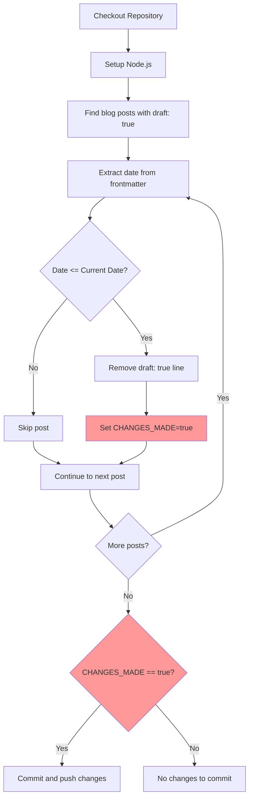
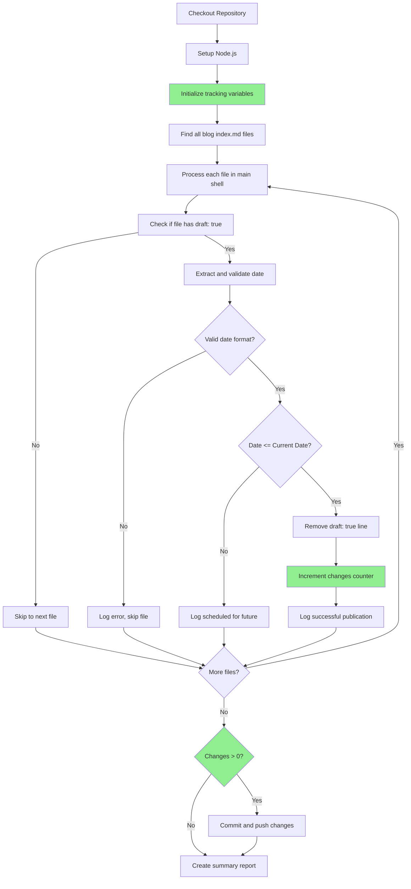

# GitHub Action Fix Plan: Auto-publish Scheduled Blog Posts

## Problem Analysis

### Primary Issue: Bash Variable Scoping
The current GitHub Action fails with "syntax error in conditional expression" due to variable scoping issues in bash pipelines.

**Root Cause**: The `CHANGES_MADE` variable is set inside a `while read` loop that's part of a pipeline:
```bash
find main-docs/blog -name "index.md" -type f | while read -r file; do
    CHANGES_MADE=true  # This runs in a subshell
done
# CHANGES_MADE is not available here
```

### Secondary Issues
1. **Date comparison vulnerability**: String comparison may fail with malformed dates
2. **Error handling**: No validation of date extraction or file processing  
3. **Git change detection**: Unreliable change tracking

## Current Workflow Analysis



**Problem**: Steps H and K fail due to variable scoping issues.

## Solution Architecture

### Approach 1: Process Substitution (Recommended)
Replace the pipeline with process substitution to maintain variable scope:

```bash
while IFS= read -r file; do
    # Process files here
    # CHANGES_MADE will persist
done < <(find main-docs/blog -name "index.md" -type f)
```

### Approach 2: Array-Based Processing
Use arrays to collect files first, then process:

```bash
mapfile -t files < <(find main-docs/blog -name "index.md" -type f)
for file in "${files[@]}"; do
    # Process files here
done
```

## Fixed Workflow Design



## Implementation Plan

### Phase 1: Core Fix
1. **Replace pipeline with process substitution**
   - Use `while read < <(find ...)` pattern
   - Ensure variables persist in main shell

2. **Improve date handling**
   - Add regex validation for YYYY-MM-DD format
   - Use safer date comparison methods
   - Handle edge cases (missing dates, invalid formats)

3. **Enhanced error handling**
   - Validate file operations
   - Check sed command success
   - Implement proper error reporting

### Phase 2: Robust Implementation
1. **Change tracking improvements**
   - Use counter instead of boolean flag
   - Track which specific files were modified
   - Generate detailed reports

2. **Git operations optimization**
   - Check for actual file changes before commit
   - Use proper git status checking
   - Implement atomic commit operations

3. **Logging and debugging**
   - Add structured logging throughout
   - Include file paths and dates in logs
   - Create detailed summary reports

### Phase 3: Publishing Logic Options

**Option A: Current Logic (Recommended)**
```bash
# Publish posts scheduled for today and earlier
if [[ "$POST_DATE" <= "$CURRENT_DATE" ]]; then
    # Publish post
fi
```

**Option B: Exact Date Match**
```bash
# Only publish posts scheduled for exactly today
if [[ "$POST_DATE" == "$CURRENT_DATE" ]]; then
    # Publish post
fi
```

**Option C: Grace Period**
```bash
# Publish posts within last 7 days
GRACE_DATE=$(date -u -d "7 days ago" +%Y-%m-%d)
if [[ "$POST_DATE" >= "$GRACE_DATE" && "$POST_DATE" <= "$CURRENT_DATE" ]]; then
    # Publish post
fi
```

## Key Improvements

### 1. Variable Scoping Fix
- Use process substitution instead of pipeline
- Maintain variable state in main shell
- Proper change tracking throughout execution

### 2. Date Validation
```bash
validate_date() {
    local date="$1"
    if [[ $date =~ ^[0-9]{4}-[0-9]{2}-[0-9]{2}$ ]]; then
        return 0
    else
        return 1
    fi
}
```

### 3. Error Handling
```bash
process_file() {
    local file="$1"
    if ! validate_date "$POST_DATE"; then
        echo "ERROR: Invalid date format in $file: $POST_DATE"
        return 1
    fi
    # Process file...
}
```

### 4. Atomic Operations
```bash
# Create backup before modification
cp "$file" "$file.backup"
if sed -i '/^draft: true$/d' "$file"; then
    rm "$file.backup"
    ((CHANGES_COUNT++))
else
    mv "$file.backup" "$file"
    echo "ERROR: Failed to modify $file"
fi
```

## Success Metrics

### Before Fix
- ❌ Syntax errors on line 24
- ❌ Variable scoping issues
- ❌ Unreliable change detection
- ❌ Limited error handling

### After Fix
- ✅ Clean execution without syntax errors
- ✅ Proper variable persistence
- ✅ Reliable change tracking with counters
- ✅ Comprehensive error handling and logging
- ✅ Detailed summary reports
- ✅ Atomic file operations with rollback

## Risk Mitigation

1. **Backup Strategy**: Create file backups before modification
2. **Validation**: Comprehensive input validation for dates and files
3. **Rollback**: Ability to undo changes if errors occur
4. **Logging**: Detailed logs for troubleshooting
5. **Testing**: Dry-run capability for testing changes

## Next Steps

1. **Clarify Publishing Logic**: Determine preferred date comparison approach
2. **Implement Core Fix**: Replace pipeline with process substitution
3. **Add Validation**: Implement date and file validation
4. **Testing**: Create test scenarios for validation
5. **Documentation**: Update workflow with new behavior

This plan addresses all identified issues while maintaining the original functionality and improving reliability significantly.