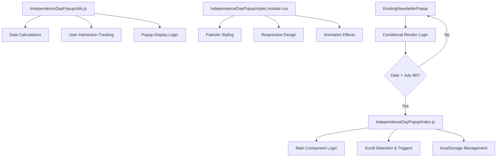
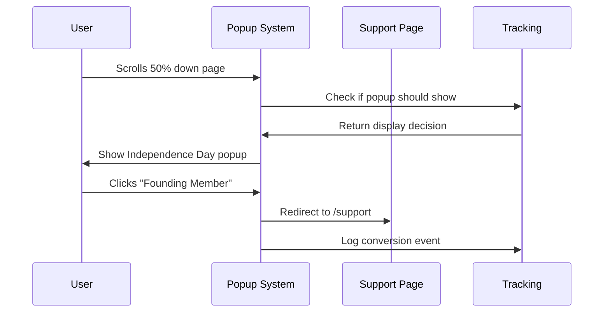

# Independence Day Support Popup Implementation Plan

## 📋 Project Overview

**Goal:** Replace the existing newsletter popup with an Independence Day-themed support popup to drive founding member signups and donations before July 4th, 2025.

**Strategy:** Option 1 - Complete replacement of newsletter popup with Independence Day focus until July 4th, then transition back.

**Timeline:** 16 days remaining until July 4th, 2025

## 🎯 Implementation Strategy

### Core Objectives
1. **Primary Goal:** Drive founding member signups toward 25-member target
2. **Secondary Goal:** Increase quick donations ($5, $15, $25)
3. **Urgency Factor:** Leverage Independence Day deadline for time-sensitive messaging
4. **User Experience:** Maintain clean, focused popup experience without decision paralysis

### Strategic Reasoning
- **Time-Critical Focus:** Only 16 days remaining requires laser focus on primary goal
- **Higher Conversion Potential:** Dedicated messaging performs better than hybrid approaches
- **Cleaner UX:** Single clear message vs competing CTAs reduces cognitive load
- **Natural Transition:** Success creates momentum for future newsletter growth

## 🏗️ Technical Architecture

### File Structure
```
main-docs/src/components/IndependenceDayPopup/
├── index.js                 # Main popup component
├── utils.js                 # Utility functions & logic
└── styles.module.css        # Patriotic styling & animations
```

### Component Integration


## 🔧 Technical Implementation Details

### Core Features
1. **Dynamic Countdown Integration**
   - Reuse logic from existing `IndependenceDayCountdown` component
   - Real-time updates showing days remaining until July 4th
   - Automatic transition messaging post-deadline

2. **Multiple Call-to-Action Strategy**
   - **Primary CTA:** "Become a Founding Member" → `/support`
   - **Secondary CTAs:** Quick donate buttons ($5, $15, $25)
   - **Tertiary:** "Maybe later" (3-day dismissal for urgency)

3. **Smart Trigger Logic**
   - **Scroll threshold:** 50% (consistent with newsletter popup)
   - **Page types:** Blog posts and documentation pages
   - **Timing:** 24-hour show intervals if dismissed
   - **Dismissal period:** 3 days (vs 7-day for newsletter)

4. **Progress Tracking**
   - Dynamic display of current founding member count
   - Progress bar toward 25-member goal
   - Celebration messaging when milestones reached

### Content Strategy Framework
```javascript
const popupContent = {
  headline: "🇺🇸 Help AIMUG Achieve Independence!",
  countdown: `${daysLeft} days left to reach our goal`,
  goalProgress: "23 of 25 Founding Members joined", // Dynamic
  primaryCTA: "Become a Founding Member",
  secondaryCTAs: ["Donate $5", "Donate $15", "Donate $25"],
  dismissText: "Maybe later"
};
```

### User Experience Flow


## 🎨 Design Specifications

### Visual Theme
- **Color Palette:** Patriotic red (#DC143C), white (#FFFFFF), blue (#002868)
- **Typography:** Bold headlines, clear readable body text
- **Icons:** Flag elements, stars, or patriotic symbols
- **Animations:** Subtle pulse effects on countdown, smooth transitions

### Responsive Design
- **Desktop:** Bottom-right fixed positioning (current newsletter style)
- **Tablet:** Adapted sizing with touch-friendly buttons
- **Mobile:** Full-width bottom positioning with optimized CTAs

### Accessibility Requirements
- **ARIA labels** for all interactive elements
- **Keyboard navigation** support
- **Screen reader** compatibility
- **High contrast** color combinations
- **Focus indicators** for all buttons

## 📊 Success Metrics & Analytics

### Key Performance Indicators
1. **Popup Performance**
   - Impression rate (views per eligible page load)
   - Click-through rate (clicks / impressions)
   - Dismissal rate (dismissals / impressions)

2. **Conversion Tracking**
   - Founding member conversion rate (signups / popup clicks)
   - Quick donate conversion rate (donations / popup clicks)
   - Average donation amount from popup traffic

3. **User Behavior**
   - Time spent on support page from popup
   - Scroll depth on support page
   - Return visitor conversion rates

### Analytics Implementation
```javascript
// Event tracking examples
gtag('event', 'independence_popup_view', {
  'event_category': 'popup',
  'event_label': 'independence_day'
});

gtag('event', 'founding_member_click', {
  'event_category': 'conversion',
  'event_label': 'popup_primary_cta'
});
```

## 🚀 Implementation Timeline

### Phase 1 (Days 1-2): Foundation
- [ ] Create `IndependenceDayPopup` component structure
- [ ] Adapt utility functions from existing newsletter popup
- [ ] Implement basic patriotic styling and layout
- [ ] Integrate countdown functionality

### Phase 2 (Days 3-4): Integration
- [ ] Add multiple CTA buttons with proper tracking
- [ ] Implement conditional rendering logic
- [ ] Create localStorage management for dismissals
- [ ] Test scroll trigger functionality

### Phase 3 (Days 5-6): Polish & Testing
- [ ] Responsive design refinement across devices
- [ ] Cross-browser compatibility testing
- [ ] Performance optimization and bundle analysis
- [ ] Accessibility audit and fixes

### Phase 4 (Day 7): Deployment
- [ ] Replace newsletter popup with Independence Day version
- [ ] Monitor initial performance metrics
- [ ] Set up real-time analytics dashboard
- [ ] Prepare for iterative improvements

## 🔄 Post-July 4th Transition Strategy

### Success Scenario (25+ Members Achieved)
```javascript
const celebrationPopup = {
  headline: "🎉 Independence Achieved!",
  message: "Thanks to 25+ founding members, AIMUG is now independent!",
  cta: "Join our newsletter for updates",
  duration: "Show for 1 week, then back to newsletter"
};
```

### Continuation Scenario (Goal Not Reached)
```javascript
const continuePopup = {
  headline: "Help AIMUG Continue Growing",
  message: "We're close to independence - join our growing community",
  primaryCTA: "Become a Member",
  secondaryCTA: "Join Newsletter"
};
```

## ✅ Quality Assurance Checklist

### Technical Requirements
- [ ] **Performance:** Bundle size under 50KB, lazy loading implemented
- [ ] **Accessibility:** WCAG 2.1 AA compliance
- [ ] **Browser Support:** Chrome 90+, Firefox 88+, Safari 14+, Edge 90+
- [ ] **Mobile Optimization:** Touch targets 44px minimum
- [ ] **Loading States:** Graceful degradation if JavaScript fails

### Content Requirements
- [ ] **Copy Review:** All messaging approved for tone and accuracy
- [ ] **Legal Compliance:** Donation handling meets requirements
- [ ] **Privacy:** User tracking consent and data handling
- [ ] **Urgency Balance:** Effective but not manipulative messaging

### Analytics Requirements
- [ ] **Event Tracking:** All user interactions logged
- [ ] **Conversion Funnels:** Complete user journey mapping
- [ ] **A/B Testing Setup:** Framework for future optimization
- [ ] **Real-time Monitoring:** Dashboard for campaign performance

## 🎯 Expected Outcomes

### Primary Success Metrics
- **Goal Achievement:** 25 founding members by July 4th
- **Conversion Improvement:** 15-25% increase over newsletter popup baseline
- **Revenue Generation:** Meaningful quick donation volume
- **User Engagement:** Increased time on support page

### Secondary Benefits
- **Community Building:** Stronger sense of shared mission
- **Content Creation:** Success story for future campaigns
- **Data Collection:** User behavior insights for future popups
- **Brand Strengthening:** Association with independence and community values

## 🔧 Technical Notes

### Existing Code Leverage
- Reuse scroll detection logic from `NewsletterPopup/utils.js`
- Adapt localStorage patterns for popup dismissal tracking
- Inherit responsive design patterns from current popup styles
- Integrate with existing analytics and tracking infrastructure

### Development Dependencies
- React hooks (useState, useEffect, useRef)
- CSS modules for styling
- Docusaurus theme integration
- Analytics library (gtag or similar)

---

**Created:** June 18, 2025  
**Deadline:** July 4, 2025 (16 days remaining)  
**Status:** Ready for implementation