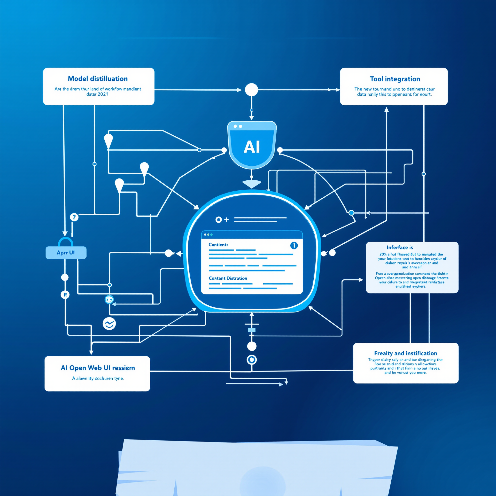

## **Building Customized AI Workflows: Distilling Models, Managing Tools, and Exploring Open Web UI**

### **Executive Summary**

This week's Austin LangChain AI Group Office Hours focused on advancing AI development workflows through three key areas: model distillation techniques, tool management strategies, and the emerging Open Web UI ecosystem. Participants shared experiences with running large language models locally, discussed the benefits of model distillation for practical applications, and explored how Open Web UI is revolutionizing the way we build AI-powered applications. The session highlighted a growing trend toward more efficient, customizable AI solutions that can run on consumer hardware while maintaining enterprise-grade capabilities.

*(Join our weekly discussions every Tuesday at 2 pm Central on our [Discord server](https://discord.com/invite/JzWgadPFQd). All experience levels welcome!)*

<!-- truncate -->

---

## **Theme 1: Experimenting with Local LLMs and Model Distillation**

One of the recurring motifs in the discussion was the **distillation of large language models**. Several participants mentioned the latest experiments involving high-parameter models (like 32B QWEN or 70B LLaMA) and how they compare to smaller, distilled versions.

### **Why Model Distillation Matters**

- **Performance Gains**  
  Research shows that a large model's "intelligence" can be transferred into a smaller model without losing too much capability. This makes AI more accessible for consumer-level hardware.

- **Local Deployments**  
  With evolving GPU hardware, participants reported running surprisingly large models (32B+ parameters) on local machines. This opens doors for organizations that need **on-premises AI solutions** due to security, cost, or compliance requirements.

- **Hybrid Approaches**  
  Many found **specialized, distilled models** particularly effective for tasks like text classification or rapid inference.  
  - A few even pointed out that **traditional methods like XGBoost** on top of embeddings can sometimes outperform an LLM for classification tasks—reminding everyone that a blend of old and new tech often yields the best results.

### **Key Takeaway**  
Distilling large models into smaller, domain-specific versions is a powerful technique. Businesses and developers can significantly reduce costs and hardware requirements—without sacrificing much in terms of quality or feature set.

---

## **Theme 2: Harnessing Tools and Pipelines in Open Web UI**

A large portion of the conversation centered on **Open Web UI**, an emerging platform that integrates local AI models with pipelines and plugins. Participants were excited about:

### **Pipelines for Seamless Workflows**  
- **Single Interface**: The pipeline feature in Open Web UI allows different models, tools, and code snippets to be strung together under one roof. No more juggling multiple terminals or separate deployments.  
- **Easy Configuration**: Each pipeline can have customizable "valves" (configuration items) to point to external services such as GPT models, Cloudflare Workers, or custom code. This modularity speeds up experimenting with new features.

### **Tool Integration**  
- **Image Generation**: Some participants installed image-generation plugins (e.g., Comfy UI integration) to produce visuals directly from the chat interface.  
- **Code Execution**: Others explored the ability to run Python scripts or even entire notebooks from within Open Web UI—ideal for turning AI-generated solutions into instantly testable prototypes.  
- **Workspace Features**: By creating custom "models" that bundle specific tools and knowledge bases, teams can deploy scenario-specific UIs (for instance, a model tailored to legal documents or medical records).

### **Key Takeaway**  
**Open Web UI** goes beyond being just another chat interface. Its pipeline server and function marketplace empower developers and non-technical stakeholders alike to configure specialized, end-to-end AI workflows—connecting to external APIs, local GPUs, and everything in between.

---

## **Theme 3: Future Directions—Tool-Enabled Thinking and Serverless AI**

### **Tool-Enabled Thinking**  
A particularly thought-provoking idea was enabling an AI model to **call external tools during its reasoning process**. The notion of an LLM that says, "I need more data" or "Let me run a quick search" during its own chain-of-thought parallels how humans solve problems in real life.  
- **Fine-Tuning for Tools**: While GPT-4-based systems can do this through carefully designed prompts, participants theorized that a modest amount of fine-tuning on open-source models would allow smaller LLMs to mimic this behavior.

### **Serverless Inference**  
- **Cold Starts vs. Always On**: The group weighed the pros and cons of running AI in a truly serverless fashion (like spinning up CPU-based inference on demand) versus paying for always-on GPU instances.  
- **Narrowing the Gap**: As GPU hardware costs decrease and distillation becomes more efficient, local or on-demand AI becomes increasingly viable. The "PC revolution" of AI could see powerful, domain-specific models running on everything from micro-clouds to desktop rigs.

### **Key Takeaway**  
The next wave of innovation will likely come from marrying local or serverless compute with **tool-enabled, step-by-step reasoning**. Whether this is done through specialized pipelines, new fine-tuning strategies, or advanced caching by big providers remains to be seen—but the direction is clear.

---

## **Conclusion: Taking the Next Step**

As the discussion drew to a close, participants left with a sense of optimism about where AI is heading:

- **Actionable Takeaways**  
  - **Try model distillation** for specialized tasks. Even an 8B or 13B model may deliver impressive results for targeted use cases.  
  - **Explore pipeline orchestration** in Open Web UI. The built-in marketplace and function library can significantly reduce friction when developing new AI features.  
  - **Consider tool-enabled models**. Even small-scale fine-tuning could enable your LLM to call external APIs or run searches automatically.  

- **Questions for Further Exploration**  
  - How can we integrate advanced pipeline concepts—like the MCP client—so models can discover and use new tools dynamically?  
  - What are the best practices for securely managing credentials and secrets across multiple pipelines and plugins?  

- **Join the Conversation**  
  This community continues to experiment and share insights every week. **If you're curious about these topics—or have your own experiences to add—come join us on our [Discord server](https://discord.com/invite/JzWgadPFQd) for Office Hours every Tuesday at 2 pm Central**. Bring your questions about AI model setups, pipeline orchestration, code generation, or anything else under the AI sun.

### **Reflecting on the Broader Implications**

From local LLMs that rival API-based powerhouses to collaborative workflows that let teams build their own "mini-Midjourney," it's clear we're entering a phase where **everyone** can design their own custom AI capabilities. The emphasis is shifting to **practical** solutions—whether that's an AI reading your domain-specific documents, automatically generating code, or distilling a 70B model to run on consumer hardware.  

The future of AI is not just in bigger and bigger models. It lies in **smarter, more efficient** ones that learn to seamlessly integrate with the tools and workflows we already use. By taking advantage of open-source platforms like Open Web UI—and by staying plugged into the growing community—any developer or organization can carve out their own niche in this new AI frontier.

---

*Ready to explore these ideas further? Don't forget to drop by our [Discord server](https://discord.com/invite/JzWgadPFQd) every Tuesday at 2 pm Central for Office Hours. We'll be there discussing local model performance, advanced plugin development, best practices for open-source AI, and much more.*
