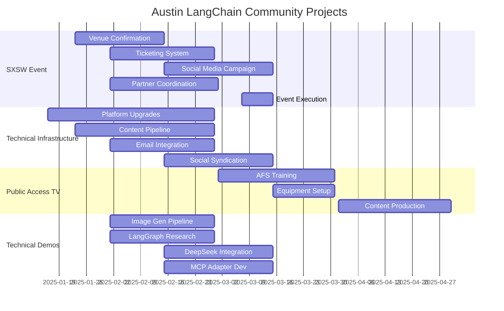

The Austin LangChain community has been making significant strides in technical development, community growth, and event planning. This comprehensive report outlines our key initiatives, progress, and future directions from mid-January through early February 2025.

<!-- truncate -->

## Executive Summary

Our community has been laser-focused on several transformative initiatives, from preparing for a major SXSW presence to expanding our technical infrastructure and exploring innovative demonstration projects. The momentum we've built is setting the stage for an exciting spring season of AI innovation in Austin.

## Key Initiatives

### SXSW Event Planning (March 7-15, 2025)

Our SXSW preparations are in full swing, with a dedicated committee led by Karim Lalani spearheading the effort. Ryan Booth is orchestrating our social media presence, and we're actively recruiting additional volunteers to ensure a seamless experience.

**Current Focus Areas:**
- Finalizing venue arrangements at our partner law firm
- Developing a robust ticketing system
- Implementing a comprehensive social media strategy
- Preparing technical demonstrations
- Coordinating with key partners including LangChain and Cloudflare

### Technical Infrastructure Evolution

We're significantly upgrading our platform capabilities to better serve our growing community:

**Platform Enhancements:**
- Automated transcription and content generation pipeline
- Streamlined email list integration
- Enhanced social media syndication
- Automated blog post publishing on aimug.org

**Distribution Improvements:**
- Seamless Discord integration
- RSS feed implementation
- Multi-channel publishing system

### Public Access Television Initiative

We're breaking new ground with our public access television presence, opening up exciting possibilities for broader community reach:

**Key Components:**
- AFS membership secured ($120/year)
- Access to professional equipment and training
- Studio facilities availability
- Broadcasting capabilities for community content

### Technical Demonstrations

Our technical teams are pushing boundaries with several cutting-edge projects:

**Image Generation Pipeline:**
- Replicate-based implementation
- Local 4090-based version
- Seamless blog integration

**LangGraph Research Tools:**
- GPT researcher implementation
- LangSmith integration
- DeepSeek integration
- MCP adapter development

## Project Timeline

## Risk Assessment & Mitigation Strategies

### High Priority Considerations

**1. Venue Availability**
- **Risk**: Potential unavailability of law firm space for SXSW event
- **Mitigation**: Active identification of backup venues and maintaining flexible scheduling options

**2. Technical Integration Challenges**
- **Risk**: DeepSeek API stability issues and tool calling limitations
- **Mitigation**: Implementation of robust fallback options and maintenance of multi-model support

**3. Resource Allocation**
- **Risk**: Limited volunteer availability for event staffing
- **Mitigation**: Early recruitment initiatives and clear role definitions

### Medium Priority Considerations

**1. Content Management**
- **Risk**: Scaling challenges in multi-channel content production
- **Mitigation**: Implementation of automated workflows and structured editorial processes

**2. Partner Coordination**
- **Risk**: Potential timing conflicts with partner organizations
- **Mitigation**: Proactive communication and flexible scheduling arrangements

## Action Plan

### Immediate Actions (Next 2 Weeks)
1. Secure final confirmation for law firm venue
2. Launch ticketing system development phase
3. Initiate social media campaign planning

### Mid-term Goals (30 Days)
1. Complete technical demonstrations development
2. Establish robust content distribution workflow
3. Finalize comprehensive SXSW event schedule

### Long-term Objectives (60-90 Days)
1. Launch inaugural public access television content
2. Complete technical infrastructure expansion
3. Conduct thorough event success metrics evaluation

## Strategic Recommendations

### Event Planning
- Proceed with SXSW party planning while maintaining contingency venues
- Implement Web3 wallet-based ticketing for enhanced tracking
- Create dedicated showcase opportunities for community projects

### Technical Development
- Continue integration efforts of MCP adapters with LangGraph
- Expand automated content generation capabilities
- Develop standardized demonstration formats

### Community Growth
- Leverage public access television for expanded reach
- Maintain regular technical demonstrations and workshops
- Foster strategic partnerships within local AI and tech communities

---

_Join us in building the future of AI in Austin! Connect with our community on Discord at [discord.gg/austinlangchain](https://discord.gg/austinlangchain) and stay tuned for updates on our SXSW event and upcoming technical showcases._
