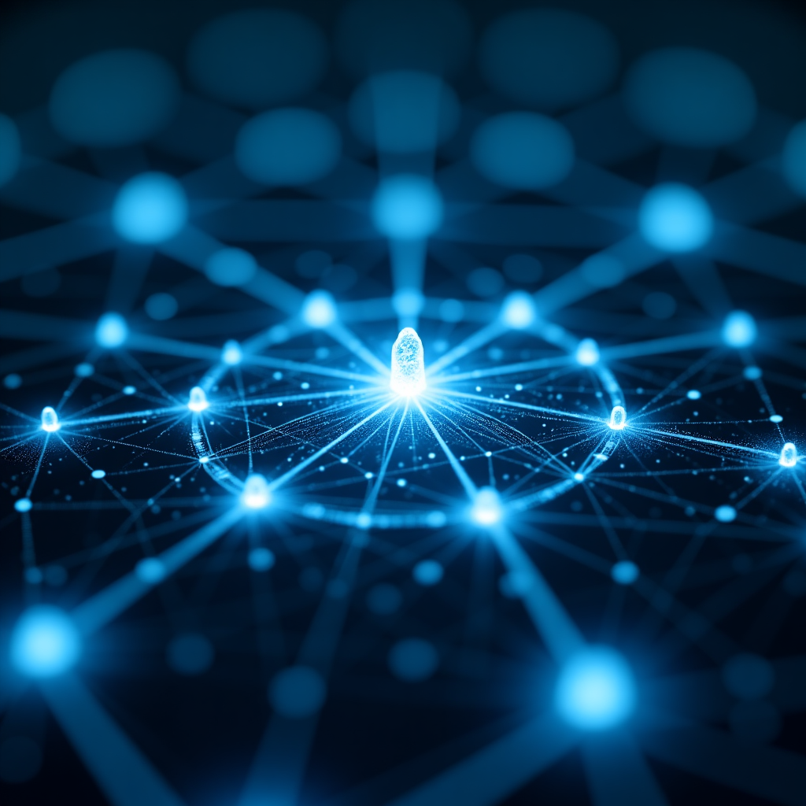
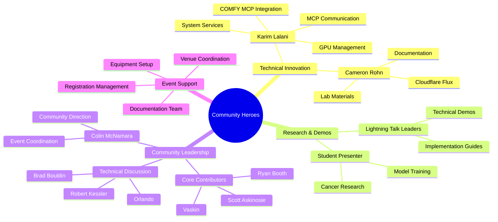
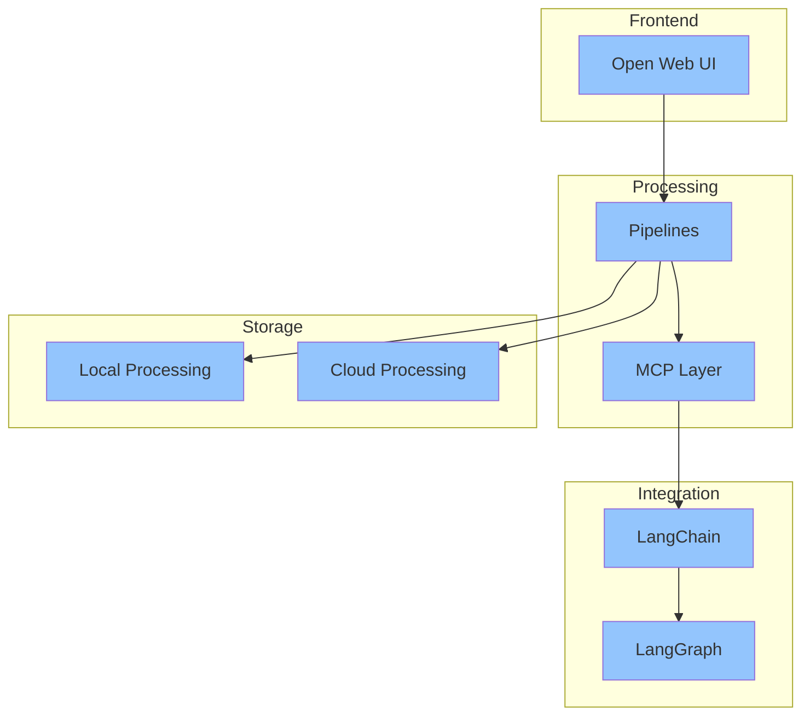
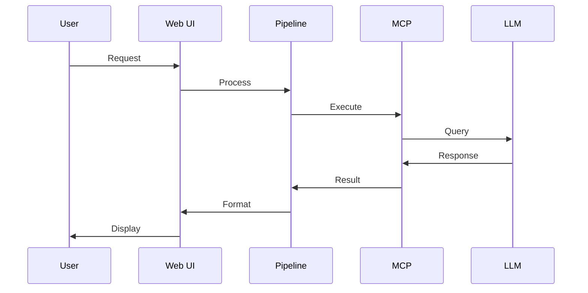
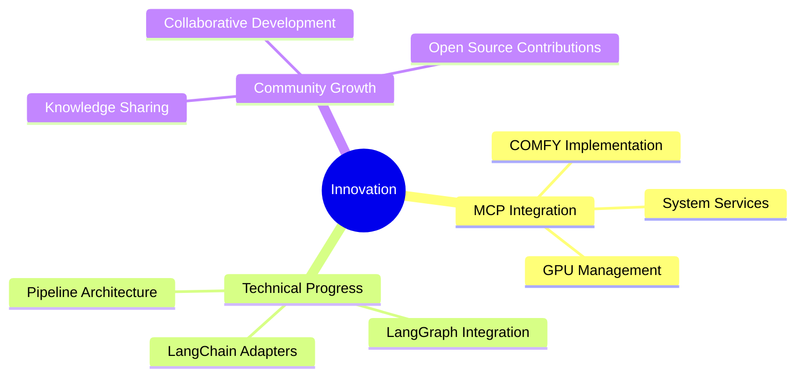
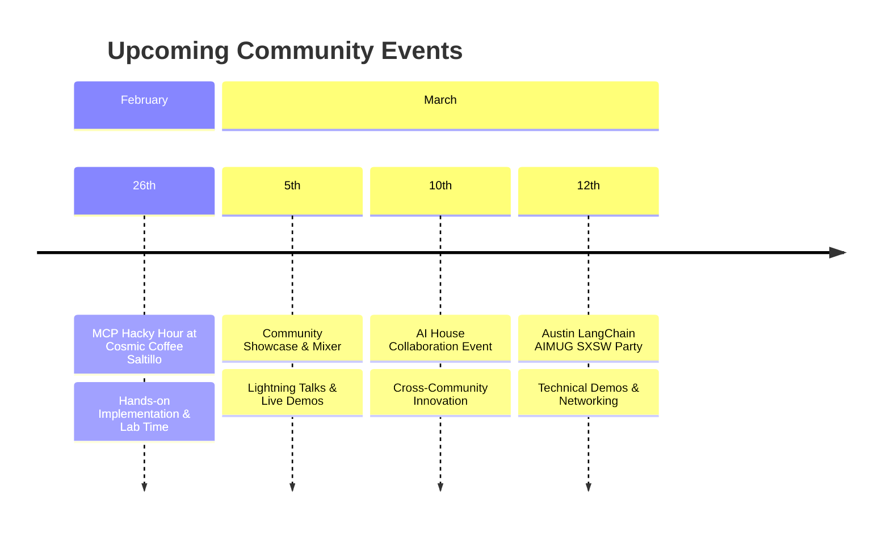
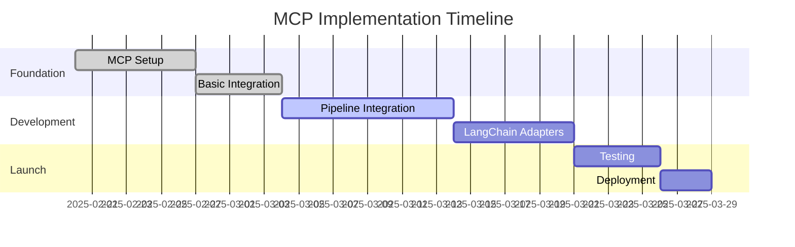
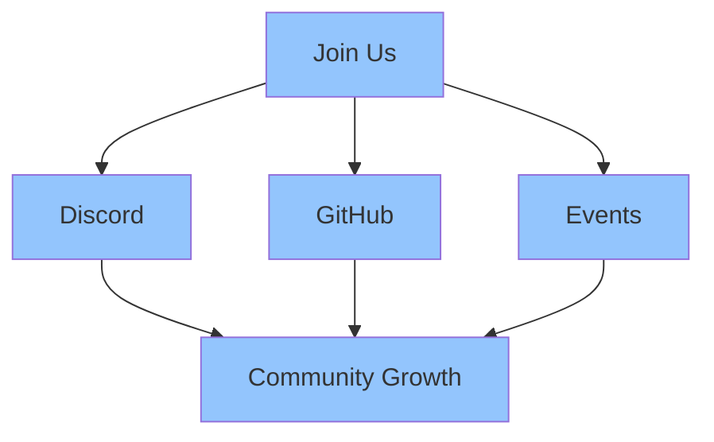

What happens when you bring together a passionate community of AI enthusiasts, developers, and innovators? Magic! That's exactly what we experienced during our February 20th Austin LangChain AIMUG community call, where we witnessed something truly special - the convergence of cutting-edge AI technologies that are setting new standards in the field.

<!-- truncate -->

Our community has been working tirelessly behind the scenes, and today we're thrilled to share a major milestone that's been months in the making. We're not just talking about individual technologies anymore; we're seeing the emergence of a fully integrated ecosystem that's revolutionizing how we approach AI development.

## Community Call Spotlight

Here's a snapshot of just some of the amazing contributions highlighted during our February 20th community call. While this represents only a small portion of our vibrant community, it showcases the incredible work happening across different areas:

This vibrant mix of talents and contributions makes our community truly special. Every member plays a crucial role in our success, from groundbreaking technical innovations to essential community support. And while these highlights from our community call showcase some amazing work, they represent just a fraction of the incredible contributions happening across our broader community every day.

## The Technical Revolution

Building on these incredible contributions, our community has developed a groundbreaking technical architecture. Picture this: a seamless integration that brings together some of the most powerful technologies in the AI landscape. We're not just building tools; we're crafting an experience that makes AI development more accessible, powerful, and intuitive than ever before:

Let's break down this game-changing architecture that's got our community buzzing with excitement:
- **Open Web UI**: Providing an intuitive frontend for user interaction
- **Pipelines**: Enabling robust and flexible processing workflows
- **MCP Layer**: Serving as the central coordination point for all components
- **LangChain**: Delivering advanced AI capabilities and chain management
- **LangGraph**: Orchestrating complex workflows and decision processes

Watch how these components dance together in perfect harmony - it's like a well-choreographed performance where every player knows their part:

What makes this architecture so special? Here's what's happening under the hood:
- Efficient request handling and processing
- Seamless integration between components
- Flexible deployment options (local or cloud)
- Robust error handling and retry logic
- Comprehensive logging and observability

## Community Innovation Showcase

With this powerful architecture as our foundation, our community members have been pushing the boundaries of what's possible. Here's a look at the innovative projects and initiatives that are already taking shape:

These innovations demonstrate the real-world impact of our technical architecture:
- COMFY MCP integration for enhanced processing capabilities
- Advanced system services management
- Efficient GPU resource optimization
- Seamless local and cloud processing integration

## Upcoming Events

Inspired by these developments and eager to keep the momentum going, we've got an exciting lineup of events where you can learn, contribute, and connect:

Mark your calendars! Our MCP Hacky Hour will be a hands-on session perfect for both newcomers and experienced developers. We've got 68 people registered and expecting 12-20 attendees for an intimate, productive session. Following that, our Community Showcase will feature everything from cancer research presentations to cutting-edge MCP implementations. The AI House collaboration will bring together different communities, and we'll wrap up with our unofficial SXSW event - the Austin LangChain AIMUG Party featuring lightning talks, technical demonstrations, and networking with visiting AI/ML professionals.

## Project Progress & Roadmap

We're moving fast, but with purpose. Take a look at our roadmap - it's ambitious, but that's how we like it:

## Get Involved

With our technical foundation solid and our roadmap clear, now is the perfect time to join our community. Whether you're interested in the technical implementation, community building, or just want to learn and grow with us, there's a place for you in this journey:

### Ready to Jump In?
1. Come hang out with us at our [MCP Hacky Hour](https://www.meetup.com/austin-langchain-ai-group/events/305585780/) on February 26th at Cosmic Coffee Saltillo - bring your laptop and your curiosity!
2. Got ideas? We'd love to see them! Contribute to our growing ecosystem on [GitHub](https://github.com/aimug-org)
3. Show off your work at our upcoming [Community Showcase](https://www.meetup.com/austin-langchain-ai-group/events/305993341/) - we celebrate both victories and valuable learning experiences
4. Join the conversation on [Discord](https://discord.gg/JzWgadPFQd) - our community is always buzzing with exciting discussions and collaborations

## Looking Forward

From our vibrant community call discussions to our groundbreaking technical achievements, the energy in our Austin LangChain community is absolutely electric right now. We're not just building tools—we're crafting the future of AI development together. Our integration of Open Web UI, Pipelines, MCP, LangChain, and LangGraph isn't just another technical achievement; it's a testament to what's possible when passionate people come together with a shared vision.

The foundation is laid, the roadmap is clear, and our community is stronger than ever. Whether you're a seasoned AI developer or just starting to explore these exciting technologies, there's never been a better time to get involved. Come join us in writing the next chapter of AI integration - it's going to be an amazing journey!
