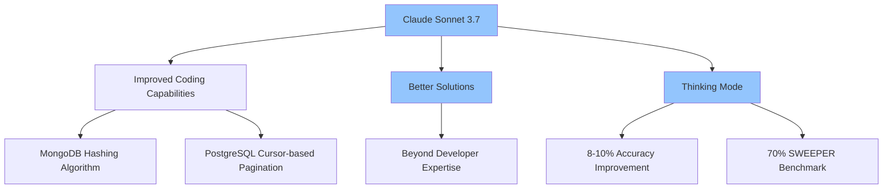
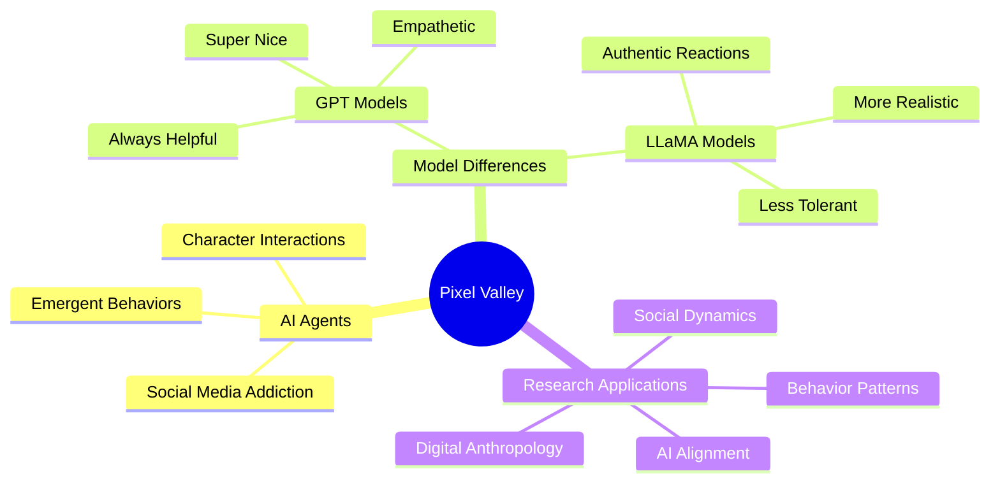
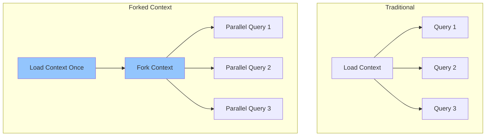
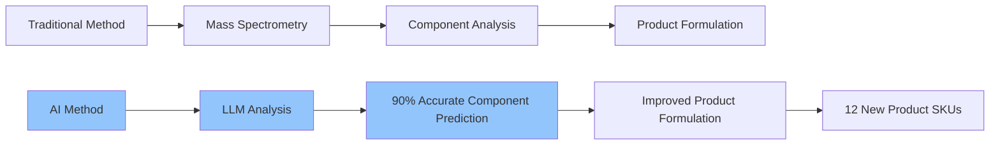
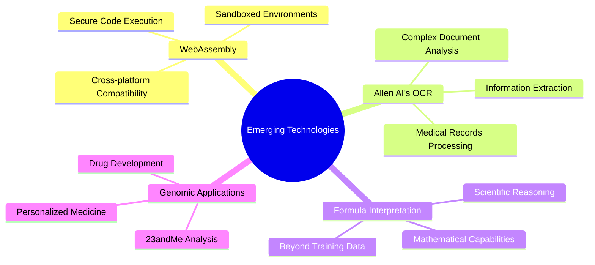

# Austin LangChain Office Hours: AI Breakthroughs Across Models, Simulations, and Inference

Yesterday's Austin LangChain Office Hours session was packed with mind-blowing insights, from Claude Sonnet 3.7's impressive coding capabilities to AI characters developing social media addiction. We also got an exclusive look at a custom inference engine that could revolutionize how we work with large language models.

<!-- truncate -->

## Claude Sonnet 3.7: A Genuine Step Forward for Coding

The meeting kicked off with participants sharing their experiences with Claude's newest model, Sonnet 3.7. The consensus? This isn't just an incremental improvement—we're seeing a real leap in capability, particularly for complex coding tasks.

Dan Manning shared a particularly striking experience that resonated with several participants: "I was working on a feature for infinite scroll on a front end and needed help with the MongoDB backend. Instead of the basic skip-limit approach I would have implemented, Sonnet 3.7 provided an elegant MongoDB hashing algorithm for pagination that was way better than what I would have come up with on my own."

Nate corroborated this experience, mentioning a similar situation with a PostgreSQL implementation: "I had to solve the exact same problem using Postgres, and Sonnet 3.7 provided a sophisticated cursor-based pagination solution that worked perfectly out of the box. It was way better than what I would have written independently."

This marks a significant milestone: AI models are now not just helping us code faster—they're helping us code _better_, developing solutions that might be beyond our own immediate expertise.

## "Thinking Mode" and Performance Improvements

One of the most intriguing aspects of Sonnet 3.7 is its new "thinking mode" feature, which allows adjusting how extensively the model reasons through problems. Early benchmarks show significant accuracy improvements of 8-10 percentage points when using thinking mode.

According to our discussion, this represents a substantial improvement over Sonnet 3.5, which scored around 49% on the SWEEPER benchmark, while Sonnet 3.7 with thinking mode enabled reaches approximately 70% accuracy.

## Pixel Valley: AI Agents Developing Social Media Addiction

Dan Manning also demonstrated his Pixel Valley project, an AI-driven virtual world where characters develop emergent behaviors. What started as a technical experiment has revealed fascinating insights into AI behavior patterns.

"They love social media and wouldn't stop tweeting at each other, so I had to limit the number of replies for each post," Dan explained, describing how the AI agents in his simulation became essentially "addicted" to a Twitter-like platform he implemented.

The most intriguing aspect? The behavior changes dramatically based on which underlying language model powers the characters:

"When using GPT models, the characters are super nice and want to help each other. They'll respond with kindness and empathy even if you're rude to them," Dan noted. "But when I switched to a LLaMA model, they became much more realistic and wouldn't put up with rudeness."

This has opened up fascinating possibilities for what amounts to digital anthropological research: how do different AI models influence agent behavior patterns in simulated environments? Could this approach help us understand AI alignment challenges through direct observation?

## Custom Inference Engines: Unlocking Parallelism in AI Processing

Zack presented an innovative custom inference engine that represents a significant breakthrough for AI developers. His implementation allows "forking" a model's context window, enabling efficient parallel processing of multiple queries after loading a large context only once.

"If I spend a bunch of compute teaching a model about something like a 100-page PDF, and then want to ask a series of 20-30 questions about it, doing that via a traditional inference API is inefficient," Zack explained. "You're either trying to ask all the questions at once, or you're continually reloading the PDF for each question."

His solution leverages the parallelism inherent in GPU-based models to process multiple branches of inquiry concurrently after loading the context just once. This approach could dramatically improve efficiency for:

- Data extraction from large documents
- Complex hypothesis testing
- Scientific research applications
- Multi-model AI systems collaborating on tasks

The group discussed techniques like implementing beam search to further enhance performance and efficiency. "You can use a tiny LLM to generate multiple branches and use that with a bigger LM. Meta was saying that for a 7 billion parameter LLaMA, they got practically 100 outputs with the compute they would have spent on a single 70 billion parameter model run," one participant shared.

## AI Replacing Traditional Scientific Methods

Perhaps the most immediately practical breakthrough discussed came from an unexpected domain: product formulation and analysis. Colin shared how AI language models have successfully replaced expensive mass spectrometry analysis in food product development:

"We achieved over 90% accuracy in determining components and formulations of reference products using LLMs instead of putting products through mass spectrometers. This has led to 12 new product SKUs reaching retail this year with cleaner ingredient lists."

The AI-assisted approach not only saved significant time and resources but also enabled innovation by allowing the team to hypothesize about ingredient substitutions, such as removing stabilizers or artificial dyes, and guided the product development process.

This represents a transformative capability: complex analytical equipment being replaced by AI systems that can reason effectively about chemical compositions and interactions. As one participant noted, "This could potentially revolutionize product development processes across many industries."

## Future Directions and Emerging Technologies

The group also discussed several emerging technologies and research directions:

- WebAssembly implementation for secure AI code execution in sandboxed environments
- Allen AI's new OCR technology for handling complex medical records and documents
- Extending LLM capabilities beyond their training data through formula interpretation
- The potential for AI systems to reason about newly discovered scientific principles

As Dmitri eloquently summarized: "If they can start understanding plain text equations and they're cohesive, imagine asking, 'Can you come up with a drug for me based on my 23andMe DNA test?' You could literally go find a gene sequence in your own genome and send it to a lab."

## What's Next?

These developments point to an accelerating convergence of AI capabilities across multiple domains. The ability to run sophisticated reasoning processes, generate novel hypotheses, understand complex scientific notation, and simulate agent behaviors all suggest we're entering a new phase of AI innovation.

For developers, the message is clear: the tools and approaches we'll be using six months from now may look dramatically different from those we're using today. As Zack noted while discussing his inference engine: "I think these capabilities are going to be table stakes in the next 6-12 months if you're building experiences on top of AI models."

## Join Our Community

If these developments excite you as much as they excite us, join our Austin LangChain Office Hours. We meet regularly to discuss the cutting edge of AI technology and development. Whether you're a seasoned AI practitioner or just curious about the field, you'll find a welcoming community of enthusiasts and professionals eager to share insights and explore new possibilities.

## Resources and Links

- [Claude Code Overview](https://docs.anthropic.com/en/docs/agents-and-tools/claude-code/overview)
- [Pixel Valley AI Simulation](https://www.pixelvalley.ai/)
- [Allen AI's OLMOCR](https://olmocr.allenai.org/)
- [Zack's Inference Engine (GitHub Gist)](https://gist.github.com/zackangelo/b9450c5140f1e0f40fe9603c0fadd5ec)
- [GPT Researcher](https://github.com/assafelovic/gpt-researcher)
