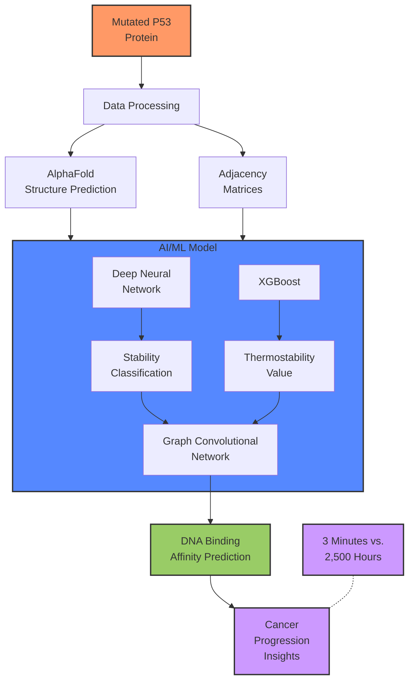
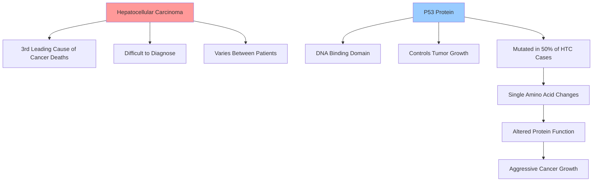
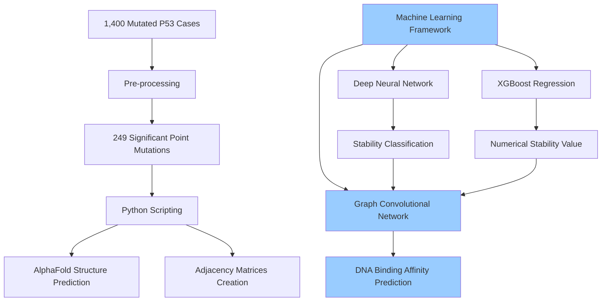

# High School Sophomore's AI Cancer Detection Breakthrough

At our March Austin LangChain meeting, we witnessed an extraordinary presentation from Venika Kakarla, a sophomore at Round Rock High School, who developed a sophisticated machine learning model to detect and analyze hepatocellular carcinoma (HTC)—the fatal liver cancer that claimed her grandfather's life. Her innovative approach combines deep neural networks, XGBoost regression, and graph convolutional networks to predict protein stability and DNA binding affinity in cancer cells with unprecedented efficiency.

<!-- truncate -->

## The Intersection of AI and Cancer Research

Venika's journey into AI-powered cancer research began with a personal connection—her grandfather's battle with hepatocellular carcinoma. This form of liver cancer is the third leading cause of cancer-related deaths worldwide and presents unique challenges due to its varying nature between patients.

Her research focuses on the P53 protein, specifically its DNA binding region, which plays a critical role in controlling tumor growth. When mutations occur in this protein—as they do in approximately 50% of HTC patients—cancer cells can replicate without bounds, leading to aggressive cancer proliferation. Even a single amino acid change in the DNA binding domain can significantly alter the protein's stability and binding affinity, dramatically affecting cancer progression.

## Current Challenges in Cancer Research

The current methods for analyzing P53 mutations are prohibitively expensive and time-consuming:

- Lab-based stability and DNA binding affinity tests can cost upwards of $10,000 for just a few protein analyses
- Computational simulations require around 2,400-2,500 hours to process multiple mutations
- Existing machine learning models lack P53-specific accuracy as they're trained on many different proteins
- Few models attempt to predict P53 DNA binding affinity, a critical factor in cancer progression

This inefficient analysis contributes to slow diagnosis and an incomplete understanding of how HTC varies between patients.

## A Novel Machine Learning Approach

Venika's solution is a three-part machine learning model that delivers results in minutes rather than hours:

### 1. Data Preparation
- Started with 1,400 cases of mutated P53 protein from the COSMIC database
- Pre-processed to include 249 significant point mutations without repetitions
- Created protein structures using AlphaFold
- Generated adjacency matrices showing interactions between protein residues and DNA

### 2. The Multi-Algorithm Approach

Her machine learning framework consists of three interconnected algorithms:

#### Deep Neural Network (DNN)
- Input layer processes features like hydrogen bond count and solvent accessible surface area
- Hidden layers analyze whether mutations bury or expose residues
- Dropout layer prevents overfitting
- Output layer predicts whether a mutation is stabilizing or destabilizing

#### XGBoost Regression
- Uses decision trees that learn and improve over time
- Analyzes features like solvent accessible surface area, hydrogen bonds, salt bridges
- Predicts numerical thermostability values

#### Graph Convolutional Network (GCN)
- Converts adjacency matrices into graph-based inputs
- Analyzes the protein structure in its natural graph form
- Uses ReLU functions to show non-linearity in residue interactions
- Compares wild type and mutated proteins
- Predicts the interaction probability between mutant P53 and DNA sequences

## Impressive Results

The model achieved remarkable accuracy with minimal processing time:
- 96% accuracy for stability classification (DNN)
- 99% accuracy for numerical stability values (XGBoost)
- Complete mutation interaction probability predictions for all 249 mutants

Most significantly, while traditional computational methods would require 2,400-2,500 hours to analyze all mutations, Venika's model completed the task in just three minutes.

Her analysis revealed that the R249S mutation (arginine to serine) decreases both stability and binding interaction probability, and that a statistical majority of P53-related point mutations affect DNA interaction, leading to faster cancer progression.

## Future Directions

Venika's plans for this project include:
1. Gathering more lab data to verify and improve model accuracy
2. Consulting with professionals to enhance the machine learning components
3. Creating a web-based interface for researchers
4. Scaling the model for worldwide research use

The implications extend beyond hepatocellular carcinoma, as P53 is a critical protein in many different cancer types, controlling the cell cycle that is central to cancer progression.

## An Inspiring Journey

When asked about her inspiration, Venika shared: "After I realized how machine learning and AI can help us understand more about different cancers and help researchers mostly understand more about the patterns in this cancer... I decided to try and apply all of these factors into a machine learning or AI model so that it can accurately predict patterns that maybe we were not able to see."

Her personal connection to the disease adds particular poignancy to this research breakthrough: "A family member of mine actually had this cancer and passed away from it. So I wanted to learn more about it and try to create an impact in this field so that I can change the lives of many in the future, hopefully, so they don't meet the same fate."

## Looking Forward

Venika's work represents a perfect intersection of personal motivation, scientific inquiry, and technological innovation. By creating a P53-specific machine learning model that predicts stability and binding affinity in minutes rather than hours, she has developed a tool that could significantly advance cancer research while making it more accessible to researchers worldwide.

The Austin LangChain community was deeply impressed by this remarkable achievement from such a young innovator. As Colin McNamara noted during the presentation, "You did amazing work with great results on zero resources. So terribly impressive."

## Watch the Full Presentation

<iframe width="100%" height="400" src="https://www.youtube.com/embed/ArqkC5sQjEY" title="Venika Kakarla: AI Cancer Detection Breakthrough" frameborder="0" allow="accelerometer; autoplay; clipboard-write; encrypted-media; gyroscope; picture-in-picture" allowfullscreen></iframe>

## Join Our Community

If you're interested in AI innovations and applications across various domains, from healthcare to business and beyond, join our Austin LangChain community. We host regular meetings featuring presentations from practitioners at all levels—from high school students with groundbreaking ideas to seasoned professionals pushing the boundaries of what's possible with AI.
