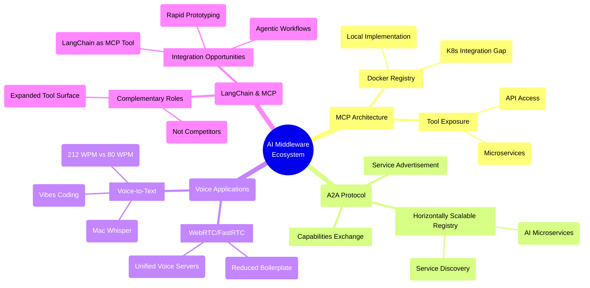

# Austin LangChain Office Hours Recap: MCP Architecture, A2A Protocol, and Voice Applications

Our April 22nd Austin LangChain AI Middleware Users Group (AIMUG) office hours session brought together six participants for a dynamic discussion on emerging technologies in the AI middleware space. The conversation spanned MCP architecture, agent-to-agent protocols, voice applications, and the evolving relationship between various AI frameworks.

<!-- truncate -->

## Meeting Overview

Our April 22nd Austin LangChain AI Middleware Users Group (AIMUG) office hours session brought together six participants for a dynamic discussion on emerging technologies in the AI middleware space. The conversation spanned MCP architecture, agent-to-agent protocols, voice applications, and the evolving relationship between various AI frameworks.

## MCP Architecture & Docker's New Registry

Joseph kicked off the session with insights from his MCP research, highlighting the straightforward implementation process. His Tableau LangChain library recently received recognition from an executive VP at the Tableau conference, demonstrating the growing enterprise interest in these technologies.

Karim shared his experience with Docker's efforts to create a Docker Hub for MCPs, generating a spirited debate about whether this approach truly adds value:

> "I'm actually disappointed with this revelation that this is still an MCP implementation for your local machine. This doesn't help me in a Kubernetes cluster," Karim noted during the discussion.

The group identified a significant gap in Kubernetes integration for MCPs, with Karim suggesting that a server-sent events (SSE) version of MCP would offer better scalability and security than Docker's current implementation, which many participants described as feeling "bolted on rather than baked in."

## The LangChain & MCP Relationship

An interesting discussion emerged around whether MCPs pose a threat to LangChain. Rather than seeing competition, the group identified complementary roles:

"I don't really see MCPs as a threat to LangChain," Karim explained. "MCPs expand the surface area for tool makers... Now the tool makers are making MCPs themselves, exposing their APIs and tooling as MCPs, and that makes it a lot easier because now you have a lot more tools to pick from for building your agentic workflows."

The consensus was that MCPs are primarily being used as plugins for cloud desktop environments, while LangChain excels at building comprehensive agent-based workflows. Several members highlighted opportunities for LangChain to be implemented as an MCP tool, creating new possibilities for rapid prototyping.

## Voice Applications with WebRTC/FastRTC

Karim introduced the group to FastRTC, demonstrating how it dramatically reduces boilerplate code when building voice applications:

"The quality of life improvements are significant. With WebRTC, there's a lot of setup involved... Fast RTC means I can create a voice application in just a handful of lines now."

This sparked an engaging conversation about creating unified voice servers that work seamlessly across web, mobile, and telephone interfaces. The group explored how the same code could be leveraged to handle multiple interface types with minimal additional configuration.

Robert and Karim debated the merits of native iOS applications versus web-based solutions for voice interactions, with Progressive Web Apps (PWAs) emerging as a compelling middle-ground solution that offers near-native experience without the development overhead.

## Agent-to-Agent Protocol (A2A)

Colin introduced the group to the A2A protocol concept for service advertisement and capabilities exchange between agents:

"If MCPs allow us to mount a tool or expose an agent as a tool to be mounted directly by another agent, the A2A protocol creates a horizontally scalable registry. It's almost like a service registration for AI microservices."

Karim suggested creating a practical demonstration to better illustrate the concept's potential, noting that "A2A started clicking when people started seeing them in action." Colin mentioned an upcoming meeting with Google Cloud to discuss their agent space implementation and A2A protocol, promising to share insights with the group in a future session.

## Voice-to-Text & "Vibes Coding"

The discussion turned to voice-driven coding workflows, with Colin sharing his experience using Mac Whisper for voice-to-text transcription to command agents:

"I can speak at 212 words a minute, and I can type between 60 and 80 if I'm really going for it. So I love transcribing to my AI coder."

This sparked a broader conversation about "vibes coding" and the convergence of no-code tools with coding agents. Karim proposed creating a voice agent that takes in prompts, executes workflows, and provides audio feedback—enabling development while performing other activities.

## Action Items

Several action items emerged from the discussion:

1. Colin is following up with Google Cloud about their agent space and A2A protocol
2. Karim will develop a showcase for A2A protocol implementation
3. Karim will create a voice agent using WebRTC/FastRTC for AI workflow interaction
4. Robert will explore mobile app options for voice interaction with AI agents
5. Ryan will complete workflows for Trello integration with AI agents

## Join Us Next Time

Our next office hours session will be held on Tuesday, April 29th at 2:00 PM Central. We'll follow up on action items and explore new developments in the AI middleware space.

Have questions or topics you'd like to discuss? Join our [Discord channel](https://discord.com/invite/JzWgadPFQd)
