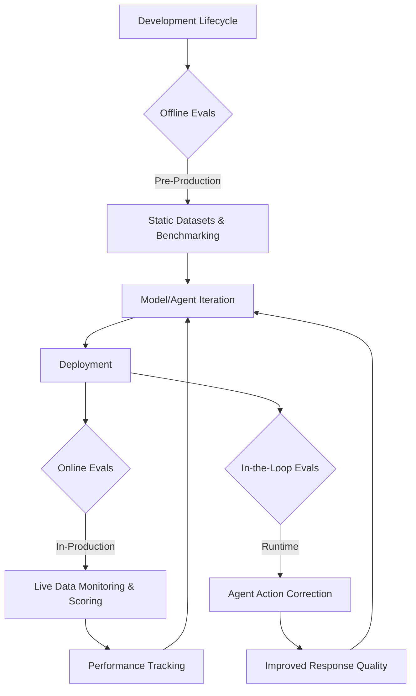
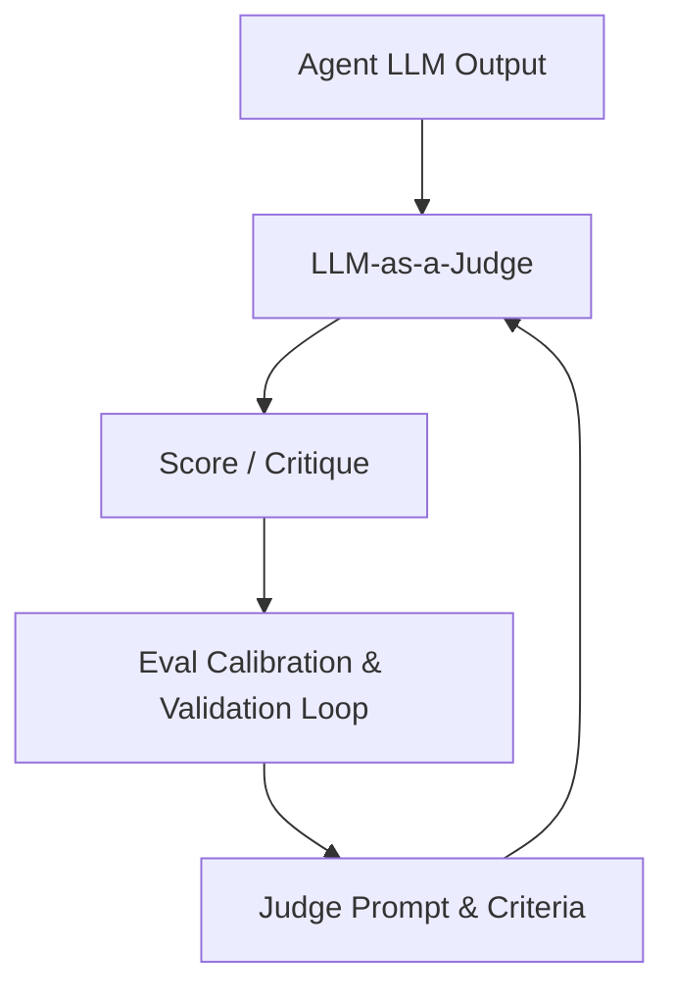
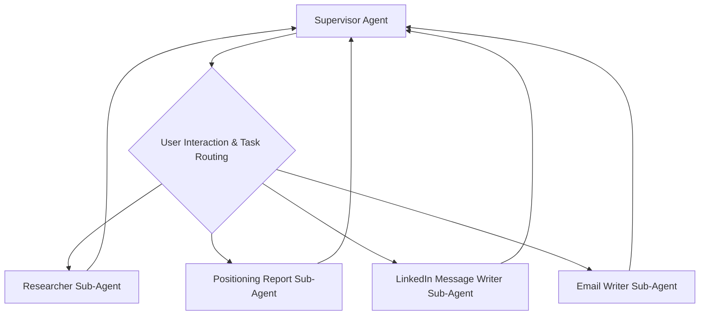
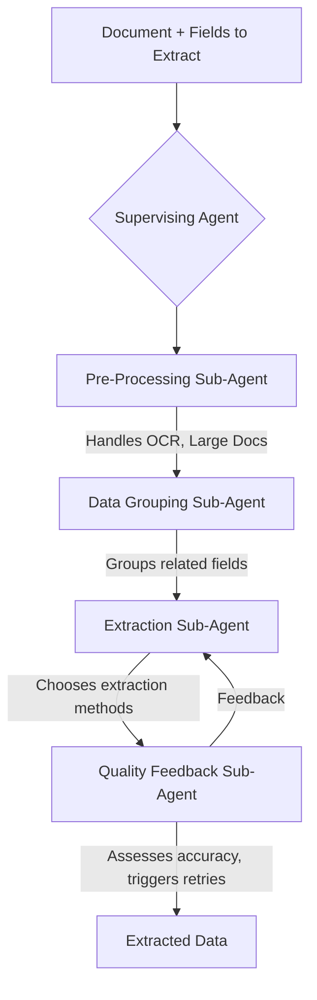
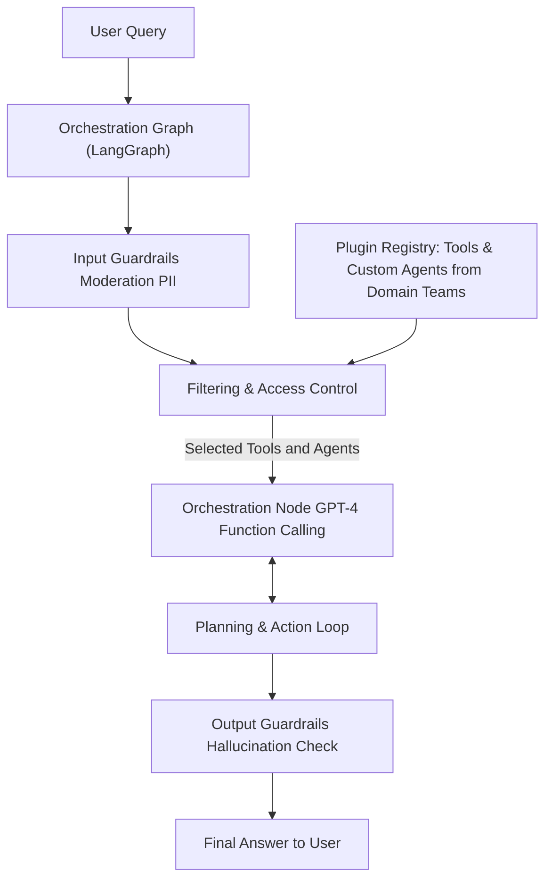
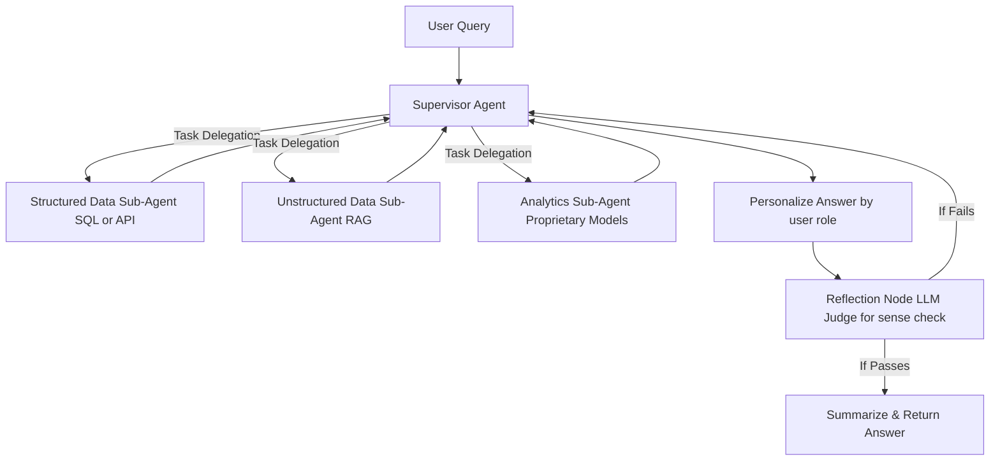
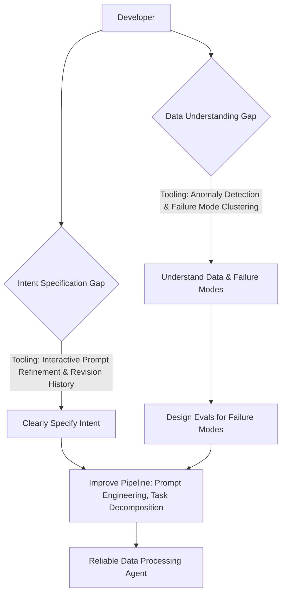
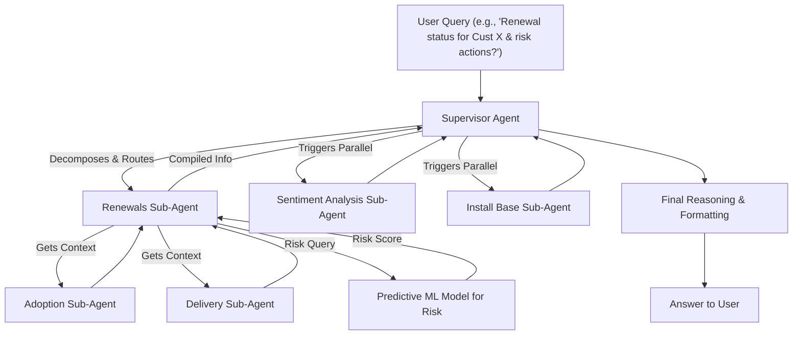

# Enterprise AI Insights from the Interrupt Conference: Real-World Deployment Strategies

*June 11, 2025 | Austin LangChain AI Middleware Users Group (AIMUG)*

The Interrupt Conference delivered a treasure trove of enterprise AI insights, and our Austin LangChain community was there to capture the most critical lessons. In a comprehensive panel discussion featuring six of our members who attended the conference, we distilled the practical wisdom from the front lines of AI deployment.

This isn't theoretical—these are battle-tested strategies from organizations like BlackRock, JP Morgan, Harvey, Monday.com, and others who are successfully deploying AI agents at enterprise scale.

<!-- truncate -->

## 🎯 The Enterprise Reality Check

The energy at Interrupt was palpable, but beneath the excitement lay a sobering truth: **moving from AI prototypes to production-ready enterprise systems requires fundamentally different approaches**. Our panelists—Colin McNamara, Collier King, Ricky Pirruccio, Karim Lalani, Cam, and Paul—brought back insights that every enterprise AI team needs to hear.

### The Four Pillars of Enterprise AI Success

Through analyzing dozens of presentations and real-world case studies, four critical themes emerged that separate successful enterprise AI deployments from failed experiments.

## 🏗️ Pillar 1: Build a Resilient Foundation - Evaluation and Observability Are Non-Negotiable

### The Evaluation Imperative

**"You need to have evaluations from day one."** This wasn't just advice—it was the drumbeat that echoed throughout Interrupt. Harrison Chase from LangChain emphasized that **quality, not latency or cost, is the number one blocker for getting agents into production**.

This represents a fundamental shift in how we approach AI development. Evaluation isn't an afterthought for mature projects; it's the foundation that enables everything else.

#### The Three-Phase Evaluation Lifecycle

Enterprise-grade AI systems require a sophisticated evaluation approach:

**1. Offline Evaluations**: Pre-production testing against static datasets and benchmarks, enabling rapid iteration on model and agent design.

**2. Online Evaluations**: Live production monitoring, scoring performance, and tracking real-world behavior patterns.

**3. In-the-Loop Evaluations**: Real-time course correction during execution—critical for high-stakes applications like financial transactions or long-running agent workflows.

### Enterprise Observability: Beyond Traditional Monitoring

**"Great evals start with great observability."** AI observability is fundamentally different from traditional system monitoring. It's not built for SREs—it's designed for the emerging "Agent Engineer" persona.

#### Key Differences in AI Observability:

- **Multimodal traces**: Large, unstructured data requiring specialized analysis
- **Tool trajectory tracking**: Understanding how agents use tools and make decisions
- **ML-specific metrics**: Beyond latency and throughput to include reasoning quality
- **Context engineering insights**: Visibility into prompt effectiveness and model behavior

#### Enterprise Preferences:

Our panelists noted strong enterprise preference for **self-hosted observability solutions** for:
- **Control and compliance**: Meeting regulatory requirements
- **Security**: Keeping sensitive data within organizational boundaries
- **Customization**: Adapting to specific enterprise workflows

### LLM-as-a-Judge: Powerful but Requires Careful Implementation

Using LLMs to evaluate other LLMs offers sophisticated assessment capabilities but demands careful engineering:

**Nubank's Success Story**: Their money transfer agent team iterated through six tests, improving their LLM-as-a-Judge F1 score from 51% to 79%—nearly matching human accuracy in just two weeks through careful prompt engineering and model tuning.

## 🤝 Pillar 2: Integrate the Human Element - Trust Through Control and Expertise

### The Trust Barrier

**"Trust, not technology, is the biggest barrier to AI agent adoption."** This insight from Monday.com's Assaf resonated throughout the conference. Technical capability means nothing if users don't trust the system.

#### Building Trust Through Design:

**User Control & Autonomy**: While engineers love fully autonomous agents, users often have different risk appetites. Monday.com found that giving users control over agent autonomy levels dramatically increased adoption.

**Previews Before Actions**: Users froze when agents directly modified production data. Introducing preview functionality before committing changes significantly increased adoption by alleviating concerns about irreversible actions.

**Explainability for Learning**: Users need to understand why an agent produced specific outputs, enabling them to learn how to interact with and guide AI more effectively over time.

### Domain Expertise Integration: The Harvey Model

**Harvey's "Lawyer-on-the-Loop" Approach** demonstrates how to embed domain expertise throughout the development lifecycle:

- **Use case identification**: Lawyers identify complex scenarios requiring AI assistance
- **Evaluation rubric creation**: Domain experts define success criteria
- **UI iteration**: Continuous feedback on user experience
- **End-to-end testing**: Real-world validation with actual practitioners

> "Harvey's strategy involves integrating lawyers at every stage of product development. Their domain expertise and user empathy are considered critical in shaping effective legal AI products." – Ben Lewald (Harvey)

### High-Stakes Human-in-the-Loop: JP Morgan's Approach

**JP Morgan's "AskDavid"** for investment research demonstrates human-AI collaboration in high-stakes environments:

- **Human Subject Matter Experts (SMEs)** provide the "last mile" of accuracy
- **100% AI accuracy may not be feasible** in complex financial domains
- **Human oversight ensures reliability** when billions of dollars are at risk

> "In high-stakes financial applications, where 100% AI accuracy may be unattainable, JP Morgan ensures reliability by incorporating Human Subject Matter Experts (SMEs) in the loop." – Jane (JP Morgan)

## 🏢 Pillar 3: Architect for Enterprise Scale - From Prototypes to Production

### Multi-Agent Architecture Evolution

#### 11x's Journey: From Simple to Sophisticated

The 11x team's evolution of their AI SDR "Alice" provides a masterclass in architectural progression:

**Key Learning**: "The multi-agent architecture provided the best of both worlds: the flexibility of a React-based agent combined with the performance characteristics of a structured workflow."

#### Box's Metadata Extraction: Agentic from the Start

Ben Kuss from Box re-architected their metadata extraction from traditional pipelines to multi-agent systems:

**Key Insight**: "An agentic-based approach offers a cleaner engineering abstraction. For new intelligent features, especially with unstructured data or complex workflows: build agentic, build it early."

### Enterprise-Grade Deployment Patterns

#### BlackRock's Federated Plugin Registry

BlackRock's Aladdin Copilot demonstrates enterprise-scale agent orchestration:

**Key Features**:
- **Federated approach**: Various engineering teams onboard domain-specific tools
- **Centralized orchestration**: Maintains control while enabling distributed development
- **Evaluation-driven development**: Rigorous testing of each intended behavior

#### JP Morgan's Multi-Agent Investment Research

**Development Strategy**: "Start simple and refactor often. Build and validate specialized sub-agents first, then integrate them with a supervisor agent."

### Core Architectural Principles

#### Tools Over Skills
**Equip agents with external tools** rather than building all capabilities internally:
- More modular and maintainable
- Token-efficient, minimizing context usage
- Enables rapid capability expansion

#### Mental Models Matter
The 11x team found that viewing agents as **"human coworkers" or "teams"** led to better architectural decisions than thinking of them as user flows.

#### Bridging the Gaps (Shreya Shankar, UC Berkeley)

**Two Critical Gaps**:
1. **Data Understanding Gap**: Knowing what's in your data and its unique failure modes
2. **Intent Specification Gap**: Clearly defining what you really want the agent to do

## 🚀 Pillar 4: Platform Thinking - Building for Scale and Collaboration

### The Emergence of the "Agent Engineer"

Harrison Chase coined the term **"Agent Engineer"**—a new professional profile combining:
- **Prompting expertise**: Crafting effective agent instructions
- **Engineering skills**: Building robust, scalable systems
- **Product sense**: Understanding user needs and business value
- **Machine learning knowledge**: Optimizing model performance

### Platform Evolution: LangChain's Vision

LangChain's platform approach addresses enterprise needs:

#### **LangGraph for Controllable Orchestration**
- Low-level, unopinionated framework
- Supreme control over cognitive architecture
- Context engineering capabilities
- Reliable agent behavior patterns

#### **LangSmith as Collaborative Platform**
- Brings together diverse team members (product, ML, engineering)
- AI-specific observability and evaluation tools
- Prompt engineering and management capabilities
- Production trace debugging

#### **Democratizing Agent Building**
- LangGraph Prebuilts for AI newcomers
- LangGraph Studio V2 with production debugging
- Open-source OpenAgent Platform for no-code building

### Enterprise Platform Patterns

#### LinkedIn's Agent Platform Strategy

LinkedIn made a strategic decision to **standardize on Python for GenAI**, building:
- Internal app framework on LangGraph
- Messaging-based asynchronous multi-agent systems
- Layered memory system
- Centralized "Skill Registry" for reusable tools and agents

#### Cisco's Agentic CX Architecture

**Key Features**:
- Use-case-driven development with clear metrics
- Hybrid approach combining GenAI and traditional ML
- 95%+ accuracy with significant time savings
- Open-source "Agency" architecture for inter-agent collaboration

## 📊 Enterprise Infrastructure Considerations

### Self-Hosted Solutions Preference

Enterprises consistently prefer self-hosted solutions for:
- **Control**: Full ownership of deployment and configuration
- **Security**: Sensitive data remains within organizational boundaries
- **Compliance**: Meeting regulatory requirements (FedRAMP, SOC 2)
- **Customization**: Adapting to specific enterprise workflows

### Scalability Patterns

Production agent systems require unique infrastructure considerations:
- **Long-running processes**: Agents may operate for extended periods
- **Bursty workloads**: Unpredictable resource demands
- **Stateful operations**: Maintaining context across interactions
- **Error recovery**: Robust fallback mechanisms

### Vendor Strategy

**Leveraging specialized vendors** (like LangChain for dev tools) enables:
- **Speed to market**: Focus on core differentiators
- **Expertise access**: Benefit from specialized knowledge
- **Reduced maintenance**: Outsource non-core infrastructure

## 🔮 Future-Proofing Enterprise AI

### Model Adaptability

**Be ready for capability jumps**: New model releases can transform struggling agents into production-ready systems. As Amjad from Replit shared, Sonnet 3.5 made their agent work "like magic."

### Continuous Learning Culture

The pace of AI innovation demands:
- **Rapid adaptation cycles**: Planning horizons of ~2 months
- **Continuous skill development**: Agent engineering capabilities
- **Community engagement**: Shared learning and best practices
- **Experimental mindset**: Willingness to iterate and refactor

## 🎯 Austin LangChain Community Response

Inspired by these insights, our community is taking action:

### Documentation Project
Converting conference insights into accessible resources, ensuring valuable lessons reach the broader community.

### Hands-On Workshops
Upcoming sessions focusing on:
- **Observability implementation** (LangSmith & LangFuse)
- **Practical evaluation methods** (from quick prototypes to sophisticated calibration)
- **Enterprise deployment strategies** (multi-agent systems, state management)

### Best Practices Sharing
Creating templates and patterns for:
- **Evaluation-driven development**
- **Human-in-the-loop workflows**
- **Multi-agent architectures**
- **Enterprise security and compliance**

## 📈 Summary: The Enterprise AI Playbook

| Component | Enterprise Requirement | Implementation Strategy |
|-----------|------------------------|------------------------|
| **Foundation** | Robust evaluation and observability | Three-phase evaluation lifecycle, AI-specific monitoring |
| **Human Integration** | Trust through control and expertise | Domain expert involvement, user autonomy, explainability |
| **Architecture** | Scalable, reliable, compliant | Multi-agent patterns, federated registries, self-hosted solutions |
| **Platform** | Collaborative development environment | Agent engineering tools, standardized frameworks, reusable components |

The Interrupt Conference revealed that enterprise AI success isn't about having the most advanced models—it's about building robust, trustworthy systems that integrate seamlessly with human expertise and organizational processes.

## 🔗 Coming Up in This Series

This is the third post in our comprehensive June 2025 series. Coming next:

- **[Part 4](/blog/specialized-ai-applications-series-part-4)**: Specialized AI Applications - From nuclear regulatory compliance to advanced testing methodologies
- **[Part 5](/blog/ai-ecosystem-2025-complete-landscape-series-part-5)**: AI Ecosystem 2025 - The complete development landscape and future trends

**Previous in this series:**
- **[Part 1](/blog/langchain-ecosystem-milestone-series-part-1)**: LangChain Surpasses OpenAI SDK - The AI ecosystem reaches production maturity
- **[Part 2](/blog/ag-ui-protocol-series-part-2)**: AG-UI Protocol - The "USB-C for AI Agents" revolutionizing human-AI collaboration

---

*The Austin LangChain AI Middleware Users Group (AIMUG) continues to bridge the gap between cutting-edge AI research and practical enterprise implementation. Join our community at [aimug.org](https://aimug.org) to participate in workshops, hackathons, and discussions shaping the future of enterprise AI.*

**Connect with our community:**
- [Colin McNamara](https://www.linkedin.com/in/colinmcnamara/) - AIMUG Co-organizer, LangChain Ambassador
- [Ricky Pirruccio](https://www.linkedin.com/in/riccardopirruccio/) - Community Contributor, RickysTech
- [Community Discord](https://discord.gg/JzWgadPFQd) - Join our active discussions

**Resources mentioned:**
- [Interrupt Conference Panel Recording](https://www.youtube.com/embed/Owvcy7GIvEY?start=3999)
- [LangChain Platform Documentation](https://docs.langchain.com/)
- [LangSmith Observability Guide](https://docs.smith.langchain.com/)
- [Enterprise AI Best Practices](https://blog.langchain.dev/enterprise-ai-best-practices/)

**Source Documentation:**
- [Interrupt Conference Takeaways](/docs/jun-2025/full-sessions/interrupt-conference-takeaways) - Complete conference analysis
- [June 2025 Documentation Overview](/docs/jun-2025/) - Full monthly documentation
- [Enterprise Agent Architectures](/docs/apr-2025/agent-architectures) - Architectural patterns and best practices
- [LangChain Ecosystem News: June 2025](/docs/jun-2025/news/langchain-ecosystem-news-june-2025) - Ecosystem context and trends
