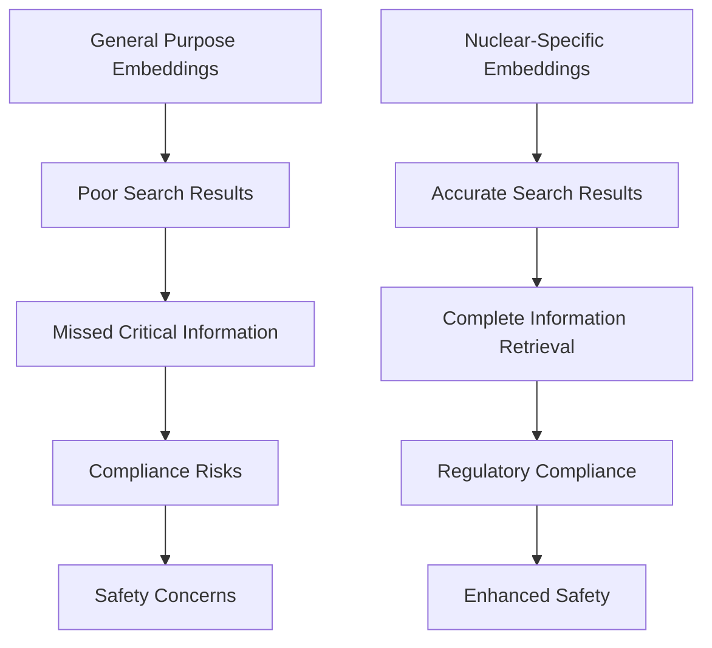
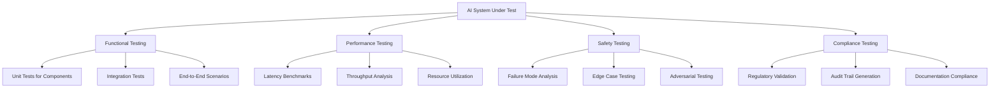
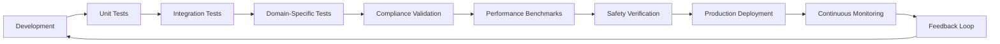
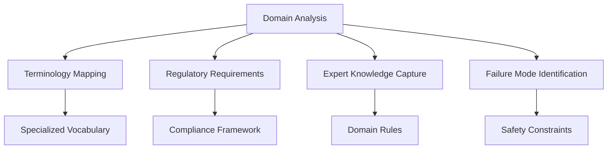
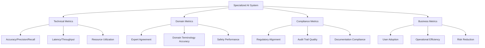

# Specialized AI Applications: From Nuclear Regulatory to Advanced Testing

*June 12, 2025 | Austin LangChain AI Middleware Users Group (AIMUG)*

While much of the AI conversation focuses on general-purpose applications, some of the most impactful work happens in highly specialized domains. Our June 2025 sessions showcased remarkable examples of AI applications in nuclear regulatory compliance and advanced testing methodologies—domains where precision, safety, and regulatory compliance are paramount.

These aren't just technical curiosities; they represent the future of AI in critical industries where failure isn't an option.

<!-- truncate -->

## 🎯 The Specialized AI Challenge

Working with AI in specialized domains presents unique challenges that general-purpose solutions simply can't address:

- **Domain-specific terminology** that general models don't understand
- **Regulatory compliance requirements** that demand precision and auditability
- **Safety-critical applications** where errors have serious consequences
- **Limited training data** in highly specialized fields
- **Expert knowledge integration** that requires deep domain understanding

Our June sessions demonstrated how to overcome these challenges with practical, production-ready solutions.

## ⚛️ Case Study 1: Fine-tuning Embeddings for Nuclear Power

### The Nuclear Domain Challenge

Rob Whelan from Gridway AI presented a masterclass in domain-specific AI adaptation, demonstrating how to fine-tune embeddings for nuclear power applications. The nuclear industry presents unique challenges for AI systems:

#### The Jargon Problem

Nuclear power is filled with specialized terminology that general-purpose embeddings simply don't understand:

- **Acronym overload**: LWR (Light Water Reactors), GEN4+, BWR, PWR, and hundreds more
- **Context-specific meanings**: Terms like "coolant" and "moderator" have precise nuclear meanings
- **Technical precision**: Safety-critical terminology requires exact understanding
- **Regulatory language**: Compliance documents use highly specific phrasing

#### The Search Impact

When embeddings don't understand nuclear terminology, the consequences are significant:



### The Technical Solution

#### Infrastructure and Approach

The fine-tuning process required careful technical planning:

**Infrastructure Requirements:**
- **GPU with substantial memory**: AWS `ml.g6.16xlarge` instance
- **PyTorch framework**: For model training and optimization
- **Base model**: Started with `BAAI/bge-base-en-v1.5` (768 dimensions)

**Training Strategy:**
- **MultipleNegativesRankingLoss**: Specialized loss function for embedding training
- **Positive and negative pairs**: Including challenging "hard negatives"
- **80/20 train/validation split**: Standard machine learning practice
- **10,000 training examples**: Generated using GPT-4o-mini from regulatory texts

#### Training Data Generation

The key to success was high-quality, domain-specific training data:

```python
# Example training data structure
{
    "query": "What is the purpose of the Rapid Borate Stop Valve?",
    "positive": "Locates and discusses opening 1CV175, Rapid Borate Stop Valve by disengaging clutch and rotating handwheel (counterclockwise).",
    "negative": "Standard valve operation procedures for non-nuclear applications."
}
```

**Data Generation Process:**
1. **Source material**: Dozens of nuclear regulatory documents
2. **GPT-4o-mini generation**: Created positive and negative pairs
3. **Hard negatives inclusion**: Similar but importantly different examples
4. **Domain expert review**: Validation by nuclear professionals

### Dramatic Results

#### Before and After Comparison

The improvements were immediately apparent:

**Before Fine-tuning:**
- "coolant" was semantically distant from nuclear-specific terms
- General embeddings missed critical nuclear relationships
- Search results included irrelevant general engineering content

**After Fine-tuning:**
- "coolant" and "moderator" properly related in nuclear context
- Nuclear-specific acronyms correctly understood
- Search results focused on relevant nuclear procedures

#### Implementation Example

```python
from sentence_transformers import SentenceTransformer, util

# Load the fine-tuned nuclear model
model = SentenceTransformer("gridwayai/nuclear-licensing-embeddings-768")

# Nuclear-specific queries
sentences = [
    'What is the purpose of the Rapid Borate Stop Valve in Reactor Control?',
    'Locates and discusses opening 1CV175, Rapid Borate Stop Valve by disengaging clutch and rotating handwheel (counterclockwise).',
    'CLOSE the Air Supply Isolation Valve, 12CV160 A/S, AIR SUPPLY FOR 12CV160.',
]

# Generate nuclear-aware embeddings
embeddings = model.encode(sentences)
# Returns vectors that understand nuclear context
```

### Real-World Applications

#### Operational Impact

The fine-tuned embeddings enable:

**Enhanced Search Capabilities:**
- **Faster procedure location**: Operators find relevant procedures quickly
- **Natural language queries**: No need to know exact terminology
- **Cross-reference automation**: Related safety procedures automatically surfaced
- **Compliance verification**: Regulatory requirements easily searchable

**Safety and Compliance Benefits:**
- **Reduced human error**: Better information retrieval reduces mistakes
- **Faster incident response**: Critical procedures found immediately
- **Training enhancement**: New operators learn faster with better search
- **Audit preparation**: Compliance documentation easily accessible

#### Use Case Examples

**Operator Training:**
```
Query: "emergency coolant injection procedures"
Results: Specific ECCS (Emergency Core Cooling System) procedures,
         related safety protocols, and training materials
```

**Maintenance Planning:**
```
Query: "valve maintenance schedule for primary loop"
Results: Specific maintenance procedures, inspection requirements,
         and regulatory compliance checklists
```

**Incident Investigation:**
```
Query: "similar events to coolant temperature anomaly"
Results: Historical incident reports, corrective actions,
         and lessons learned documentation
```

### Open Source Contribution

#### Community Impact

Gridway AI made the model publicly available, demonstrating the power of open source in specialized domains:

**Available Resources:**
- **Hugging Face Model**: [gridwayai/nuclear-licensing-embeddings-768](https://huggingface.co/gridwayai/nuclear-licensing-embeddings-768)
- **Gridway AI SDK**: Complete implementation toolkit
- **Training Notebook**: Full code for replication and adaptation
- **Sample Data**: 10,000 training examples with hard negatives

**Community Benefits:**
- **Shared expertise**: Nuclear organizations benefit from collective knowledge
- **Reduced duplication**: No need for each organization to start from scratch
- **Continuous improvement**: Community contributions enhance the model
- **Industry standardization**: Common understanding of nuclear terminology

## 🧪 Case Study 2: Advanced Testing Methodologies

### The Testing Evolution

While the nuclear case study focused on embeddings, our June sessions also explored advanced testing methodologies for AI systems in specialized domains. These approaches are crucial for any organization deploying AI in high-stakes environments.

#### Multi-Modal Testing Approaches

Modern AI systems require sophisticated testing strategies:



#### Domain-Specific Test Scenarios

**Nuclear Power Testing:**
- **Regulatory compliance scenarios**: Testing against NRC requirements
- **Safety system validation**: Emergency response procedure accuracy
- **Terminology precision**: Ensuring correct technical language usage
- **Historical incident simulation**: Testing against known failure modes

**Financial Services Testing:**
- **Regulatory compliance**: SOX, Basel III, GDPR requirements
- **Risk assessment accuracy**: Credit scoring and fraud detection
- **Market volatility scenarios**: Stress testing under extreme conditions
- **Audit trail completeness**: Full transaction traceability

**Healthcare Testing:**
- **HIPAA compliance**: Privacy and security validation
- **Clinical accuracy**: Medical terminology and procedure correctness
- **Patient safety scenarios**: Error detection and prevention
- **Regulatory submission**: FDA and other agency requirements

### Testing Framework Architecture

#### Comprehensive Testing Pipeline



#### Key Testing Components

**1. Domain Knowledge Validation:**
- **Expert review processes**: Subject matter expert involvement
- **Terminology accuracy**: Specialized vocabulary testing
- **Regulatory alignment**: Compliance requirement verification
- **Historical validation**: Testing against known good outcomes

**2. Safety and Reliability Testing:**
- **Failure mode analysis**: Systematic evaluation of potential failures
- **Edge case exploration**: Testing boundary conditions
- **Adversarial testing**: Resistance to malicious inputs
- **Graceful degradation**: Behavior under system stress

**3. Performance and Scalability:**
- **Load testing**: System behavior under high demand
- **Latency optimization**: Response time requirements
- **Resource efficiency**: Memory and compute utilization
- **Scalability validation**: Growth capacity verification

## 🏗️ Implementation Patterns for Specialized AI

### Domain Adaptation Strategy

#### The Four-Phase Approach

**Phase 1: Domain Analysis**


**Phase 2: Data Preparation**
- **Source material collection**: Regulatory documents, procedures, standards
- **Expert annotation**: Domain specialist review and validation
- **Synthetic data generation**: AI-assisted training data creation
- **Quality assurance**: Multi-level validation processes

**Phase 3: Model Adaptation**
- **Base model selection**: Choosing appropriate foundation models
- **Fine-tuning strategy**: Domain-specific optimization approaches
- **Evaluation framework**: Specialized metrics and benchmarks
- **Iterative improvement**: Continuous refinement processes

**Phase 4: Deployment and Monitoring**
- **Compliance validation**: Regulatory requirement verification
- **Performance monitoring**: Continuous quality assessment
- **Expert feedback integration**: Ongoing domain specialist input
- **Safety monitoring**: Real-time risk assessment

### Technical Implementation Patterns

#### Embedding Fine-tuning Pipeline

```python
# Specialized embedding fine-tuning workflow
class DomainEmbeddingTrainer:
    def __init__(self, base_model, domain_data):
        self.base_model = base_model
        self.domain_data = domain_data
        self.training_config = self._setup_training()
    
    def prepare_training_data(self):
        """Generate positive/negative pairs with hard negatives"""
        return self._create_training_pairs()
    
    def fine_tune(self):
        """Execute domain-specific fine-tuning"""
        return self._train_with_domain_loss()
    
    def validate_performance(self):
        """Test against domain-specific benchmarks"""
        return self._domain_evaluation()
    
    def deploy_model(self):
        """Deploy with monitoring and compliance tracking"""
        return self._production_deployment()
```

#### Compliance Testing Framework

```python
# Domain-specific compliance testing
class ComplianceTestSuite:
    def __init__(self, domain_requirements):
        self.requirements = domain_requirements
        self.test_cases = self._generate_test_cases()
    
    def regulatory_compliance_test(self):
        """Validate against regulatory requirements"""
        return self._check_regulatory_alignment()
    
    def safety_validation_test(self):
        """Verify safety-critical functionality"""
        return self._safety_scenario_testing()
    
    def expert_review_test(self):
        """Subject matter expert validation"""
        return self._expert_evaluation()
    
    def audit_trail_test(self):
        """Ensure complete audit traceability"""
        return self._audit_compliance_check()
```

## 📊 Measuring Success in Specialized Domains

### Domain-Specific Metrics

#### Beyond Standard AI Metrics

Traditional AI metrics (accuracy, precision, recall) are necessary but not sufficient for specialized domains:

**Nuclear Power Metrics:**
- **Regulatory compliance score**: Alignment with NRC requirements
- **Safety procedure accuracy**: Correctness of critical procedures
- **Expert agreement rate**: Validation by nuclear professionals
- **Incident prevention capability**: Ability to surface relevant safety information

**Financial Services Metrics:**
- **Regulatory compliance**: SOX, Basel III, GDPR alignment
- **Risk assessment accuracy**: Credit and fraud detection performance
- **Audit trail completeness**: Full transaction traceability
- **Market stress resilience**: Performance under extreme conditions

**Healthcare Metrics:**
- **Clinical accuracy**: Medical terminology and procedure correctness
- **Patient safety score**: Error detection and prevention capability
- **HIPAA compliance**: Privacy and security validation
- **Provider acceptance rate**: Healthcare professional adoption

### Success Measurement Framework

#### Comprehensive Evaluation Approach



## 🚀 Future Directions in Specialized AI

### Emerging Trends

#### Cross-Domain Learning

**Pattern Recognition Across Industries:**
- **Regulatory compliance patterns**: Common approaches across industries
- **Safety system architectures**: Shared safety-critical design patterns
- **Expert knowledge integration**: Standardized approaches to domain expertise
- **Testing methodologies**: Reusable testing frameworks

#### Advanced Techniques

**Multi-Modal Domain Adaptation:**
- **Text + Visual**: Combining document analysis with visual inspection
- **Audio + Text**: Voice-activated safety systems with text validation
- **Sensor + Language**: IoT data integration with natural language interfaces
- **Time Series + Text**: Historical data analysis with textual context

### Technology Evolution

#### Next-Generation Capabilities

**Enhanced Fine-tuning Approaches:**
- **Few-shot domain adaptation**: Rapid adaptation with minimal data
- **Continual learning**: Ongoing improvement without catastrophic forgetting
- **Multi-task learning**: Simultaneous optimization for multiple domain tasks
- **Federated learning**: Collaborative improvement across organizations

**Advanced Safety Mechanisms:**
- **Formal verification**: Mathematical proof of safety properties
- **Adversarial robustness**: Resistance to malicious inputs
- **Uncertainty quantification**: Confidence estimation for critical decisions
- **Explainable AI**: Clear reasoning for regulatory compliance

## 🎯 Austin LangChain Community Impact

### Knowledge Sharing Initiative

Our community is actively working to democratize specialized AI knowledge:

#### Open Source Contributions

**Nuclear Power AI Resources:**
- **Model sharing**: Public availability of fine-tuned embeddings
- **Training methodologies**: Open source training pipelines
- **Evaluation frameworks**: Standardized testing approaches
- **Best practices documentation**: Comprehensive implementation guides

**Cross-Industry Patterns:**
- **Compliance frameworks**: Reusable regulatory compliance patterns
- **Safety testing suites**: Standardized safety validation approaches
- **Expert integration patterns**: Methods for domain specialist involvement
- **Monitoring and alerting**: Production deployment best practices

#### Community Workshops

**Upcoming Sessions:**
- **Domain-Specific Fine-tuning Workshop**: Hands-on embedding customization
- **Compliance Testing Masterclass**: Regulatory validation techniques
- **Safety-Critical AI Design**: Architecture patterns for high-stakes applications
- **Expert Integration Strategies**: Involving domain specialists effectively

### Industry Collaboration

#### Building Bridges

**Cross-Industry Learning:**
- **Nuclear ↔ Healthcare**: Safety-critical system design patterns
- **Finance ↔ Nuclear**: Regulatory compliance frameworks
- **Healthcare ↔ Finance**: Privacy and security best practices
- **All Industries**: Expert knowledge integration strategies

**Shared Challenges:**
- **Regulatory compliance**: Common approaches across industries
- **Safety validation**: Shared testing and verification methods
- **Expert integration**: Standardized domain specialist involvement
- **Audit and traceability**: Common documentation and tracking needs

## 📈 Key Takeaways for Specialized AI

### Implementation Success Factors

| Factor | Nuclear Power Example | General Application |
|--------|----------------------|-------------------|
| **Domain Understanding** | Nuclear terminology and safety protocols | Deep industry knowledge required |
| **Expert Integration** | Nuclear engineers in development loop | Subject matter experts throughout process |
| **Regulatory Compliance** | NRC requirements and safety standards | Industry-specific regulatory frameworks |
| **Safety Validation** | Emergency procedure accuracy | Domain-appropriate safety testing |
| **Continuous Monitoring** | Real-time safety system monitoring | Ongoing performance and compliance tracking |

### Critical Success Patterns

**1. Start with Domain Experts:**
- Involve specialists from day one
- Validate assumptions continuously
- Build domain knowledge into the team

**2. Prioritize Safety and Compliance:**
- Design for regulatory requirements
- Implement comprehensive testing
- Maintain audit trails

**3. Invest in Quality Data:**
- Domain-specific training data
- Expert-validated examples
- Comprehensive edge case coverage

**4. Plan for Continuous Improvement:**
- Feedback loops with domain experts
- Regular model updates
- Evolving compliance requirements

## 🔗 Coming Up in This Series

This is the fourth post in our comprehensive June 2025 series. Coming next:

- **Part 5**: AI Ecosystem 2025 - The complete development landscape, emerging tools, and future trends shaping the industry

---

*The Austin LangChain AI Middleware Users Group (AIMUG) continues to explore the frontiers of specialized AI applications. Join our community at [aimug.org](https://aimug.org) to participate in workshops, hackathons, and discussions about domain-specific AI implementation.*

**Connect with our community:**
- [Colin McNamara](https://www.linkedin.com/in/colinmcnamara/) - AIMUG Co-organizer, LangChain Ambassador
- [Rob Whelan](https://www.linkedin.com/in/rob-whelan-gridway/) - Gridway AI, Nuclear AI Specialist
- [Community Discord](https://discord.gg/JzWgadPFQd) - Join our specialized AI discussions

**Resources mentioned:**
- [Nuclear Embeddings Model](https://huggingface.co/gridwayai/nuclear-licensing-embeddings-768) - Fine-tuned nuclear power embeddings
- [Gridway AI SDK](https://github.com/gridwayai/gridwayai-sdk) - Nuclear AI development toolkit
- [Lightning Talk Recording](https://www.youtube.com/embed/Owvcy7GIvEY?start=2053) - Complete nuclear AI presentation
- [Training Notebook](https://github.com/gridwayai/nuclear-embeddings-training) - Implementation details

**Source Documentation:**
- [AI Finetuning for Nuclear Regulatory](/docs/jun-2025/lightning-talks/ai-finetuning-nuclear-regulatory) - Complete technical documentation
- [June 2025 Documentation Overview](/docs/jun-2025/) - Full monthly documentation
- [Specialized AI Applications](/docs/jun-2025/lightning-talks/) - Additional specialized use cases
- [Enterprise AI Best Practices](/docs/apr-2025/agent-architectures) - Architectural patterns for specialized domains
