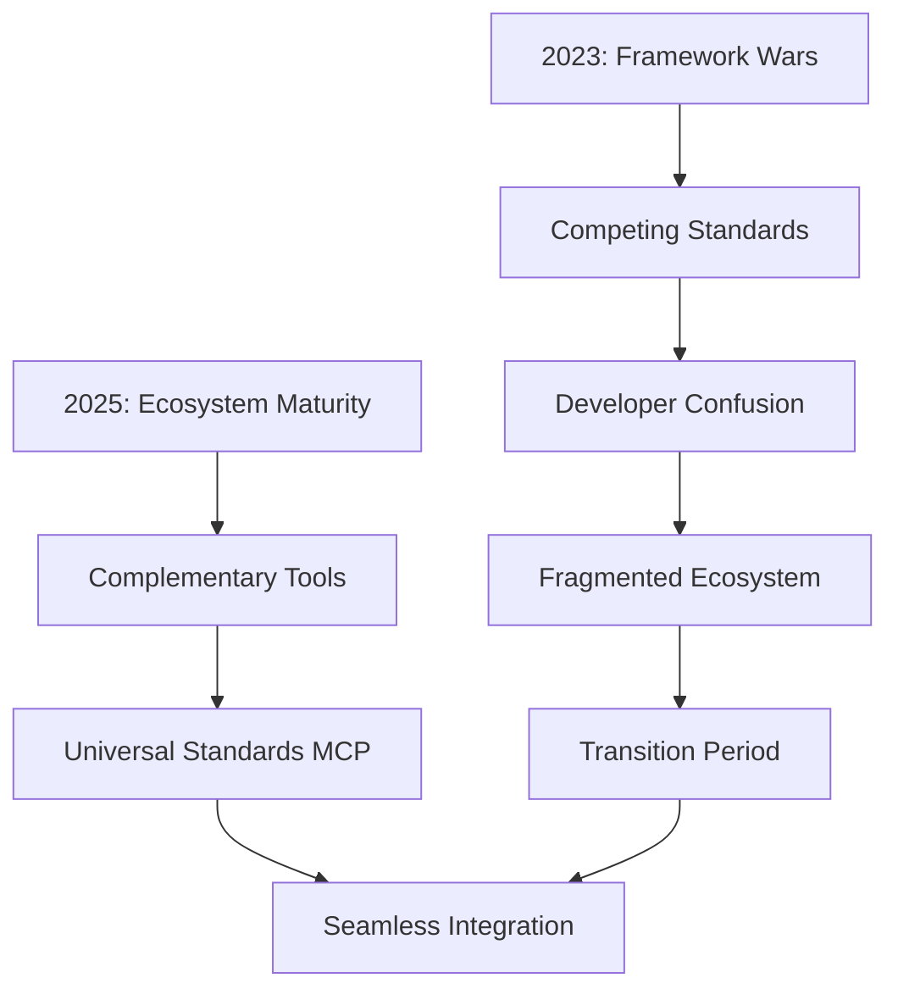
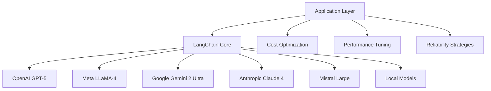
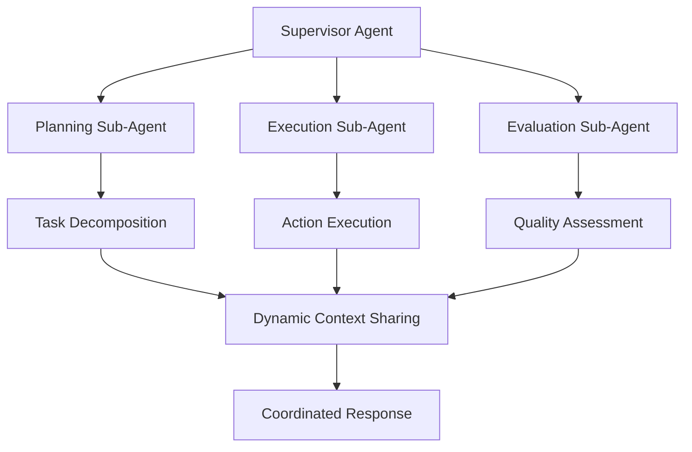
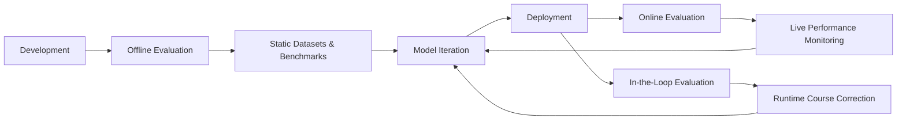
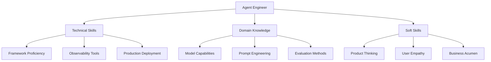
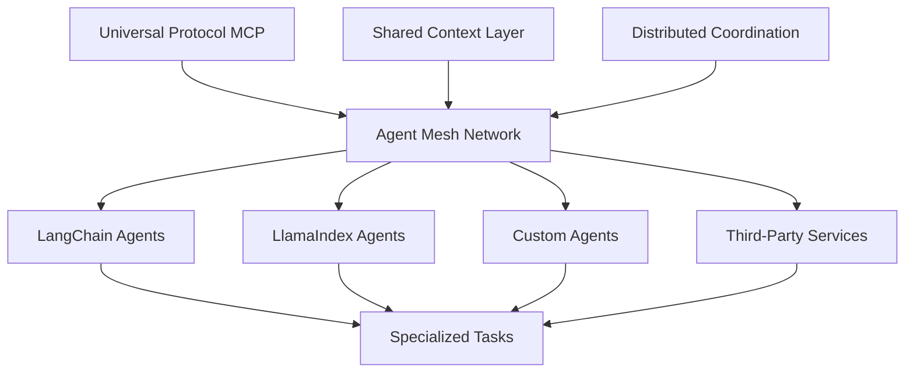
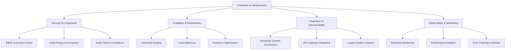

# AI Ecosystem 2025: The Complete Development Landscape and Future Trends

*June 13, 2025 | Austin LangChain AI Middleware Users Group (AIMUG)*

We've reached a pivotal moment in AI development. The "framework wars" are ending—not because one tool won, but because the ecosystem has evolved to make tool choice less critical. Universal standards like MCP (Model Context Protocol) are enabling seamless integration, while AI IDEs are revolutionizing how we build intelligent applications.

This is the final post in our comprehensive June 2025 series, synthesizing insights from the Interrupt Conference, specialized applications, and the broader ecosystem transformation. We're witnessing the transition from experimental chaos to production-ready maturity.

<!-- truncate -->

## 🌟 The Great Transformation: From Chaos to Maturity

### The End of Framework Wars

The AI development landscape has fundamentally shifted. Where once developers agonized over choosing between LangChain, LlamaIndex, or building from scratch, we now see these tools finding complementary niches in a mature ecosystem.



**Key Transformation Indicators:**
- **LangChain now exceeds OpenAI SDK in monthly Python downloads**
- **Universal integration standards** (MCP) enabling tool interoperability
- **Specialized tools** finding distinct, valuable niches
- **Production-grade infrastructure** replacing experimental prototypes

### The New AI Development Stack

#### Foundation Layer: Universal Integration
**Model Context Protocol (MCP)** has emerged as the universal standard, enabling:
- **Seamless tool integration** across different frameworks
- **Vendor independence** from specific model providers
- **Standardized agent communication** protocols
- **Cross-platform collaboration** capabilities

#### Framework Layer: Specialized Excellence
Rather than one-size-fits-all solutions, we see specialized excellence:

**LangChain**: The integration hub
- Universal model support (GPT-5, LLaMA-4, Gemini 2 Ultra, Claude 4)
- Enterprise connectors (SAP, Salesforce, ServiceNow)
- Production-ready templates and deployment strategies

**LangGraph**: Controllable orchestration
- Low-level, graph-based agent workflows
- Supreme control over cognitive architecture
- Multi-agent coordination and complex workflows

**LlamaIndex**: Data-centric applications
- Advanced RAG (Retrieval-Augmented Generation) capabilities
- Specialized indexing and retrieval strategies
- Document processing and knowledge management

**Google ADK**: Enterprise integration
- Google Cloud native development
- Enterprise security and compliance features
- Scalable infrastructure integration

#### Platform Layer: Production Infrastructure
**LangSmith** and emerging observability platforms provide:
- **AI-specific monitoring** and debugging capabilities
- **Evaluation frameworks** for agent performance
- **Collaborative development** environments
- **Production deployment** and scaling tools

## 📊 LangChain Ecosystem: The Central Hub

### Dominance Through Integration

LangChain's success stems not from being the "best" framework, but from becoming the **universal integration layer** for AI applications.

#### Model Optionality Revolution



**Strategic Advantages:**
- **Switch models** for cost, performance, and reliability optimization
- **Combine models** for specialized tasks within single applications
- **Future-proof** applications against model provider changes
- **Optimize costs** through intelligent model selection

#### Enterprise Connector Ecosystem

The expansion into enterprise systems marks LangChain's evolution from developer tool to business platform:

**New Enterprise Integrations:**
- **SAP**: ERP and business process integration
- **Salesforce**: CRM and customer data connectivity
- **ServiceNow**: IT service management and workflow automation
- **Vector Databases**: Enhanced support for enterprise vector stores
- **On-Device Models**: Local deployment for privacy-sensitive applications

### Production-Ready Infrastructure

#### LangGraph Platform: Generally Available

The transition from experimental to production-grade is exemplified by LangGraph Platform's GA release:

**Scalable Infrastructure:**
- **1-Click Deployment**: Simplified production deployment
- **30+ API Endpoints**: Comprehensive programmatic access
- **Horizontal Scaling**: Enterprise-level traffic handling
- **Persistence Layer**: Stateful agent memory management

**Advanced Orchestration Features:**
- **Interrupts Support**: Human-in-the-loop workflows
- **Node-Level Caching**: Performance optimization
- **Deferred Nodes**: Asynchronous execution patterns
- **Streamable HTTP Transport**: Real-time communication

#### Multi-Agent Orchestration Patterns



**Enterprise Use Cases:**
- **Complex Coordination**: Multiple specialized agents in workflows
- **Dynamic Context Sharing**: Real-time information exchange
- **Asynchronous Execution**: Parallel agent processing
- **Robust Error Recovery**: Fault-tolerant systems

## 🔍 Observability: The Production Imperative

### LangSmith: Beyond Traditional Monitoring

AI observability requires fundamentally different approaches than traditional software monitoring:

#### Agent-Specific Monitoring Capabilities

**Multimodal Trace Analysis:**
- **Large, unstructured data** requiring specialized analysis
- **Tool trajectory tracking** for agent decision understanding
- **ML-specific metrics** beyond latency and throughput
- **Context engineering insights** for prompt effectiveness

**Production Monitoring Features:**
- **Real-time failure alerts** for immediate issue detection
- **Interactive evaluation tools** (LangSmith Playground)
- **Cost tracking integration** (OpenAI usage monitoring)
- **SDLC integration** for prompt management workflows

#### Enterprise Security and Compliance

**Self-Hosted Solutions (v0.10):**
- **On-premises deployment** for sensitive data
- **RBAC implementation** for role-based access control
- **Workspace management** for multi-tenant organizations
- **Audit trail generation** for compliance requirements

### The Evaluation Revolution

#### Three-Phase Evaluation Lifecycle



**Evaluation Maturity Indicators:**
- **Evaluation-first development**: Building tests before implementation
- **Continuous calibration**: Ongoing model performance optimization
- **Human-in-the-loop validation**: Expert review integration
- **Automated quality gates**: Production deployment safeguards

## 🚀 Emerging Patterns and Future Trends

### The "Agent Engineer" Professional

A new professional category has emerged, combining:
- **Software engineering skills**: Building robust, scalable systems
- **ML expertise**: Understanding model capabilities and limitations
- **Prompt engineering**: Crafting effective agent instructions
- **Product sense**: Understanding user needs and business value

#### Required Skill Set Evolution



### Architectural Evolution: Async-First Design

#### The "Get Back to Me in 20 Minutes" Pattern

Traditional synchronous interactions are giving way to asynchronous workflows:

**Benefits of Async-First Architecture:**
- **Cost optimization**: Longer processing times with cheaper models
- **Better results**: More thoughtful, comprehensive responses
- **User experience**: Non-blocking interactions for complex tasks
- **Scalability**: Better resource utilization and system efficiency

**Implementation Patterns:**
```python
# Async-first agent workflow
class AsyncAgentWorkflow:
    async def initiate_task(self, user_request):
        """Start long-running agent task"""
        task_id = await self.create_task(user_request)
        await self.notify_user(f"Working on your request. Task ID: {task_id}")
        return task_id
    
    async def process_in_background(self, task_id):
        """Execute complex multi-step workflow"""
        result = await self.multi_agent_pipeline(task_id)
        await self.notify_completion(task_id, result)
        return result
    
    async def get_status(self, task_id):
        """Check task progress"""
        return await self.task_status(task_id)
```

### Agent Mesh Architectures

#### Cross-Platform Collaboration

The future of AI systems involves **agent mesh architectures** enabling:



**Key Capabilities:**
- **Cross-platform agent communication** via MCP
- **Distributed task coordination** across different systems
- **Shared context and memory** for collaborative workflows
- **Fault-tolerant mesh networking** for reliable operations

### No-Code and Accessibility Revolution

#### Democratizing Agent Development

**LangGraph Studio V2** and emerging no-code platforms are:
- **Lowering barriers** to agent development
- **Visual workflow design** for non-technical users
- **Rapid prototyping** capabilities for business users
- **Template libraries** for common use cases

**Open Agent Platform Features:**
- **Drag-and-drop** agent workflow creation
- **Pre-built components** for common tasks
- **Visual debugging** and monitoring tools
- **One-click deployment** to production environments

## 🏢 Enterprise Adoption and Production Patterns

### Major Production Deployments

#### Success Stories and Patterns

**Enterprise Adopters:**
- **Klarna**: Customer support automation and efficiency gains
- **LinkedIn**: AI search and content recommendation systems
- **Replit**: Code generation and development assistance
- **BlackRock**: Financial analysis and investment research
- **Harmonic**: Video processing and content optimization

**Common Success Patterns:**
- **Start with specific use cases** rather than general AI
- **Invest in evaluation infrastructure** from day one
- **Build human-in-the-loop workflows** for quality assurance
- **Focus on integration** with existing enterprise systems

#### Enterprise Infrastructure Requirements



### Compliance and Security Maturation

#### FedRAMP and SOC 2 Readiness

The ecosystem is rapidly maturing toward enterprise compliance:

**Security Features:**
- **Self-hosted deployment options** for sensitive data
- **End-to-end encryption** for data in transit and at rest
- **Role-based access control** for multi-tenant environments
- **Comprehensive audit logging** for compliance requirements

**Compliance Frameworks:**
- **FedRAMP authorization** for government deployments
- **SOC 2 Type II** certification for enterprise trust
- **GDPR compliance** for European data protection
- **HIPAA readiness** for healthcare applications

## 🔮 Future Predictions and Emerging Trends

### Technology Evolution Trajectories

#### Model Capabilities and Integration

**Next 12 Months:**
- **GPT-5 and beyond**: Significantly enhanced reasoning capabilities
- **Multimodal integration**: Seamless text, image, audio, and video processing
- **Specialized models**: Domain-specific fine-tuned models for industries
- **Edge deployment**: Local model execution for privacy and latency

#### Framework and Platform Evolution

**LangChain Ecosystem:**
- **Enhanced enterprise features**: Advanced RBAC and compliance tools
- **Improved performance**: Optimized execution and reduced latency
- **Expanded integrations**: More enterprise systems and data sources
- **Advanced evaluation**: Sophisticated testing and validation frameworks

**Emerging Platforms:**
- **Industry-specific solutions**: Vertical AI platforms for healthcare, finance, legal
- **Hybrid architectures**: Combining cloud and edge deployment strategies
- **Advanced orchestration**: More sophisticated multi-agent coordination
- **Real-time collaboration**: Live human-AI collaborative workflows

### Industry Transformation Patterns

#### Workflow Revolution

**Traditional Software Development:**
```
Requirements → Design → Code → Test → Deploy → Monitor
```

**AI-First Development:**
```
Use Case → Evaluation Design → Agent Architecture → 
Human-AI Workflow → Continuous Evaluation → Production Monitoring
```

#### New Business Models

**AI-Native Companies:**
- **Agent-as-a-Service**: Specialized AI agents for specific business functions
- **Workflow Automation**: End-to-end business process automation
- **Intelligent Integration**: AI-powered system integration and data flow
- **Adaptive Systems**: Self-improving business processes

### Community and Ecosystem Growth

#### Open Source Innovation

**Community Contributions:**
- **Specialized connectors** for niche enterprise systems
- **Domain-specific agents** for industry applications
- **Evaluation frameworks** for specific use cases
- **Best practice libraries** for common patterns

**Knowledge Sharing:**
- **Conference ecosystem**: Interrupt, AI Engineer Summit, specialized events
- **Community platforms**: Discord, forums, and collaborative spaces
- **Educational content**: Courses, workshops, and certification programs
- **Research collaboration**: Academic and industry partnerships

## 📈 Key Metrics and Success Indicators

### Ecosystem Health Indicators

| Metric | 2024 Status | 2025 Status | Trend |
|--------|-------------|-------------|-------|
| **LangChain Downloads** | Below OpenAI SDK | Exceeds OpenAI SDK | ↗️ Rapid Growth |
| **Production Deployments** | Experimental | Enterprise Scale | ↗️ Maturation |
| **Framework Diversity** | Competing Standards | Complementary Tools | ↗️ Specialization |
| **Evaluation Adoption** | Optional | Standard Practice | ↗️ Professionalization |
| **Enterprise Features** | Basic | Compliance Ready | ↗️ Enterprise Readiness |

### Developer Experience Evolution

**2024 Challenges:**
- Framework choice paralysis
- Limited production guidance
- Experimental tooling
- Fragmented ecosystem

**2025 Solutions:**
- Clear tool specialization
- Production-ready platforms
- Mature observability
- Integrated workflows

## 🎯 Austin LangChain Community Impact

### Leading the Transformation

Our community has been at the forefront of this ecosystem evolution:

#### Knowledge Synthesis

**June 2025 Series Contributions:**
- **Interrupt Conference insights**: Enterprise deployment patterns
- **Specialized applications**: Nuclear regulatory and domain-specific AI
- **Protocol innovations**: AG-UI and human-AI interaction standards
- **Ecosystem analysis**: Comprehensive landscape understanding

#### Community Initiatives

**Ongoing Projects:**
- **Best practices documentation**: Production deployment guides
- **Workshop series**: Hands-on training for emerging patterns
- **Industry collaboration**: Cross-sector knowledge sharing
- **Open source contributions**: Tools and frameworks for the community

### Future Community Focus

#### Upcoming Initiatives

**Technical Workshops:**
- **Agent Engineering Bootcamp**: Comprehensive skill development
- **Production Deployment Masterclass**: Enterprise-grade implementation
- **Evaluation Framework Workshop**: Building robust testing systems
- **Multi-Agent Architecture Lab**: Complex system design patterns

**Industry Collaboration:**
- **Enterprise AI Roundtables**: Sharing production experiences
- **Compliance Working Groups**: Addressing regulatory requirements
- **Cross-Industry Learning**: Patterns across different sectors
- **Research Partnerships**: Academic and industry collaboration

## 🔗 Series Conclusion: The Path Forward

This five-part series has captured a pivotal moment in AI development history. We've documented:

1. **[LangChain Ecosystem Milestones](/blog/langchain-ecosystem-milestone-series-part-1)**: The foundation of modern AI development
2. **[AG-UI Protocol Innovation](/blog/ag-ui-protocol-series-part-2)**: Human-AI interaction standards
3. **[Enterprise Insights from Interrupt](/blog/interrupt-conference-enterprise-insights-series-part-3)**: Production deployment wisdom
4. **[Specialized AI Applications](/blog/specialized-ai-applications-series-part-4)**: Domain-specific implementation strategies
5. **AI Ecosystem 2025**: The complete landscape and future trends

### Key Takeaways for Practitioners

**For Developers:**
- **Embrace the ecosystem**: Choose tools based on specific needs, not popularity
- **Invest in evaluation**: Build testing infrastructure from day one
- **Think async-first**: Design for long-running, thoughtful AI workflows
- **Focus on integration**: Leverage MCP and universal standards

**For Enterprises:**
- **Start with specific use cases**: Avoid general AI initiatives
- **Build human-in-the-loop workflows**: Maintain quality and trust
- **Invest in observability**: Monitor and improve AI system performance
- **Plan for compliance**: Address security and regulatory requirements early

**For the Community:**
- **Share knowledge**: Document patterns and best practices
- **Collaborate across industries**: Learn from different domains
- **Contribute to standards**: Help shape the future of AI development
- **Stay curious**: The ecosystem continues to evolve rapidly

### The Future is Collaborative

The end of framework wars doesn't mean the end of innovation—it means the beginning of true collaboration. As universal standards enable seamless integration and specialized tools find their niches, we're entering an era where the focus shifts from choosing the right tool to building the right solution.

The Austin LangChain community will continue to be at the forefront of this transformation, bridging the gap between cutting-edge research and practical implementation, ensuring that the benefits of AI reach everyone.

---

*The Austin LangChain AI Middleware Users Group (AIMUG) continues to lead the conversation about the future of AI development. Join our community at [aimug.org](https://aimug.org) to participate in shaping the next chapter of AI innovation.*

**Connect with our community:**
- [Colin McNamara](https://www.linkedin.com/in/colinmcnamara/) - AIMUG Co-organizer, LangChain Ambassador
- [Community Discord](https://discord.gg/JzWgadPFQd) - Join our ecosystem discussions
- [AIMUG Events](https://aimug.org/events) - Upcoming workshops and sessions

**Resources mentioned:**
- [LangChain Platform](https://www.langchain.com/) - The central AI development hub
- [LangGraph Platform](https://langchain-ai.github.io/langgraph/) - Production agent orchestration
- [LangSmith](https://smith.langchain.com/) - AI observability and evaluation
- [Model Context Protocol](https://modelcontextprotocol.io/) - Universal AI integration standard

**Source Documentation:**
- [AI Ecosystem 2025 Analysis](/docs/jun-2025/lightning-talks/ai-ecosystem-2025/) - Complete ecosystem documentation
- [LangChain Ecosystem News](/docs/jun-2025/news/langchain-ecosystem-news-june-2025) - Latest updates and trends
- [June 2025 Documentation](/docs/jun-2025/) - Full monthly documentation
- [Interrupt Conference Takeaways](/docs/jun-2025/full-sessions/interrupt-conference-takeaways) - Enterprise insights

**Video Resources:**
- [AI Ecosystem Lightning Talk](https://www.youtube.com/embed/Owvcy7GIvEY?start=2969) - Complete presentation
- [LangChain Ecosystem Updates](https://www.youtube.com/embed/Owvcy7GIvEY?start=772) - Latest news and developments
- [June 2025 Full Session](https://www.youtube.com/embed/Owvcy7GIvEY) - Complete community session
