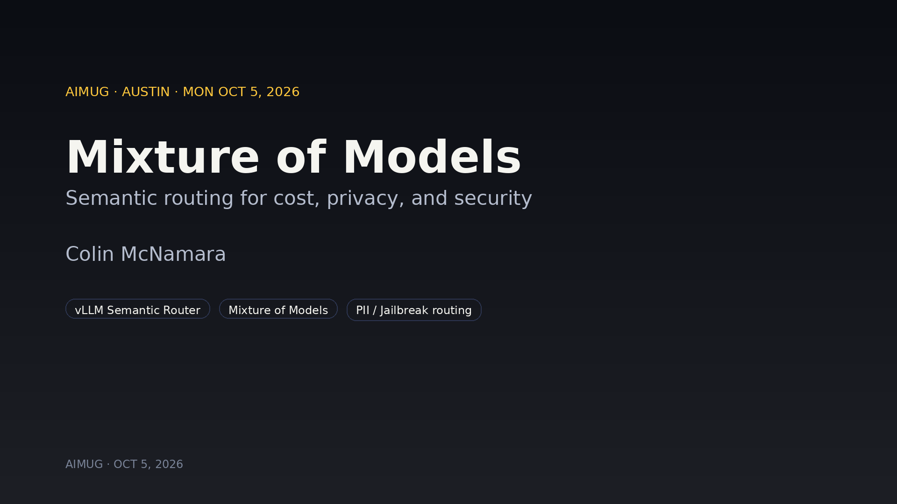
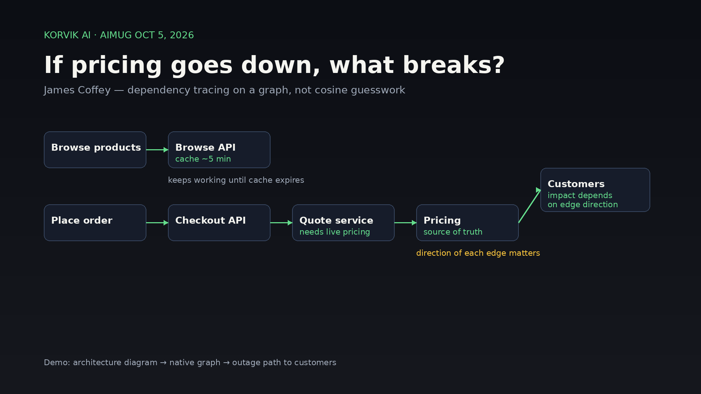

# October 2026 Monthly Meeting Recap

Our first Monday-night AIMUG was a builder night. One theme kept coming up: **use the smallest thing that does the job, and measure it.** Colin routed requests across a mixture of models to cut token spend and add a second layer of PII and prompt-injection defense. Joseph swapped slow LLM routing steps for a calibrated decision model (JEV). Jeff used Harbor evals to find out which `agents.md` wording actually gets coding agents to use MCP tools. Jake showed a spec-driven "coding factory" that runs sequential agents for hours. James showed Corvic AI tracing dependencies through a graph instead of guessing from embeddings.

<!-- truncate -->

## Opening

- Format: lightning-style talks of about 15–20 minutes, then Q&A. Sessions can end up on Austin public television, so talks have **no calls to action**.
- Ground rules: Learning in the Open. Be kind, no nerd sniping, and give constructive feedback.
- We now meet the **first Monday of every month** (in-person Mixer & Showcase at ACC). Virtual Office Hours: **2nd, 3rd, and 4th Mondays · 5:00 PM CT · Google Meet** ([meet.google.com/fsm-nawg-cng](https://meet.google.com/fsm-nawg-cng); also in Discord events). Hacky hours are coming back.
- The Zoom link lives on [aimug.org](https://aimug.org) and the Meetup page.

## Talks

### Mixture of models and semantic routing — Colin McNamara

**Slides:** [Mixture of Models](https://www.colinmcnamara.com/talks/mixture-of-models)  
**Project:** [vLLM Semantic Router](https://vllm-sr.ai/)

**The problem:** every request goes to the same model. That includes easy questions, hard ones, PII, healthcare data, and prompt injections. With one model you pay more, give up some privacy, and take on security risk. Colin found this out the hard way when a token-spend report put him near the top of his company's list.

**The idea:** mixture-of-experts models route requests to subsets of weights inside one model. A **mixture of models** does the same thing one level up. You expose one blended API and route each request by policy: tiny or private work goes to a local model on the laptop, mid-size work goes to an open-weights model (he's been using Qwen), and hard work goes to a hosted frontier API. vLLM Semantic Router ships with presets out of the box: balanced, cost-optimized, speed-optimized, accuracy, and privacy.

**What the router can do:**
- Classify each request, then route by complexity, PII, or jailbreak signals.
- Send suspected prompt injections to a tool-less model that only logs them, a kind of honeypot.
- Turn thinking off dynamically, reuse cached answers, and start small, escalating to a bigger model only when confidence is low.
- Pin rules per session or per turn, like a content switch (Nginx, NetScaler, Traefik) pinning a session on a cookie.

**Defense in depth:** your *primary* control is still the agent graph. That means LangChain/LangGraph middleware for PII masking, local routing for private data, and NeMo Guardrails-style checks. But nobody's agent code is perfectly consistent, especially with generations of agent-written code piling up. Pointing those agents at a shared semantic router gives you a *secondary* point of enforcement, routing, and logging.

**The stack:** these tools stack; you don't pick just one. A gateway (Envoy / Agent Gateway; if you use Kubernetes AI endpoints, you may already be running vLLM Semantic Router) hands off to a semantic router, which hands off to KV-cache-aware fan-out like llm-d, then to the model. NVIDIA's Switchyard hooks in earlier and leans on tool calls. Rough latency on Colin's laptop: about **240 ms** at session start for vLLM Semantic Router, then a fast path. Switchyard took about **1 second**. The llm-d classifier was very fast, but he hasn't measured the full stack yet.

**Learning by patching:** the routers handled OpenAI-style `v1/chat` but broke on Anthropic's `v1/messages` for model and complexity selection. Colin has been filing bugs and PRs against vLLM, vLLM Semantic Router, and Switchyard, with a backlog of roughly 20–30 more. Some of his merged vLLM fixes are already flowing into downstream packages. His tips for upstream bugs: keep them structured and short, propose a fix, read past PRs for guidance, and join the project Slack.

**Open question from Q&A:** once a request is routed, do the PII and prompt-injection protections stay active? Colin assumes yes but hasn't tested it. That's next, with a patch if it breaks.

**Takeaways**
1. Start in your graph. Use LangChain/LangGraph middleware for PII and injection controls.
2. Then add a semantic router as a secondary control. It runs on Kubernetes or locally in a container (Colin uses kind).
3. Turn on OTEL at more than one point. If what you see at one point doesn't match the other, look deeper.

### Grokbot and JEV, a decision model — Joseph Fluckiger

**Slides:** [Joseph’s deck — GrokBot and Jev](https://share.fluckiger.org/aimug)

Joseph builds fraud agents at eBay with LangGraph. For personal agents he has used OpenClaw, Hermes, and now **Grokbot**.

**Personal agents:** hosted options like Grokbot are much less setup than self-hosted OpenClaw or Hermes. You get your own VM, a name, a description, and connections. Self-hosted stays useful when you want to try different models, pay only token costs, or reach local-only things like iMessage or WhatsApp. Joseph uses Grokbot for calendar and email, a daily "This Day in History" image, Strava, an Obsidian vault synced to his phone, and a fitness-coaching bot. He liked two things in particular: the VM browser works well on a phone, including logins with two-factor auth, and Grokbot agents hand jobs to each other well enough to work in parallel.

**JEV:** cost and latency pressure is now a CFO-level conversation. JEV is **not an LLM**. It doesn't generate text. It classifies, and it's trained for calibrated decisions (Joseph expanded the acronym RLCD as "Reinforcement Learning, Calibrated Decisions"). The pitch: when an LLM tells you its confidence, that's an estimate shaped by RLHF, which rewards answers that *sound* right. JEV is trained so its stated probability matches how often it's actually right. The name comes from the Jevons paradox (make something cheaper and people use more of it). Joseph framed it as "System 1" fast judgment next to "System 2" LLM reasoning.

**Where it fits in a LangGraph workflow:**
- **Golden-answer matching:** pre-compute curated Q&A pairs and use JEV at runtime to decide whether a question matches one. That beats a 7–10 second RAG round trip for repeat questions.
- **Concierge routing:** pick the sub-agent (returns, disputes, general knowledge) in about **600 ms** instead of roughly 4–5 seconds with a small LLM. That matters when the customer is waiting and the agent hasn't even started thinking.
- **Fraud triage and routing** decisions.
- The API has three output types: **choice**, **score**, and **boolean**. His demo classified "I've been charged twice for an order" by team (billing), anger level (high), and whether the customer wants a refund (yes, with high confidence).

**Numbers, with honest caveats:** in Joseph's own tests against a small LLM, JEV was about **7–10× faster** and somewhere between **10× and 100× cheaper** (he gave both figures). It isn't in production yet. JEV came out mid-September and his team is still prototyping. He expects routing to drop from about 5 seconds to under 1, and knowledge answers from about 10 seconds to 1–2.

He also gave a plug for **MLflow** tracing next to LangSmith and Langfuse. Once you run complex LangGraph workflows, you need observability.

**Next step:** prototype JEV in the eBay fraud-agent workflows and measure latency and cost.

### Harbor evals for coding agents — Jeff Linwood

**Slides:** [Agent evals with Harbor](https://www.jefflinwood.com/2026/10/agent-evals-with-harbor/)

**The problem:** Jeff's macOS agent workspace exposes a task board to coding agents over MCP. The connection worked and the tools showed up, but when asked to pull a task off the board, the agents skipped the tools and went straight to grep. The fix is "a couple of lines in `agents.md` / `CLAUDE.md`." But which lines?

**Harbor basics:** Harbor is an open-source eval harness from the team behind Terminal-Bench.
- **Task:** a folder with `instruction.md` (the prompt), an environment (the repo), and tests that check the result.
- **Agent under test:** in Jeff's case, Claude Code and Codex.
- **Model:** pair one with each agent, since performance varies a lot by tier.
- **Verifier:** in Jeff's case, two checks. Did the code work (pytest)? And did the agent actually use the MCP tools (checked against his framework's audit log and SQLite state)?
- **Trials:** LLMs are non-deterministic, so run each task several times. Every run costs money, so size the experiment to your budget.

It runs locally with Docker, or on a cloud sandbox like Daytona when you need scale. Jeff used API keys instead of subscriptions to avoid usage limits and terms-of-service questions.

**The experiment:** 120 runs covering 5 fixtures × 2 agents (Claude Code, Codex) × 2 model tiers (small, medium) × 3 conditions, with 10 runs per cell. The three conditions:
1. **Control:** nothing about the task tracker in `agents.md`.
2. **Short instruction:** a very brief note pointing at the tools.
3. **Shipped instructions:** the long per-tool descriptions in the current Mac app.

**Results:**
- All 120 runs passed the coding tests.
- **Control:** the agents didn't use the tracker. They grepped or ignored it.
- **Short instruction:** Claude Code (medium) went 10/10 and Codex (medium) 8/10.
- **Shipped long instructions:** about 3/10 and 2/10, down to 0/10 on Codex (medium).
- Small models did worse than medium ones.
- **Shorter beat longer.** The detailed tool descriptions didn't help, so the next Mac app version ships the short instruction.

**Try it yourself:** A/B test your own `agents.md` changes, use evals to work on MCP tool names and descriptions, and build an internal benchmark of where your team stands on agentic coding. Additional links may also appear in Discord.

### The coding factory: canonical specs and sequential agents — Jake Cukjati

**Slides:** [Forge with Rigor](https://byteofcode.io/presentations/forge-with-rigor/)

Jake has spent most of the past year with Claude Code. His point: if your agents sit idle every 30 minutes waiting for you, **you're the bottleneck.** Stop prompting agents to write code. Have them work from specs. His runs now go for hours (his longest was about 23.8 hours), and one slide showed 100+ agents over about 16 hours turning out tens of thousands of lines.

**Specs are the canonical truth.** He spends a long time writing them up front. Because they're canonical, they're verifiable: when a bug shows up, agents check the spec to decide how things *should* work. He's in control by reviewing specs, not every line of code. Nothing gets built without a spec, so gaps get caught and stale tables get thrown out during planning, before any code exists.

**The loop:** specs → implementation (unit tests) → integration and end-to-end testing → code review → triage → compounding.
- A spec plugin manages several spec types. A workflow plugin ("Forge") plans and implements from them. A test-harness skill checks the specs against an integration checklist. It works best on back-end services.
- **Compounding:** after review, agents write reference material on patterns and implementation notes, and that feeds the next spec run. This is how the system "learns."
- **Triage:** every run logs leftover to-dos that the specs didn't cover. A product-manager agent (Warhammer 40K naming throughout) sets priorities and blockers.

**Sequential, not parallel:** one agent and one feature at a time, with structured handoffs (JSON or similar output). It's a factory line, not a swarm. Jake mentioned *The Mythical Man-Month* on why.

**Context discipline:** his first CLI ran one agent until it hit the context limit, compacted, and kept going. Now the biggest context any agent reaches is about 330K tokens, and another agent watches for bloat to push toward a soft limit of about 250K. He also writes **CLIs as prompt engines**: the CLI feeds the agent the right context at the right moment and tells it when to call back. His earlier open-source CLI was mostly replaced by Claude Code's own dynamic workflows.

**Scaling specs:** his main project has 80–90 specs. Each covers one area of concern, maps to entry points, and stays under 1,000 lines (usually 400–500). With the codebase nearing 200K lines, he plans to split it into 3–4 domains of about 20 specs each, using domain-driven design. A **manifest** generated from a single commit lists every spec and carries that commit hash. A scheduler splits the work into batches, and each batch records the canonical hash, the files it touches, and what it's blocked by. Architecture gets its own HTML design docs, generated by skills.

**Takeaways:** keep specs as the canonical truth, turn your skills into CLIs, and compound everything. Jake plans to **open-source the skills and CLI** once the test-harness piece is as rigorous as he wants.

### Corvic AI: graph analytics and dependency tracing — James Coffey

**Slides:** [What Breaks If We Turn This Off? (James Coffey / Corvic)](/docs/oct-2026/presentation-materials/james-coffey-what-breaks-if-we-turn-this-off.pdf)

*Disclosure:* James knows the Corvic AI team and said so up front. The company is an early seed-stage startup. The host noted the talk sits near our no-pitch line and invited it anyway because James knows graphs and data.

**Why graphs:** embedding a PDF and pulling the nearest chunk by cosine similarity loses relationships. GraphRAG and entity graphs keep them, and enforce them, which James called "keeping your agent honest." Corvic's predecessor worked out a way to shard graph databases so analytics stay fast without exploding compute.

**The demo:** a made-up e-commerce architecture with browsing, checkout, a quote service, and pricing. Browsing can run off a cache for about 5 minutes; quoting needs pricing to be live. The question: **if pricing goes down, what breaks?** Corvic read the architecture diagram as an image, pulled out the entities and relationships into a native graph, and traced the outage path to customers. Browsing keeps working until the cache window runs out. **The direction of each dependency matters.** A similarity-only approach can get cause and effect backwards. James's personal agent built the demo over the weekend.

**The platform:** rooms for your data, live apps, chat history, templates and playbooks for repeatable processing, plus MCP access, data pipelines, embeddings, and clustering for people building their own context graphs.

**Where it fits:** engineering prints, financial lineage, and any "prove the lineage" problem. James's background includes aviation parts traceability. In Q&A he gave the example of medical ontologies: linking conditions, genes, and medications so a physician or pharmacist can spot risky drug interactions. Closest comparisons are LlamaParse (mostly embeddings) and graph databases like Neo4j. Graphs still have the "hairball" visualization problem, but an agent querying through tools doesn't care what the graph looks like. James's honest advice: Corvic is strongest for quickly building graphs from images, PDFs, and tables, for agent-facing graph analytics, and for very large graphs. If your graph is small, something simpler is probably fine.

**Offer:** if you want to try Corvic on your project, write it up, or demo it, talk to James. Credits are possible, but the terms aren't final.

## Closing

That was a wrap on our first Monday-night AIMUG, noted by our CGCS host. Thanks to everyone who moved their schedules. We cleaned up for the college and headed down the street to **The Tavern's** upstairs patio for the after-party (Monday Night Football and all) to keep talking with the speakers.

## What's next

- **Slides:**
  - [Colin McNamara — Mixture of Models](https://www.colinmcnamara.com/talks/mixture-of-models)
  - [Joseph Fluckiger — GrokBot and Jev](https://share.fluckiger.org/aimug)
  - [Jeff Linwood — Agent evals with Harbor](https://www.jefflinwood.com/2026/10/agent-evals-with-harbor/)
  - [Jake Cukjati — Forge with Rigor](https://byteofcode.io/presentations/forge-with-rigor/)
  - [What Breaks If We Turn This Off? (James Coffey / Corvic)](/docs/oct-2026/presentation-materials/james-coffey-what-breaks-if-we-turn-this-off.pdf)
- **Recording:** Recording will be linked here once archived.
- **Follow-ups we heard:** Colin will test PII and injection protections after routing. Joseph will prototype JEV on fraud workflows. Jeff will ship the short-instruction Mac app update. Jake will open-source his skills and CLI once the test harness is solid. James will set up Corvic demo access.
- **Office hours:** 2nd, 3rd, and 4th Mondays · 5:00 PM CT · Google Meet ([link](https://meet.google.com/fsm-nawg-cng)). 1st Monday is the Mixer & Showcase (in person), not virtual OH.

## Join in

- Site: [aimug.org](https://aimug.org)
- Discord: [invite](https://discord.com/invite/JzWgadPFQd)
- Meetup: [Austin LangChain AIMUG](https://www.meetup.com/austin-langchain-ai-group/)

---

*Austin LangChain AI Middleware Users Group (AIMUG): Learning in the Open.*
