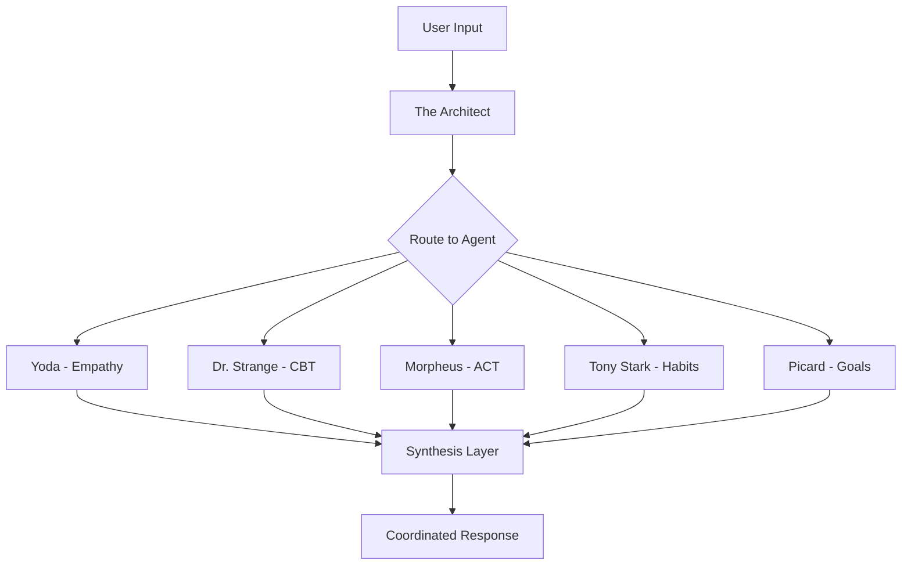

# EmoJourn: Learning in the Open

*Presenter: Robert Davis*  
*Topic: A Mental Health AI Case Study - What Not to Do*

## 🧠 **The Mental Health Challenge**

### **Problem: Mental Health Crisis**

**📊 The Statistics**
- **1 in 5 adults** experience mental health issues each year
- **Limited access** to professional support in many communities
- **High cost** of therapy creates barriers to treatment
- **Social stigma** around seeking help prevents many from getting support

**💡 The Software Solution Hypothesis**
Could AI provide accessible, affordable, and stigma-free mental health support? EmoJourn was built to test this hypothesis.

## 🛠️ **The EmoJourn Solution**

### **Key Features**

**🔒 Secure Journaling**
- **End-to-end encryption** for all user data
- **Private reflection** space for emotional processing
- **Daily prompts** to encourage consistent engagement
- **Mood tracking** and pattern recognition

**🤖 Six Specialized AI Agents**
Each agent serves a specific therapeutic purpose:

| Agent | Role | Therapeutic Approach |
|-------|------|---------------------|
| **Yoda** | Deep empathy & emotional validation | Mindfulness-based support |
| **Dr. Strange** | Cognitive-behavioral therapist | CBT techniques and reframing |
| **Morpheus** | Acceptance & commitment therapy | ACT principles and values work |
| **Tony Stark** | Habit formation & behavior coach | Behavioral change strategies |
| **Picard** | Goal-setting & achievement mentor | Leadership and motivation |
| **The Architect** | Orchestrates & synthesizes insights | Meta-analysis and coordination |

**🎭 Movie Character Personas**
- **Familiar Faces**: Reduces intimidation factor of therapy
- **Distinct Personalities**: Different approaches for different needs
- **Engaging Interaction**: Makes mental health work more approachable
- **Cultural References**: Relatable characters for broader audience

**📊 Personalized Mental Health Insights**
- **Progress tracking** across multiple dimensions
- **Pattern recognition** in mood and behavior
- **Trend analysis** for long-term improvement
- **Intervention suggestions** based on user patterns

## 🏗️ **Architecture & Technology**

### **Agent Flow Overview**



### **High-Level Architecture**

**🏢 System Components**
- **Frontend**: React Native + Expo for cross-platform mobile
- **Authentication**: JWT tokens for secure session management
- **API Layer**: REST + WebSockets for real-time interaction
- **Agent Layer**: LangChain + OpenAI GPT-4 for AI processing
- **Data Layer**: PostgreSQL, Redis, Weaviate for storage

### **Technology Stack**

**📱 Frontend**
- **React Native + Expo**: Cross-platform mobile development
- **React Context & Hooks**: State management
- **React Navigation**: App navigation and routing

**🧪 Testing**
- **Jest + React-Native-Testing-Library**: Comprehensive testing
- **Test-Driven Development**: Quality-first approach

**⚙️ Backend**
- **FastAPI (Python)**: High-performance API framework
- **LangChain + OpenAI GPT-4**: AI agent orchestration
- **Docker → Kubernetes**: Containerized deployment (planned)

**📨 Infrastructure**
- **RabbitMQ**: Message queuing for agent communication
- **PostgreSQL**: Primary data storage
- **Redis**: Session and cache management
- **Weaviate**: Vector database for semantic search

### **Backend Data Flow**

```python
# Simplified agent processing pipeline
async def process_user_input(user_message):
    # Route to appropriate agent
    agent = select_agent(user_message)
    
    # Process with agent
    response = await agent.process(user_message)
    
    # Synthesize with other agent insights
    synthesis = await orchestrator.synthesize(response)
    
    # Store and return
    await store_interaction(synthesis)
    return synthesis
```

## 🎯 **Methodology: Test-Driven Development**

### **TDD Throughout**
- **Red-Green-Refactor**: Write failing tests, implement, improve
- **Agent Testing**: Specific tests for AI agent behavior
- **Integration Testing**: End-to-end workflow validation
- **User Experience Testing**: Real user feedback integration

### **Quality Assurance**
- **Automated Testing**: Continuous integration testing
- **Manual Testing**: Human validation of AI responses
- **Ethics Review**: Regular review of AI outputs for appropriateness
- **Security Testing**: Regular penetration testing and vulnerability assessment

## ⚠️ **Operational Questions & Deployment Considerations**

### **Where Do You Go When Agents Start to Fail?**
Because they will fail. Here's what we learned:

**🔍 Where Do You Begin?**
1. **Observability First**: Implement comprehensive logging before you need it
2. **Agent Isolation**: Each agent must be independently debuggable
3. **Fallback Strategies**: Always have human escalation paths
4. **Error Classification**: Categorize failures by severity and type

**📊 Monitoring & Observability**
- **Datadog**: Application performance monitoring
- **Fluentd**: Log aggregation and analysis
- **LangSmith**: AI agent tracing and debugging
- **Custom Dashboards**: Mental health-specific metrics

**🛡️ Governance & Safety**
- **Strict Tooling Controls**: Limit what agents can and cannot do
- **Human Oversight**: Regular review of agent interactions
- **Crisis Detection**: Automatic escalation for serious mental health concerns
- **Data Protection**: HIPAA-compliant data handling

### **How Hard Is It to Move from Prototypes to Production?**

**🚧 The Reality Check**
- **Agent prototypes** work great in controlled environments
- **Production reality** involves edge cases, user variability, and scale
- **Context management** becomes critical at scale
- **Performance optimization** required for real-time interaction

**📈 Scaling Challenges**
- **Multi-user support**: Session management across thousands of users
- **Resource management**: GPU/CPU allocation for AI processing
- **Data consistency**: Maintaining user state across agent interactions
- **Cost management**: AI API costs can scale exponentially

## 🚨 **Challenges Encountered**

### **1. Governance Issues**

| Challenge | Key Points | Solutions |
|-----------|------------|-----------|
| **Rule Breaking** | Agents may break established rules, access unintended data | Strict API boundaries, comprehensive logging, regular audits |
| **Observability** | Need visibility into agent decision-making | Datadog, Fluentd, LangSmith integration |
| **Isolation** | Agents must be contained and controlled | Containerized deployment, resource limits |

### **2. Context & Rules Problems**

**🧠 Context Loss**
- **Conversation Compression**: Agents lose important context when conversations get long
- **Rule Ignoring**: Sub-agents may ignore design constraints
- **Memory Management**: Balancing context retention with performance

**🔧 Solutions Attempted**
- **Context Summarization**: AI-powered conversation summaries
- **Rule Reinforcement**: Regular injection of core principles
- **Memory Hierarchies**: Different types of memory for different timeframes

### **3. Design Constraint Challenges**

**📋 Common Issues**
- **Duplicate Work**: Agents repeating tasks due to lost context
- **TDD Bypass**: Agents may skip testing requirements
- **Framework Deviation**: Not following specified methodologies

**🎯 Mitigation Strategies**
- **Explicit Constraints**: Document and enforce development methodologies
- **Regular Check-ins**: Automated validation of process adherence
- **Template Systems**: Pre-built patterns for common tasks

## 🔄 **What to Do Better**

### **Planning & Architecture**

**📋 Break Tasks into Phases**
- **SCRUM Methodology**: Sprint-based development with clear goals
- **User Stories**: Well-defined requirements with acceptance criteria
- **Incremental Delivery**: Regular deployments with user feedback
- **Risk Assessment**: Early identification of potential failure points

**🏗️ Real Architecture**
- **Containerized Agents**: True isolation and scalability
- **Enforced Governance**: Pre-commit hooks and automated validation
- **Comprehensive Observability**: Full visibility into agent behavior
- **Security by Design**: Built-in security rather than bolt-on protection

### **Regression Management**

**🔄 Automated Feedback Loops**
- **Continuous Monitoring**: Real-time detection of agent behavior changes
- **Automatic Rollback**: Quick reversion when agents deviate
- **Performance Baselines**: Establish and maintain quality metrics
- **User Feedback Integration**: Direct input into agent improvement

### **Cost & Speed Optimization**

**💰 Local Models Where Feasible**
- **On-premises Deployment**: Reduce API costs for high-volume operations
- **Hybrid Architecture**: Cloud for complex tasks, local for routine operations
- **AI-UX Interfaces**: Claude-like experiences with local models
- **Resource Optimization**: Efficient use of computational resources

## 🧪 **A/B Testing with Real Agents**

### **Structured Validation**
- **Agent Performance**: Different therapeutic approaches with real users
- **User Engagement**: Which interaction patterns work best
- **Outcome Measurement**: Mental health improvement metrics
- **Safety Validation**: Ensuring no harm in any test condition

### **Ethical Considerations**
- **Informed Consent**: Users know they're part of testing
- **Safety Monitoring**: Continuous oversight for user wellbeing
- **Privacy Protection**: Anonymized data collection and analysis
- **Professional Oversight**: Mental health professional involvement

## 📚 **Key Lessons Learned**

### **Technical Insights**
1. **Start with Observability**: You can't fix what you can't see
2. **Agent Isolation is Critical**: Each agent must be independently debuggable
3. **Context Management is Hard**: Plan for context loss and recovery
4. **Testing AI is Different**: Traditional testing approaches need adaptation

### **Product Insights**
1. **User Safety First**: Mental health apps have unique safety requirements
2. **Professional Integration**: AI should augment, not replace professional care
3. **Gradual Rollout**: Start small and scale carefully with user feedback
4. **Ethics as Code**: Build ethical considerations into the architecture

### **Business Insights**
1. **Regulatory Compliance**: HIPAA and other regulations add complexity
2. **Professional Partnerships**: Work with licensed mental health professionals
3. **User Trust**: Transparency about AI limitations builds confidence
4. **Sustainable Development**: Balance innovation with responsible deployment

## 🔗 **Resources & Follow-up**

### **Technical Resources**
- **🔧 FastAPI Documentation**: [fastapi.tiangolo.com](https://fastapi.tiangolo.com)
- **🤖 LangChain Guides**: AI agent development patterns
- **📊 LangSmith**: Agent observability and debugging tools
- **🧪 Testing Strategies**: AI application testing best practices

### **Connect with Robert Davis**
- **💬 AIMUG Discord**: Available for detailed technical discussions
- **📚 Knowledge Sharing**: Open to sharing implementation details
- **🤝 Collaboration**: Interested in AI ethics and safety initiatives
- **⚠️ Lessons Learned**: Happy to discuss what not to do

### **Mental Health Resources**
- **🆘 Crisis Support**: National Suicide Prevention Lifeline: 988
- **🏥 Professional Help**: Directory of licensed mental health professionals
- **📖 Educational Resources**: Mental health awareness and education materials

---

## 🔗 **Related Content**

- **[Lightning Talks Overview](./index.md)** - All July 2025 lightning presentations
- **[Toolhouse Fastlane Worker](./toolhouse-fastlane-worker.md)** - Web automation for AI agents
- **[Cloudflare Containers](./cloudflare-containers.md)** - Edge deployment strategies
- **[Slack + Cursor Integration](./slack-cursor-integration.md)** - Mobile development workflows

---

*Building AI applications for sensitive domains like mental health requires careful consideration of ethics, safety, and professional standards. This case study demonstrates both the potential and the challenges of responsible AI development.*