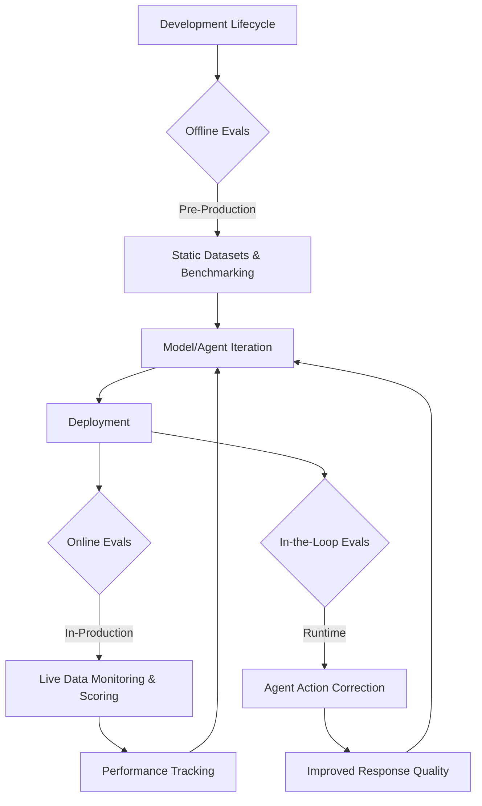
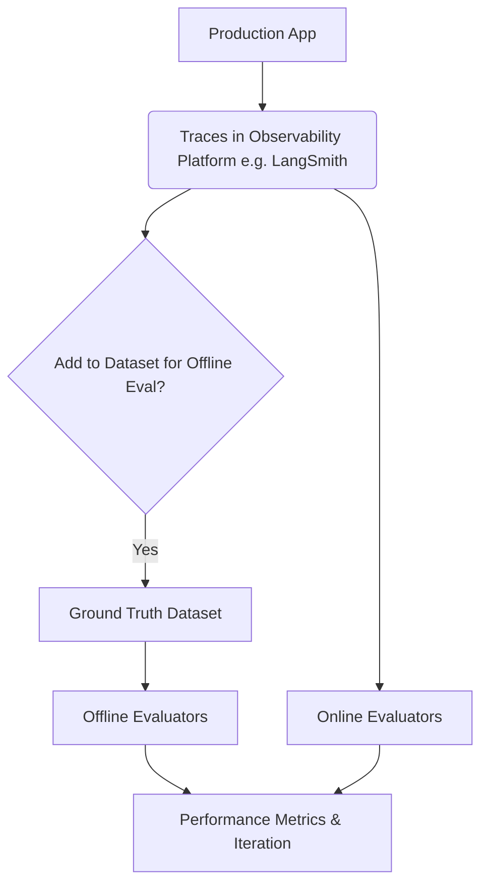
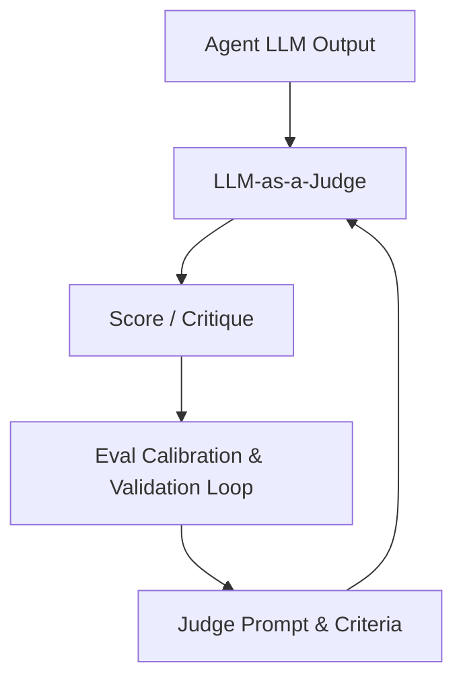

# Interrupt Conference Takeaways

The energy at the Interrupt Conference was palpable. AI agents are not just on the horizon; they're being built, deployed, and iterated upon at lightning speed. Several members of our own Austin LangChain & AI MUG were right there in the thick of it, and they recently came together for a fantastic panel to share their biggest insights. This is a distillation of practical wisdom from the front lines, for our community, designed to help us all **build better, smarter, and more reliable AI that truly delivers value.**

## 📹 Video Recording

<iframe width="100%" height="500" src="https://www.youtube.com/embed/Owvcy7GIvEY?start=3999" title="June 2025 AIMUG - Interrupt Conference Panel Discussion" frameborder="0" allow="accelerometer; autoplay; clipboard-write; encrypted-media; gyroscope; picture-in-picture; web-share" allowfullscreen></iframe>

**Our Panelists on the Ground:**

- **Colin McNamara** - Moderator
- **Collier King** - Conference attendee
- **Ricky Pirruccio** - Conference attendee
- **Karim Lalani** - Conference attendee
- **Cam** - Conference attendee
- **Paul** - Conference attendee

These folks dove deep into the sessions, and here’s what resonated most, structured around the critical lessons for anyone building in the AI space:

### **Takeaway 1: Build a Resilient Foundation – Evals, Observability, and Adaptive Architectures are Non-Negotiable**

If there was one drumbeat that echoed throughout Interrupt, it was this: **"You need to have evaluations from day one."** As Harrison Chase (LangChain) emphasized, quality, not latency or cost, is the number one blocker for getting agents into production. This isn't an afterthought or a "nice-to-have" for mature projects; it’s fundamental to bridging the gap from prototype to production. For anyone serious about building reliable AI agents, robust evaluation and observability practices are table stakes, right from the initial commit. Our panelists confirmed that many attendees left prioritizing their observability stack—comparing options like **LangSmith and LangFuse**, considering **self-hosted vs. cloud solutions** for enterprise needs, and planning **smart integration patterns**—even before diving deeper into agent logic. This commitment to a solid base is paramount for building anything lasting.

**The Continuous Journey of Evaluation: Beyond the Single Checkbox**

The conference made it clear that evaluation isn't a single checkbox but a dynamic, ongoing lifecycle, essential for robust development:

1.  **Offline Evals:** Think pre-production. This is where you test against static datasets and benchmarks, iterating on your model and agent design.
2.  **Online Evals:** Once deployed, you're monitoring live production data, scoring performance, and tracking how your agent behaves in the wild.
3.  **In-the-Loop Evals:** This is about real-time course correction. As Harrison Chase noted, the agent's proposed actions are evaluated _during_ execution. This is particularly crucial for tasks with low tolerance for mistakes (like financial transactions, as discussed by Nubank) or in long-running agent workflows, allowing for improvements or even blocking bad responses before they ever reach the user. Michele from Replit highlighted how their Agent v2’s increased autonomy (running for 10-15 minutes doing useful work) relied heavily on their "in-the-loop" approach.

> "Evaluation is truly a continuous journey... an ongoing process integral to the entire development lifecycle. Whether you call them phases or just continuous improvement, it's got to be there." – Harrison Chase (LangChain)



**Observability: The Bedrock of Great Evals and a Core Tenet of Enterprise Readiness**

You can't evaluate what you can't see. The conference stressed that **"great evals start with great observability."** Robust tracing (think LangSmith, LangFuse, or custom solutions) is fundamental. These traces, often large, unstructured, and multimodal, become the raw material for creating effective datasets for both online and offline evaluations. As Harrison Chase pointed out, **AI observability is fundamentally different** from traditional observability. It's not built for an SRE, but for the "Agent Engineer" persona, requiring insights into tools, trajectories, and ML-specific metrics.

Discussions covered the practicalities: the strong enterprise preference for **self-hosted observability solutions** for control and compliance (as noted by BlackRock and Cisco), and the patterns for integrating these tools into existing infrastructure. Uber also highlighted the need for **particular durability solutions** for agentic execution.



**LLM-as-a-Judge: Powerful but Needs Careful Handling**

Using LLMs to evaluate other LLMs (LLM-as-a-Judge) is a powerful technique, offering the ability to handle more complex, nuanced evaluations than rule-based systems. However, it's not plug-and-play. As Harrison Chase noted, **"A key challenge is managing an additional layer of prompting for the judge model itself, which requires careful tuning."** Nubank's presentation on their money transfer agent provided a compelling example, demonstrating how they iterated through prompt engineering and model tuning across six tests to get their LLM-as-a-Judge F1 score from 51% to 79%, nearly matching human accuracy in just two weeks. Ongoing work like **AlignEval** (influenced by Shreya Shankar's "Who Validates the Validators?") and **eval calibration** in LangSmith aim to make these techniques more reliable and easier to implement, as Harrison Chase detailed.



### **Takeaway 2: Integrate the Human Element – Feedback, Control, Domain Expertise, and Trust are Paramount**

AI agents don't operate in a vacuum. The most successful systems are designed with humans deeply embedded in the loop, not just as consumers, but as active participants in refining and guiding AI behavior. This human touch is critical for building trust and ensuring agents are genuinely useful.

**Guiding Your Agents: Trajectory, Human Feedback, and Smarter Judging**

Beyond just the final output, understanding _how_ an agent arrives at a decision (its trajectory) is critical. This means **trajectory evaluation**: analyzing decision paths and tool usage, a new metric now available in LangSmith as mentioned by Harrison Chase.

**Humans in the Loop: More Than Just Feedback – Embedding Expertise**

Human critique systems are vital. This isn't just about users rating responses; it's about enabling **external feedback loops** that can actively refine agent behavior. For instance, **Harvey (AI for Legal)** demonstrated a powerful model: they embed lawyers at every stage – a true **"lawyer-on-the-loop"** approach – from identifying complex use cases and creating evaluation rubrics to UI iteration and end-to-end testing. Ben Lewald stressed that this deep domain expertise is critical for handling the complexity and nuance of the legal domain, where subtle misinterpretations, not just hallucinations, can be career-impacting. Harvey prioritizes **rapid prototyping over lengthy PRDs** because "prototypes make the work tangible and easier to grok."

> "Harvey's strategy involves integrating lawyers at every stage of product development. Their domain expertise and user empathy are considered critical in shaping effective legal AI products." – Ben Lewald (Harvey)

Similarly, **JP Morgan's "AskDavid"** for investment research, handling queries about thousands of financial products, incorporates **Human Subject Matter Experts (SMEs)** in the loop. Jane from JP Morgan explained that in high-stakes domains like finance, achieving 100% accuracy with AI alone may not be feasible. Human SMEs are crucial for that **"last mile" of accuracy**, ensuring reliability when billions of dollars are at risk.

> "In high-stakes financial applications, where 100% AI accuracy may be unattainable, JP Morgan ensures reliability by incorporating Human Subject Matter Experts (SMEs) in the loop—symbolized by 'Ask David still consults with real David whenever needed.'" – Jane (JP Morgan)

**Building Trust: The Biggest Barrier to Adoption**

Assaf from **Monday.com** powerfully stated that **"trust, not technology"** is the biggest barrier to AI agent adoption. His team’s experience provided critical lessons on how to build this trust:

- **User Control & Autonomy:** While engineers love fully autonomous agents, users often have different risk appetites. Monday.com found that giving users control over agent autonomy levels dramatically increased adoption.
- **Previews Before Actions:** Users froze when agents directly pushed changes to production data (like Monday boards). Introducing a **"preview" feature** before committing changes significantly increased adoption by alleviating concerns about irreversible actions. This parallels Andrew Ng's point about developers needing to see and debug AI-generated code.
- **Explainability for Learning:** Explainability is more than a "nice-to-have"; it's a crucial feature that allows users to understand _why_ an agent produced a certain output, enabling them to learn how to interact with and guide the AI more effectively over time.
- **Seamless Integration:** Instead of forcing new user experiences, Monday.com integrated agents directly into existing workflows (e.g., assigning agents to tasks), making adoption seamless and familiar.

Andrew Ng also highlighted **voice as an underrated modality** for AI applications. It can lower user friction for input compared to text, as people often feel less pressure to deliver perfection when speaking. Techniques like **"pre-responses"** (e.g., "Hmm, let me think about that") can help manage perceived latency, making interactions feel more natural.

### **Takeaway 3: Architect for the Enterprise – Scalability, Governance, Specialized Design, and Real-World Reliability**

Moving from prototypes to production, especially in enterprise settings, requires a deliberate focus on robust architectures, scalability, compliance, and practical deployment strategies. This is where the rubber meets the road for AI systems.

**From the Trenches: Technical Patterns and Real-World Architectures**

The conference was packed with "how-to" insights from teams building real agents.

**Evolving Agent Architectures: Lessons from 11x and Box**

- The **11x team**, building their AI SDR "Alice," shared a fascinating evolution from a simple React-based agent to a structured workflow model, and finally to a multi-agent system. This progression, which Sherwood and Keith detailed, was driven by the need to handle complex campaign creation, improve output quality, and maintain flexibility. Their key learning: **"The multi-agent architecture provided the best of both worlds: the flexibility of a React-based agent combined with the performance characteristics of a structured workflow."** This iterative approach, starting simple and refactoring, was also echoed by JP Morgan.
  ```mermaid
  graph TD
      Supervisor[Supervisor Agent] --> UserInteraction{User Interaction & Task Routing}
      UserInteraction --> Researcher[Researcher Sub-Agent];
      UserInteraction --> PositioningReport[Positioning Report Sub-Agent];
      UserInteraction --> LinkedInWriter[LinkedIn Message Writer Sub-Agent];
      UserInteraction --> EmailWriter[Email Writer Sub-Agent];
      Researcher --> Supervisor;
      PositioningReport --> Supervisor;
      LinkedInWriter --> Supervisor;
      EmailWriter --> Supervisor;
  ```
- **Ben Kuss from Box** detailed re-architecting their metadata extraction from a traditional pipeline to a multi-agent system. This was crucial for handling complex documents and diverse data fields, achieving reliability beyond simple pre/post-processing. His insight: **"An agentic-based approach offers a cleaner engineering abstraction."** For new intelligent features, especially with unstructured data or complex workflows, his advice is profound: **"Build agentic, build it early."**
  ```mermaid
  graph TD
      Input[Document + Fields to Extract] --> Supervisor{Supervising Agent};
      Supervisor --> PreProcessingAgent[Pre-Processing Sub-Agent];
      PreProcessingAgent -- Handles OCR, Large Docs --> DataGroupingAgent[Data Grouping Sub-Agent];
      DataGroupingAgent -- Groups related fields --> ExtractionAgent[Extraction Sub-Agent];
      ExtractionAgent -- Chooses extraction methods (OCR, Vision) --> QualityFeedbackAgent[Quality Feedback Sub-Agent];
      QualityFeedbackAgent -- Assesses accuracy, triggers retries --> Output[Extracted Data];
      QualityFeedbackAgent -- Feedback --> ExtractionAgent;
  ```

**Core Principles for Building Smarter, More Reliable Agents:**

- **Tools over Skills:** Equip agents with external tools rather than trying to build all capabilities internally. It's more modular and token-efficient, minimizing context usage. Sherwood from 11x highlighted this preference, and Eno from Factory AI stressed that **"control over an agent's tools...is the most critical factor for ensuring agent reliability,"** emphasizing the need for effective **"AI computer interfaces"** to interact with the digital world.
- **Mental Models Matter:** The 11x team found viewing agents as "human coworkers" or "teams" led to better architectural decisions than just thinking of them as user flows. Misaligned mental models can lead to suboptimal implementations.
- **Bridging the Gaps (Shreya Shankar, UC Berkeley):** Shreya Shankar's research highlighted fundamental challenges beyond LLM accuracy in building reliable data processing agents:
  1.  The **"data understanding gap"**: Knowing what's in your data and its unique failure modes. Tooling like anomaly detection and failure mode clustering are needed.
  2.  The **"intent specification gap"**: Clearly defining what you _really_ want the agent to do. Tools for interactive prompt refinement and revision history are crucial.
      Shankar's staged approach: **"First understand your data, then ensure prompts are as well-specified as possible. Only after these foundational steps can significant gains be achieved by applying known accuracy optimization strategies."**
  ```mermaid
  graph TD
      Developer --> A{Data Understanding Gap};
      A -- Tooling: Anomaly Detection & Failure Mode Clustering --> B[Understand Data & Failure Modes];
      Developer --> C{Intent Specification Gap};
      C -- Tooling: Interactive Prompt Refinement & Revision History --> D[Clearly Specify Intent];
      B --> E[Design Evals for Failure Modes];
      D --> F[Improve Pipeline: Prompt Engineering, Task Decomposition];
      E --> F;
      F --> G[Reliable Data Processing Agent];
  ```
- **The Long Tail of Failures:** Real-world data has countless, often obscure, failure modes. Shreya Shankar noted it's common to find hundreds of distinct issues in moderately sized document collections, underscoring the need for comprehensive evaluation that hunts these down.
- **Iterative Evaluation is Key:** Evaluation is never "done." Developers continuously collect new failure modes and refine their test sets. As Andrew Ng advised, instead of "eval writer's block," begin with **"quick, imperfect evals"** (even for specific regressions) and incrementally improve them.

**Enterprise Agent Craft: Strategic Deployments and Lessons Learned**

- **BlackRock's Aladdin Copilot** utilizes a **federated plugin registry**, allowing various engineering teams to onboard their domain-specific tools and custom agents. This approach, as Brennan Rosales explained, scales agent capabilities across a large organization while maintaining centralized orchestration. Their mantra is **"evaluation-driven development,"** especially for system prompts, rigorously testing each intended behavior with synthetic and expert-curated data to ensure reliability and prevent undesired outcomes like providing investment advice.
  ```mermaid
  graph TD
      UserQuery["User Query"] --> OrchestrationGraph["Orchestration Graph (LangGraph)"]
      OrchestrationGraph --> InputGuardrail["Input Guardrails Moderation PII"]
      InputGuardrail --> FilteringAccessControl[Filtering & Access Control];
      PluginRegistry[Plugin Registry: Tools & Custom Agents from Domain Teams] --> FilteringAccessControl;
      FilteringAccessControl -- Selected Tools and Agents --> OrchestrationNode["Orchestration Node GPT-4 Function Calling"]
      OrchestrationNode <--> PlanningActionLoop[Planning & Action Loop];
      PlanningActionLoop --> OutputGuardrail["Output Guardrails Hallucination Check"]
      OutputGuardrail --> FinalAnswer[Final Answer to User];
  ```
- **Harvey (AI for Legal):** Beyond lawyers-on-the-loop, Ben Lewald posited a forward-looking insight: for truly advanced domain-specific agentic workflows, **"process data"**—data showing _how_ tasks are done within firms (e.g., steps in an M&A transaction, often unwritten)—will be more crucial than vast amounts of publicly available data.
- **JP Morgan's "AskDavid"** demonstrates successful multi-agent architecture for high-stakes investment research. Jane shared their iterative development strategy: **"Start simple and refactor often."** They built and validated specialized sub-agents (e.g., RAG agent) first, then integrated them with a supervisor agent. They also stressed the crucial role of Human SMEs for the "last mile" of accuracy in finance, where 100% AI accuracy may not be achievable.
  ```mermaid
  graph TD
      UserQuery["User Query"] --> Supervisor[Supervisor Agent];
      Supervisor -- Task Delegation --> StructDataAgent["Structured Data Sub-Agent SQL or API"]
      Supervisor -- Task Delegation --> UnstructDataAgent["Unstructured Data Sub-Agent RAG"]
      Supervisor -- Task Delegation --> AnalyticsAgent["Analytics Sub-Agent Proprietary Models"]
      StructDataAgent --> Supervisor;
      UnstructDataAgent --> Supervisor;
      AnalyticsAgent --> Supervisor;
      Supervisor --> Personalize["Personalize Answer by user role"]
      Personalize --> Reflect["Reflection Node LLM Judge for sense check"]
      Reflect -- If Fails --> Supervisor;
      Reflect -- If Passes --> Summarize[Summarize & Return Answer];
  ```

**The "Agent Engineer" and Platform Thinking: Building Blocks for Scale**

A new breed of engineer is emerging, and platforms are evolving to support them.

- **Harrison Chase (LangChain)** coined the **"Agent Engineer"**—a new profile of builder who combines skills in prompting, engineering, product sense, and machine learning. LangChain's vision for making intelligent agents ubiquitous:
  - Agents leveraging **many different models** (optimizing for reasoning, writing, speed, cost). Harrison noted LangChain's Python downloads now surpass OpenAI's, driven by developers seeking model optionality.
  - **LangGraph for controllable orchestration**: A low-level, unopinionated framework giving developers "supreme control" over cognitive architecture and context engineering, crucial for reliable agent behavior.
  - **LangSmith as a collaborative platform**: Bringing together diverse team members (product, ML, engineering) for agent development, offering observability, evals, and prompt engineering tools. Harrison highlighted that **AI observability is different**—it's for the agent engineer, with new metrics for tools and trajectories.
  - **Democratizing agent building**: Through LangGraph Prebuilts (for AI newcomers), LangGraph Studio V2 (with features like pulling production traces for debugging), and the open-source OpenAgent Platform (for no-code agent building).
  - **Deployment of agents is the next hurdle**: Agents are often long-running, bursty, and stateful, requiring unique deployment solutions. LangGraph Platform, now GA, addresses these challenges.
- **Cognition (Devin & Kevin):**
  - Devin is positioned as a **"cloud AI agent,"** an "AI teammate" for asynchronous delegation, complementary to local copilots, enabling parallelism and shared learning.
  - Their **DeepWiki** builds codebase understanding (macro context) by analyzing metadata (PRs, commits) _before_ diving into code, and connecting it to micro context (specific code). This helps agents work effectively in large, existing codebases.
  ```mermaid
  graph TD
      A["Codebase Metadata PRs Commits Docs"] --> B{Concept Extraction};
      B --> C[Identify Key Concepts];
      C --> D["Generate Wiki Pages per Concept Macro Context"]
      E[Source Code Files] --> F{Code Analysis};
      F --> G["Connect Code to Concepts Micro Context"]
      G --> D;
      D --> H[Interactive DeepWiki];
      H --> I[Devin Agent];
  ```
  - Their **Kevin model** (CUDA kernel writing) demonstrates that **custom post-training with reinforcement learning (RL) can outperform frontier models in narrow domains.** The key: an **automatically verifiable reward function** (correctness and performance of generated code), which software development uniquely provides. They used multi-turn GRPO with discounted rewards.
- **Factory AI:** Eno argued for a mindset shift from "collaborating with AI" to **"delegating to AI."** This demands new platforms for managing and scaling agents, designed for the "outer loop" of human reasoning while agents handle the "inner loop" of coding. Factory defines agentic systems by: **Planning, Decision-Making, and Environmental Grounding.** They stressed **"control over an agent's tools...is the most critical factor for ensuring agent reliability,"** often requiring new **"AI computer interfaces"** to bridge human-centric digital environments.
- **Unify:** Uses agents for go-to-market research. Kunal and Conor found that **stronger reasoning models** (like OpenAI's o1-preview at the time) produced significantly more thorough and specific research plans, leading to better downstream performance, even if slower. They evolved their **internet search tools to mimic human research behavior** (reviewing multiple full-content links) and built a **"browser access" sub-agent** (using computer vision) to extract rich data from interactive web pages, unlocking new use cases.
  ```mermaid
  graph TD
    A[Agent Needs Info] --> E{Upgraded Search Tool}
    E -- "Query and Params Category Live Crawl Domain" --> F[Retrieve Multiple URLs & Full Page Content]
    F --> G[Agent Reviews Full Content from Multiple Sources]
    G --> H[More Informed Decision]
    H --> I[Browser Access Sub-Agent]
    I -->|Decomposes into Browser Trajectory| J["Interact with Web Pages e.g. Google Maps"]
    J -- "Uses Computer Vision Computer Use Preview" --> K[Extract Rich, Interactive Data]
  ```
- **Monday.com:** Assaf noted that while breaking tasks into sub-agents is beneficial, **"compound hallucination"** can occur if too many agents are in sequence (e.g., 90% accuracy _ 90% _ 90% = 72.9%). A balance is needed. Their future vision is **dynamic orchestration of specialized agents** to perform an infinite variety of tasks, much like human teams. They also emphasized robust **fallback mechanisms** for conversational agents, as "99% of user interactions won't be perfectly handled."
- **LinkedIn:** Made a strategic decision to **standardize on Python for GenAI**, leveraging the rapidly evolving open-source ecosystem. They built an internal app framework on LangGraph and an **"Agent Platform"** using messaging for asynchronous, multi-agent systems (like their Hiring Assistant). This platform includes a layered memory system and a centralized **"Skill Registry"** where teams can register reusable tools and even other agents, promoting modularity and reusability across the organization. Matas and Sorabh highlighted this approach for scalability.
- **Andrew Ng:** Suggested viewing "agentic" as a **spectrum of autonomy** rather than a binary definition, promoting a pragmatic approach to building. He emphasized the current rarity of **agentic workflow design skills** (task decomposition, branching logic, eval implementation). He also sees the **Model Context Protocol (MCP)** as a "fantastic first step" towards standardizing tool access and data integration, aiming to reduce N\*M integration effort to N+M.
- **Poe (Adam D'Angelo):** Adam described Poe's vision as a **"web browser" for AI**—a single interface for users to access a wide diversity of language models and agents. This lowers the barrier for AI creators to reach consumers. He noted significant growth in **"reasoning models"** (like o3, o4-mini, Claude Sonnet 3.7) and the **incredibly fast pace of change in AI** compared to traditional web development (planning cycles are now ~2 months), necessitating constant adaptation. He also highlighted the substantial monetization opportunity for creators building bots on Poe (some earning millions per year).
- **Uber (Validator & AutoCover):** Uber's developer platform team built AI-powered tools like **"Validator"** (flags best practices) and **"AutoCover"** (generates high-quality tests). Sorabh and Matas explained that Validator uses a **hybrid LangGraph agent** (LLM + deterministic sub-agents like static linters) for reliable outputs. AutoCover uses highly specialized **"domain expert" agents** (scaffolder, generator, executor, validator) for superior test generation (2-3x more coverage in half the time). This was enabled by **"intentional tech transfer,"** identifying reusable components from initial AI product development to build opinionated internal frameworks like **"LangFX"** wrapping LangChain/Graph.
- **Cisco (Agentic CX):** Cisco is building a hyper-personalized, proactive **"Agentic CX"** with multi-agents (human/machine, GenAI/traditional ML). Brennan and Pedro emphasized **use-case-driven development with clear metrics** for business value (e.g., "only five of 412 initial use cases truly contributed to core business objectives"). Their Renewals Assistant uses a supervisor agent with specialized sub-agents and predictive ML for risk assessment, achieving high accuracy (95%+) and significant time savings. They highlighted the difficulty of **text-to-SQL in enterprise** (recommend de-normalized data, avoid LLM-generated SQL joins). Critically, Cisco is championing **"Agency," an open-source architecture** (with LangChain) for **inter-agent collaboration** beyond MCP, proposing semantic/syntactic layers and an **agent directory** (like DNS for agents) to foster a more mature agent ecosystem.
  ```mermaid
  graph TD
      UserQuery["User Query (e.g., 'Renewal status for Cust X & risk actions?')"] --> Supervisor[Supervisor Agent];
      Supervisor -- Decomposes & Routes --> RenewalsAgent[Renewals Sub-Agent];
      RenewalsAgent -- Gets Context --> AdoptionAgent[Adoption Sub-Agent];
      RenewalsAgent -- Gets Context --> DeliveryAgent[Delivery Sub-Agent];
      Supervisor -- Triggers Parallel --> SentimentAgent[Sentiment Analysis Sub-Agent];
      Supervisor -- Triggers Parallel --> InstallBaseAgent[Install Base Sub-Agent];
      RenewalsAgent -- Risk Query --> PredictiveML[Predictive ML Model for Risk];
      AdoptionAgent --> RenewalsAgent;
      DeliveryAgent --> RenewalsAgent;
      SentimentAgent --> Supervisor;
      InstallBaseAgent --> Supervisor;
      PredictiveML -- Risk Score --> RenewalsAgent;
      RenewalsAgent -- Compiled Info --> Supervisor;
      Supervisor --> FinalReasoning[Final Reasoning & Formatting];
      FinalReasoning --> Answer[Answer to User];
  ```

**Infrastructure Wisdom for Enterprise Scale:**

A few recurring infrastructure themes crucial for enterprise adoption:

- Enterprises often prefer **self-hosted solutions** (observability, models) for control, security, and compliance.
- **Scalability patterns** for production agent systems are an active area of design, including managing state for long-running, bursty agents.
- **Leveraging vendors** (like LangChain for dev tools and infrastructure components) can be vital for speed, especially in hypergrowth, allowing internal teams to focus on core differentiators.
- Be ready: a **new, more capable model release** can sometimes "magically" make a struggling agent viable. Design for adaptability! As Amjad from Replit shared, Sonnet 3.5 transformed their agent's performance, making it work "like magic."

### **Takeaway 4: Learn Together, Build Faster – The Power of Community and Shared Knowledge**

The sheer pace of innovation in AI can be overwhelming. No single individual or organization can keep up with everything. The conference itself was a testament to the power of shared learning, and our MUG panel amplified that. Andrew Ng's caution against advising people _not_ to learn to code because of AI assistance is a strong testament to the value of **coding literacy** in this new era – it's crucial for effectively instructing and debugging AI-generated code.

**Bringing It Home: Community Actions & Next Steps**

Inspired by the conference, our Austin LangChain & AI MUG is already putting these learnings into action:

- **Documentation Project:** We're transcribing conference videos (shoutout to Mac Whisper and NotebookLM!) and converting insights into accessible Markdown docs for everyone. This collaborative effort ensures these valuable lessons reach a wider audience, including the "long tail" of issues and nuanced evaluations discussed by Shreya and Nubank.
- **Follow-up Sessions:** Get ready for hands-on workshops focusing on observability (LangSmith & LangFuse), practical evaluation methods (from Andrew Ng's "quick and imperfect" to sophisticated LLM-as-a-Judge calibration), and enterprise deployment strategies, including considerations for multi-agent systems and state management.

**Our Core Takeaways for You, Expanded:**

1.  **Build a Resilient Foundation:** Implement robust observability and a continuous evaluation lifecycle (offline, online, in-the-loop) _before_ getting lost in complex agent logic. Design adaptive architectures ready for new model capabilities and address nuanced domain-specific challenges from day one.
2.  **Integrate the Human Element Profoundly:** Design for human feedback, critique (e.g., Harvey's "lawyer-on-the-loop"), and expert guidance at multiple points. Prioritize user control, previews, and explainability (e.g., Monday.com) to build crucial trust, recognizing that "trust, not technology," is often the biggest barrier.
3.  **Architect for the Enterprise:** From day one, consider compliance, security, scalability (multi-agent systems, platforms like LinkedIn's), and real-world reliability. Embrace evaluation-driven development (BlackRock, JP Morgan) and learn from cutting-edge patterns like plugin registries, specialized agent design (Uber, Cisco), and advanced context management (Cognition's DeepWiki).
4.  **Learn Together, Build Faster:** Our community is a powerhouse of shared knowledge. The insights from Interrupt, from Andrew Ng's strategic views to specific company implementations, show the value of collective learning. Leverage this community to navigate the incredibly fast pace of change, accelerating your journey from prototype to production.

The insights from Interrupt are still buzzing. Stay tuned for the community documentation and upcoming workshops where we’ll dive even deeper into these topics. The future of AI is collaborative, and our community is excited to be a part of building it.

---

_This panel discussion represents the collective insights of our community members who attended the Interrupt Conference, helping to bring cutting-edge AI development practices to our local community._
