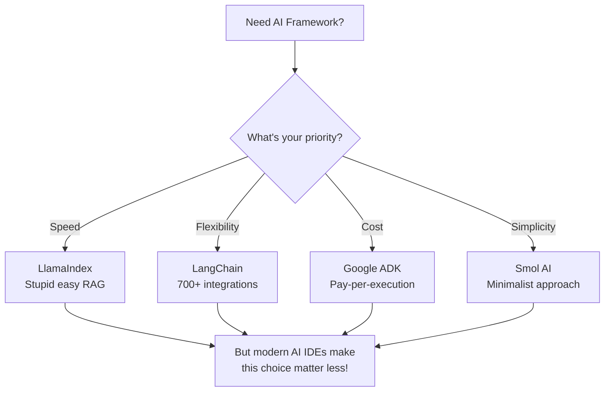
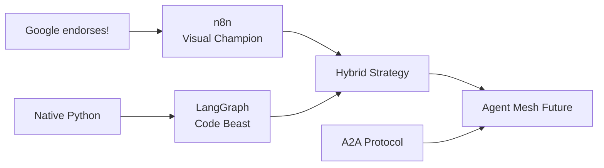
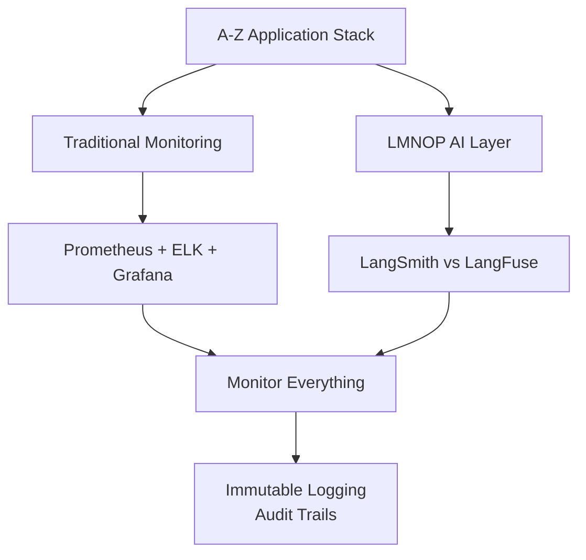
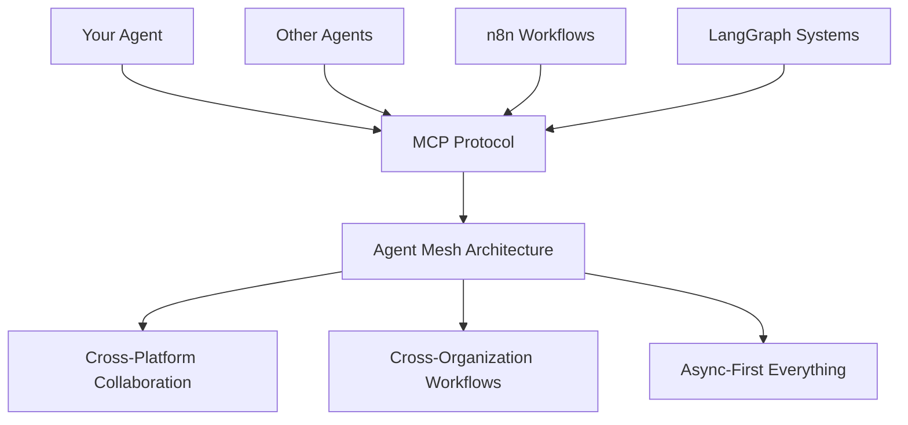

# AI Ecosystem 2025: Lightning Talk Slides

*Visual companion for Colin McNamara's AI ecosystem presentation*

---

## Slide 1: Title Slide

```
AI Ecosystem Landscape 2025
From Framework Wars to Universal Standards

Colin McNamara
Austin LangChain AI Middleware User Group
June 2025
```

---

## Slide 2: The Big Picture Hook

```
Everything you thought you knew about 
AI development just changed.

❌ Framework wars? OVER.
❌ Tool integration chaos? SOLVED.
❌ "What should I use?" paralysis? DEAD.

✅ The question now: "What are you going to build?"
```

---

## Slide 3: What Happened While You Weren't Looking

```
🔗 MCP became the standard
   → Universal tool integration across everything

🤖 AI IDEs killed framework choice
   → You can build with anything, anywhere

☁️ Google endorsed n8n
   → Plot twist nobody saw coming

⚡ Async became inevitable
   → "Get back to me in 20 minutes. I don't care."

🌐 Agent mesh architectures arrived
   → Your agents will talk to other agents
```

---

## Slide 4: Framework Decision Tree



---

## Slide 5: The MCP Revolution

```
Model Context Protocol (MCP)
"Everyone has switched to MCP. It is kind of the standard."
- Colin McNamara

🎯 What MCP Solved:
• Framework chaos
• IDE fragmentation  
• Integration hell

🚀 Why MCP Won:
✅ Framework agnostic
✅ IDE native
✅ Developer friendly
✅ Ecosystem momentum
```

---

## Slide 6: AI IDE Champions

```
🏆 The IDE Revolution

Cursor → Most popular (SOC 2 certified)
Cline → Community favorite (1.6M+ installs)
Windsurf → Dark horse (OpenAI acquisition rumors)

🧠 Documentation Revolution:
• Context7 → Research any library
• MCP Docs → LangChain/LangGraph via MCP
• Memory Bank → Project knowledge storage
• Perplexity Agent → Real-time research
```

---

## Slide 7: Orchestration Battle



```
Colin's Verdict: "LangGraph is the winner"
Why? Native Python + built-in observability + A2A ready
```

---

## Slide 8: The Economics Revolution

```
💰 Deployment Economics

"I want to pay for agents when they're executed, 
especially now that things are moving async."
- Colin McNamara

🚀 Async-First Benefits:
• Cost optimization → Cheaper infrastructure
• Eventual consistency → 20-minute response times
• Agent mesh enablement → Cross-system collaboration
• Background processing → Hours/days workflows

Winner: Google Cloud Run + ADK
```

---

## Slide 9: A-Z Observability Framework



```
"Think of my entire application stack as A through Z. 
My agents are like LMNOP."
- Colin McNamara
```

---

## Slide 10: Security Reality Check

```
🔒 Federal Standards Approach

"I really do think you should build applications 
to federal standards"
- Colin McNamara

⚠️ AI Security Warning:
"At some point your AI is going to lose its mind 
and hack you. How are you gonna know?"

🛡️ The Solution:
• TLS everywhere
• External authentication  
• RBAC
• Immutable logging
• Complete audit trails
```

---

## Slide 11: Your Action Plan

```
🎯 Start Tomorrow:

1. 🔧 Start anywhere → Modern tooling makes any framework viable
2. 🔗 Embrace MCP → Universal integration is here
3. 📊 Monitor everything → Build A-Z observability
4. 💰 Design for async → Cost optimization architecture
5. 🔒 Security first → Federal standards baseline
6. 🤝 Join community → Shared knowledge accelerates all

Reality Check: You don't need to wait.
The tools exist. The standards are emerging.
```

---

## Slide 12: Agent Mesh Future



```
"The future of asynchronous development agents 
collaborating together and orchestrating these 
complex graphs together."
- Colin McNamara
```

---

## Slide 13: Key Takeaways

```
🎯 The Big 6:

1. 🔧 Framework choice matters less
   → Modern tooling makes any viable

2. 🔗 MCP is the standard
   → Universal tool integration protocol

3. 📊 Observability is critical
   → Monitor A-Z, not just LMNOP

4. 💰 Cost drives architecture
   → Async-first, pay-per-execution

5. 🔒 Security must be built-in
   → Federal standards as baseline

6. 🤝 Community accelerates progress
   → Shared knowledge benefits all
```

---

## Slide 14: Connect & Collaborate

```
🔗 Find Colin:
• LinkedIn → https://www.linkedin.com/in/colinmcnamara/
• Blog → https://colinmcnamara.com
• Twitter/X → https://x.com/colinmcnamara
• Discord → AIMUG Discord https://discord.gg/JzWgadPFQd

🤝 Join the Community:
Austin LangChain AI Middleware User Group

"Please feel free to collaborate, 
comment on LinkedIn"
- Colin McNamara

The infrastructure is being built NOW.
Will you be ready?
```

---

## Slide 15: Questions & Discussion

```
Questions?

💬 Let's discuss:
• Your current AI stack challenges
• Framework selection decisions
• MCP integration experiences
• Async architecture patterns
• Security and compliance needs

🚀 What are YOU going to build?
```

---

## Presenter Notes

### Timing Guide (20 minutes total)
- **Slides 1-3**: Intro + Big Picture (2 min)
- **Slides 4-6**: Frameworks + MCP + IDEs (5 min)
- **Slides 7-8**: Orchestration + Deployment (4 min)
- **Slides 9-10**: Observability + Security (3 min)
- **Slides 11-12**: Action Plan + Future (4 min)
- **Slides 13-14**: Takeaways + Connect (2 min)

### Key Presentation Moments

#### **MCP Bombshell (Slide 5)**
- Pause after "Everyone has switched to MCP"
- Let the impact sink in
- Emphasize the universality

#### **Framework Wars Ending (Slide 4)**
- Point to the decision tree
- Emphasize "choice matters less"
- Connect to AI IDE revolution

#### **Google's n8n Endorsement (Slide 7)**
- Build up the surprise
- "Plot twist nobody saw coming"
- Explain the strategic implications

#### **Async Economics (Slide 8)**
- Quote delivery with emphasis
- "Get back to me in 20 minutes. I don't care."
- Connect to cost optimization

#### **AI Security Warning (Slide 10)**
- Serious tone shift
- "Your AI is going to lose its mind and hack you"
- Pause for effect, then solution

### Visual Cues

#### **Slide Transitions**
- Use consistent animation timing
- Bullet points appear on click
- Mermaid diagrams load smoothly

#### **Color Scheme**
- **Primary**: Austin LangChain blue (#2563eb)
- **Accent**: Warning orange (#f59e0b)
- **Success**: Green (#10b981)
- **Text**: Dark gray (#374151)

#### **Typography**
- **Headers**: Bold, large font
- **Quotes**: Italic, attributed
- **Code/Tech**: Monospace font
- **Emphasis**: Bold or colored text

### Interactive Elements

#### **Audience Engagement**
- **Slide 4**: "Show of hands - who's using which framework?"
- **Slide 6**: "How many are using AI IDEs daily?"
- **Slide 11**: "What's your biggest AI development challenge?"

#### **Demo Opportunities**
- **MCP in action**: Quick tool integration demo
- **AI IDE showcase**: Live coding with Cursor/Cline
- **LangGraph visualization**: Show agent orchestration

### Backup Slides (if time permits)

#### **Technical Deep Dive**
- MCP protocol architecture details
- A2A implementation examples
- Cost optimization case studies

#### **Community Showcase**
- Austin LangChain project highlights
- Member success stories
- Upcoming events and workshops

---

## Slide Deck Export Options

### **PowerPoint Version**
- Convert Mermaid diagrams to images
- Use Austin LangChain template
- Include speaker notes

### **Google Slides Version**
- Web-friendly format
- Easy sharing and collaboration
- Real-time updates

### **PDF Version**
- Printable handout format
- Include QR codes for links
- Appendix with resources

---

*This slide deck is designed to complement Colin McNamara's lightning talk guide, providing visual support for maximum audience engagement and impact.*

---

## 📚 **Related Resources**

### **📊 Ready-to-Use Slides (RECOMMENDED)**
**[Concise Slide Deck](./ai-ecosystem-slides-concise.md)** - 16 presentation-optimized slides
- ✅ One key point per slide, no content overflow
- ✅ Large fonts for better readability
- ✅ Ready for Google Slides import
- 📁 **PowerPoint File**: `ai-ecosystem-slides-concise.pptx`

### **🔧 Conversion Guide**
**[Google Slides Conversion Guide](./google-slides-conversion-guide.md)** - Step-by-step import instructions

### **🎤 Lightning Talk Guide**
For presentation script and Colin's authentic voice, see:
**[AI Ecosystem Landscape 2025: Lightning Talk Guide](./ai-ecosystem-updates.md)**

### **📖 Deep Dive Research**
For comprehensive industry analysis and detailed technical information, see:
**[AI Ecosystem Landscape 2025: Comprehensive Research Guide](./ai-ecosystem-landscape-2025.md)**

### **🔗 Document Navigation**
- **This Document**: Visual presentation materials with timing and notes
- **Lightning Talk**: Presentation script optimized for audience engagement
- **Research Guide**: Authoritative industry analysis with detailed citations
