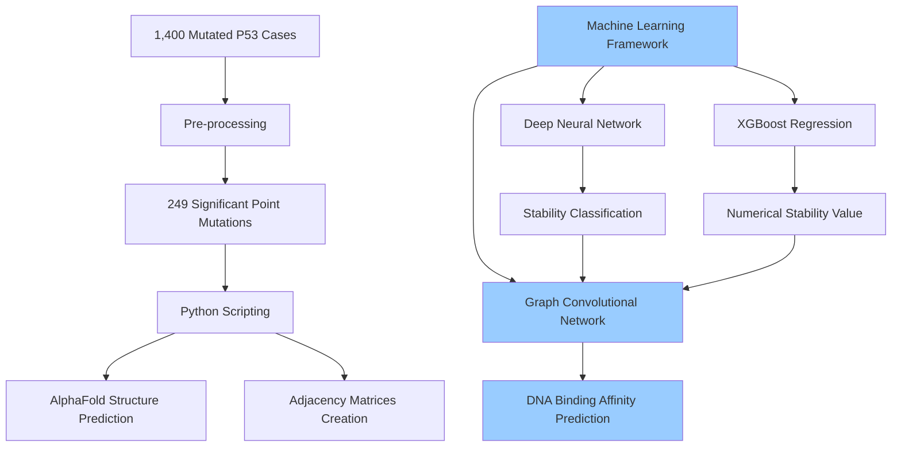

# AI Cancer Detection with Machine Learning

In this session from our March meeting, Round Rock High School sophomore Venika Kakarla presented her groundbreaking machine learning approach to detecting and analyzing hepatocellular carcinoma (HTC), the fatal liver cancer that claimed her grandfather's life.

## The Problem: Hepatocellular Carcinoma

HTC is the third leading cause of cancer-related deaths worldwide and presents multiple challenges:

- It varies significantly between patients
- It's difficult to diagnose in early stages
- Traditional analysis methods are prohibitively expensive ($10,000+ per analysis)
- Computational simulations require 2,400-2,500 hours to process multiple mutations

## Biological Background: P53 Protein

The research focuses on the P53 protein, specifically its DNA binding region:

- Plays a critical role in controlling tumor growth
- Is mutated in approximately 50% of HTC patients
- When mutated, cancer cells can replicate without bounds
- Even a single amino acid change can significantly alter protein stability and binding affinity

## The Multi-Algorithm Solution

Venika developed a three-part machine learning model that efficiently analyzes P53 mutations:

### 1. Data Preparation

- Started with 1,400 cases of mutated P53 protein from the COSMIC database
- Pre-processed to include 249 significant point mutations without repetitions
- Created protein structures using AlphaFold
- Generated adjacency matrices showing interactions between residues and DNA

### 2. Deep Neural Network (DNN)

Purpose: Classify whether mutations stabilize or destabilize the protein

Technical implementation:
- Input layer processes features like hydrogen bond count and solvent accessible surface area
- Hidden layers analyze whether mutations bury or expose residues 
- Dropout layer prevents overfitting
- Output layer predicts stability classification with 96% accuracy

### 3. XGBoost Regression

Purpose: Predict numerical thermostability values

Technical implementation:
- Uses decision trees that learn and improve over time
- Analyzes features like solvent accessible surface area, hydrogen bonds, salt bridges
- Achieved 99% accuracy in predicting stability values

### 4. Graph Convolutional Network (GCN)

Purpose: Predict DNA binding affinity of mutated proteins

Technical implementation:
- Converts adjacency matrices into graph-based inputs
- Analyzes protein structure in its natural graph form
- Uses ReLU functions to show non-linearity in residue interactions
- Compares wild type and mutated proteins
- Predicts interaction probability between mutant P53 and DNA sequences

## Results and Significance

This innovative approach achieved remarkable results:

- Reduced analysis time from 2,400-2,500 hours to just 3 minutes
- 96-99% accuracy across different prediction tasks
- Identified that R249S mutation (arginine to serine) decreases both stability and binding interaction probability
- Found that a statistical majority of P53-related point mutations affect DNA interaction, leading to faster cancer progression

## Technical Implementation

The model was built entirely in Google Colab using:
- TensorFlow
- Torch Geometric (for GCN)
- AlphaFold for structure prediction
- Python for data processing and adjacency matrix creation

## Future Work

- Lab validation of computational predictions
- Enhancement of the machine learning components
- Creation of a web-based interface for researchers
- Scaling the model for worldwide research use

## Broader Applications

While focused on hepatocellular carcinoma, this approach has implications for:
- Other cancers where P53 is mutated
- Protein structure analysis in general
- Computational biology and drug discovery
- Personalized medicine approaches

## Watch the Presentation

For the full presentation, watch the [YouTube video](https://www.youtube.com/watch?v=ArqkC5sQjEY).

## Resources

- [Blog post with additional details](../../blog/2025-03-20-ai-cancer-detection-breakthrough/index.md)
- [COSMIC Database](https://cancer.sanger.ac.uk/cosmic) - Source of mutation data
- [AlphaFold](https://alphafold.ebi.ac.uk/) - Protein structure prediction
- [Torch Geometric](https://pytorch-geometric.readthedocs.io/) - Graph Neural Network library
