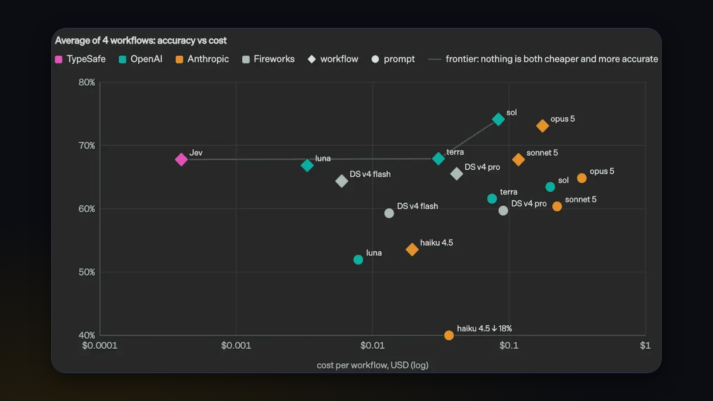
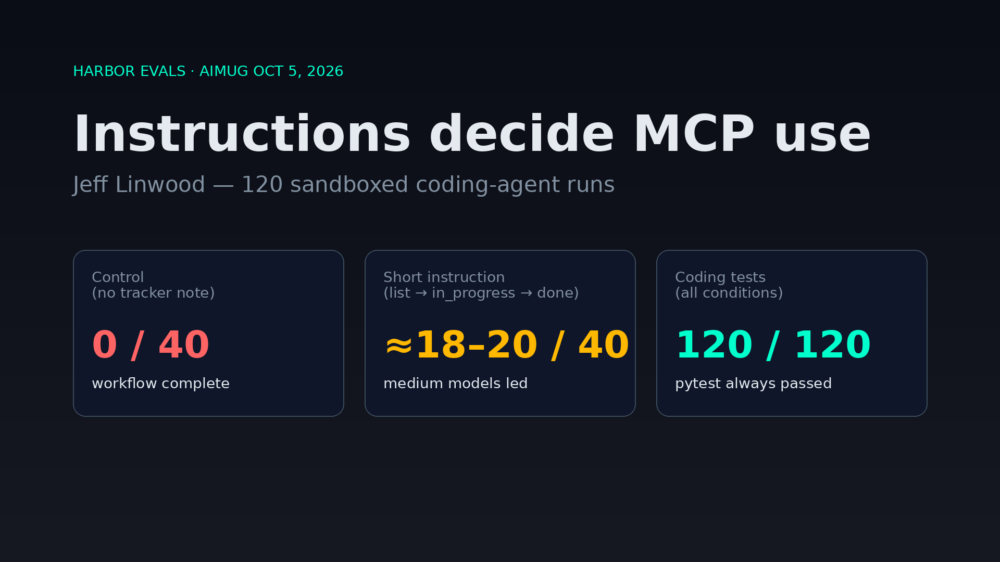
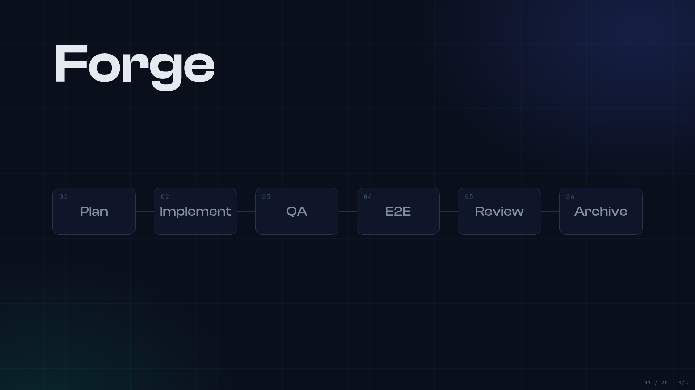

# October 5th, 2026 — Monthly Meeting

Builder night and our first Monday-night AIMUG. The talks covered routing requests across a mixture of models, calibrated decision models for agent workflows, evals for coding-agent harnesses, a spec-driven "coding factory," and graph-based dependency tracing. The thread through all of them: use the smallest thing that does the job, and measure it.

## Event Details

**Date:** Monday, October 5th, 2026  
**Format:** Monthly meeting, in person plus Zoom, with lightning-style talks (~15–20 min) and Q&A  
**Host:** AIMUG with CGCS (Center for Government and Civic Service)  
**Recording:** Recording will be linked here once archived.

## Talks

### Mixture of models and semantic routing
**Speaker:** Colin McNamara  

**Slides:** [Mixture of Models](https://www.colinmcnamara.com/talks/mixture-of-models)  
**Project:** [vLLM Semantic Router](https://vllm-sr.ai/)

Sending every request to one model costs more, weakens privacy, and widens the prompt-injection surface. A mixture of models exposes one blended API and routes each request by policy: local model for tiny or private work, an open-weights mid-size model, or a hosted frontier API.

- vLLM Semantic Router presets: balanced, cost-optimized, speed-optimized, accuracy, privacy.
- Route by complexity, PII, or jailbreak signals. Send suspected injections to a tool-less logging model (a honeypot). Turn thinking off dynamically, reuse cached answers, and escalate to a bigger model only when confidence is low.
- **Defense in depth:** the primary control lives in the agent graph (LangChain/LangGraph middleware, PII masking, guardrails). The router adds a secondary point for enforcement and logging.
- **The stack:** gateway (Envoy / Agent Gateway) → semantic router → KV-cache-aware fan-out (llm-d) → model. NVIDIA Switchyard hooks in earlier.
- **Rough laptop latency:** about 240 ms at session start for vLLM Semantic Router, about 1 s for Switchyard.
- Anthropic `v1/messages` support was missing across routers. Colin is filing bugs and PRs upstream, and some merged vLLM fixes are already moving into downstream packages.
- **Takeaways:** start with middleware in your graph, add a router as a secondary control (Kubernetes or a local container), and turn on OTEL at more than one point so you can compare.
- **Follow-up:** test whether PII and injection protections stay active after routing, and patch if not.

### Grokbot and JEV, a decision model
**Speaker:** Joseph Fluckiger  

**Slides:** [Joseph’s deck — GrokBot and Jev](https://share.fluckiger.org/aimug)

- **Personal agents:** Grokbot (hosted VM, quick setup, works well on a phone including 2FA logins, agents hand off jobs to each other) versus self-hosted OpenClaw or Hermes (pick any model, local-only integrations like iMessage). His uses: calendar, email, Strava, an Obsidian vault, a fitness coach.
- **JEV** is a classification model, not an LLM, trained for calibrated decisions, so its probabilities are meant to match reality instead of being LLM self-estimates. Named after the Jevons paradox. Output types: choice, score, boolean.
- **LangGraph use cases:** golden Q&A matching instead of a RAG round trip, concierge sub-agent routing (about 600 ms versus about 4–5 s with a small LLM), fraud triage.
- **His own tests:** about 7–10× faster and 10–100× cheaper than a small LLM. Still a prototype, not in production.
- He recommended MLflow tracing, alongside LangSmith and Langfuse.
- **Follow-up:** prototype JEV on eBay fraud-agent workflows and measure latency and cost.

### Harbor evals for coding agents
**Speaker:** Jeff Linwood  

**Slides:** [Agent evals with Harbor](https://www.jefflinwood.com/2026/10/agent-evals-with-harbor/)

- **The problem:** coding agents ignored the MCP task-board tools in his macOS agent workspace and fell back to grep.
- **Harbor** (open source, from the Terminal-Bench team) breaks an eval into task folder (`instruction.md`, environment, tests), agent under test, model, verifier, and trials. It runs locally in Docker or on Daytona. Jeff used API keys instead of subscriptions.
- **Experiment:** 120 runs covering 5 fixtures × Claude Code/Codex × small/medium tiers × 3 conditions (none, short instruction, the long instructions shipped in the Mac app).
- **Results:** all runs passed the coding tests. The control didn't use the tools. The short instruction got 10/10 (Claude Code, medium) and 8/10 (Codex, medium). The shipped long instructions got about 0–3/10. Small models did worse than medium.
- **Takeaways:** A/B test your `agents.md`, design MCP tool names and descriptions with evals, and build an internal agentic-coding benchmark.
- **Follow-up:** the next Mac app version ships the short instruction.

### The coding factory: canonical specs and sequential agents
**Speaker:** Jake Cukjati  

**Slides:** [Forge with Rigor](https://byteofcode.io/presentations/forge-with-rigor/)

- Stop prompting agents to write code. Have them work from specs. Runs now last hours (his longest was about 23.8 h).
- Specs are canonical and verifiable. Agents check them when they hit a bug, and Jake reviews specs instead of every line.
- **The loop:** specs → implementation → integration/E2E testing → code review → triage → compounding (reference material that feeds the next run).
- Sequential agents, one feature at a time, with structured handoffs. No parallel swarm.
- **Context discipline:** the largest agent context is about 330K tokens, with a soft target of about 250K. CLIs act as prompt engines that hand the agent the right context at the right time.
- **Scale:** 80–90 specs of 400–500 lines each (under 1,000). A commit-pinned manifest and a scheduler create batches that record the commit hash, files, and blockers. He plans a domain split as the codebase approaches 200K lines.
- **Follow-up:** open-source the skills and CLI once the test-harness rigor is where he wants it.

### Corvic AI: graph analytics and dependency tracing
**Speaker:** James Coffey  

**Slides:** [What Breaks If We Turn This Off? (James Coffey / Corvic)](./presentation-materials/james-coffey-what-breaks-if-we-turn-this-off.pdf)

- Graphs keep and enforce relationships that embedding plus cosine similarity loses. Direction of dependency matters.
- **Demo:** Corvic read an architecture diagram image, built a graph, and traced what breaks when pricing goes down. The quote path breaks right away; browsing survives until its ~5-minute cache window runs out.
- **Platform:** rooms, live apps, templates and playbooks, MCP access, pipelines, embeddings and clustering.
- **Fits:** engineering prints, financial and parts lineage, medical ontologies and drug interactions. Compare against LlamaParse and Neo4j. For small graphs, something simpler is probably fine.
- **Disclosure:** James knows the team. Corvic is an early seed-stage startup.
- **Follow-up:** demo access for interested attendees. Credits are possible, but terms aren't final.

## Closing

This was the first Monday-night AIMUG, noted by our CGCS host. The after-party moved to The Tavern's upstairs patio.

## Resources

- [Colin McNamara — Mixture of Models](https://www.colinmcnamara.com/talks/mixture-of-models)
- [Joseph Fluckiger — GrokBot and Jev (deck)](https://share.fluckiger.org/aimug)
- [Jeff Linwood — Agent evals with Harbor](https://www.jefflinwood.com/2026/10/agent-evals-with-harbor/)
- [Jake Cukjati — Forge with Rigor](https://byteofcode.io/presentations/forge-with-rigor/)
- [What Breaks If We Turn This Off? (James Coffey / Corvic)](./presentation-materials/james-coffey-what-breaks-if-we-turn-this-off.pdf)
- Blog recap: [/blog/october-2026-monthly-meeting-recap](/blog/october-2026-monthly-meeting-recap)
- Office hours: 2nd, 3rd, and 4th Mondays · 5:00 PM CT · Google Meet (1st Monday is the Mixer & Showcase at ACC)

## Next Steps

- Recording will be linked here once archived
- Community: post to Discord and Meetup once the public page is live
