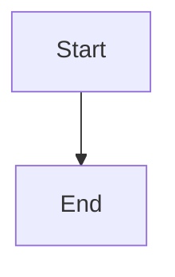

# Mermaid Diagram Utilities

This directory contains utility scripts for working with Mermaid diagrams in blog posts and documentation.

## Scripts

### 1. `generate-thumbnail.sh`

Generates a PNG image from a Mermaid diagram file.

```bash
# Usage
./generate-thumbnail.sh <path-to-mmd-file> <output-png-path> [width] [height]

# Example
./generate-thumbnail.sh blog/my-post/diagram.mmd blog/my-post/img/thumbnail.png 1200 630
```

**Requirements:**
- Node.js
- Mermaid CLI (will be installed automatically if not present)

**Features:**
- Automatically creates output directories if they don't exist
- Customizable image dimensions
- Transparent background by default

### 2. `create-placeholder.js`

Creates a minimal transparent PNG file to use as a placeholder when the actual diagram image is not yet generated.

```bash
# Usage
node create-placeholder.js <output-path> [width] [height]

# Example
node create-placeholder.js blog/my-post/img/thumbnail.png 1200 630
```

**Requirements:**
- Node.js

**Features:**
- Creates output directories automatically
- Creates a transparent PNG file that works with Docusaurus
- Minimal dependencies (uses built-in Node.js modules)

## Using in Blogging Workflow

### Standard Flow
1. Create a Mermaid diagram and save it as `.mmd` in your blog post directory
2. Use `create-placeholder.js` to create an initial placeholder image
3. Reference this image in your blog post's frontmatter via the `image` property
4. Include the Mermaid source directly in your post for Docusaurus to render
5. When ready to publish, generate a proper PNG using `generate-thumbnail.sh`

### Example

```bash
# 1. Create a directory for your blog post
mkdir -p main-docs/blog/my-new-post/img

# 2. Create your Mermaid diagram
vim main-docs/blog/my-new-post/diagram.mmd

# 3. Create a placeholder image
node scripts/mermaid-utilities/create-placeholder.js main-docs/blog/my-new-post/img/thumbnail.png

# 4. When ready, generate the actual thumbnail
scripts/mermaid-utilities/generate-thumbnail.sh main-docs/blog/my-new-post/diagram.mmd main-docs/blog/my-new-post/img/thumbnail.png
```

Then in your blog post's frontmatter:

```markdown
---
title: "My Blog Post"
authors: [username]
tags: [tag1, tag2]
image: ./img/thumbnail.png
---



...
```

## Advanced Options

For more advanced rendering options, such as custom themes or styling, refer to the [Mermaid CLI documentation](https://github.com/mermaid-js/mermaid-cli).
